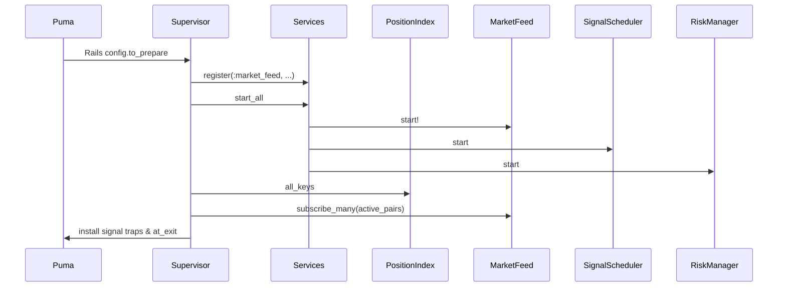
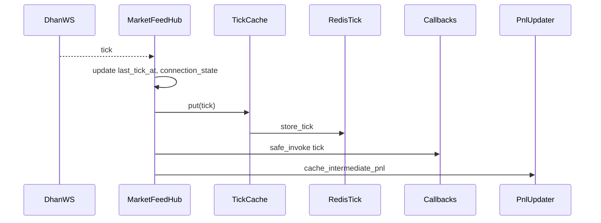
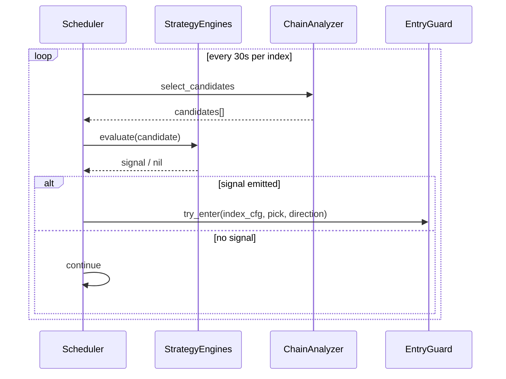
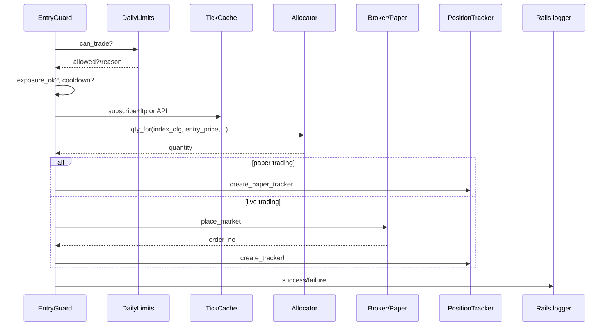
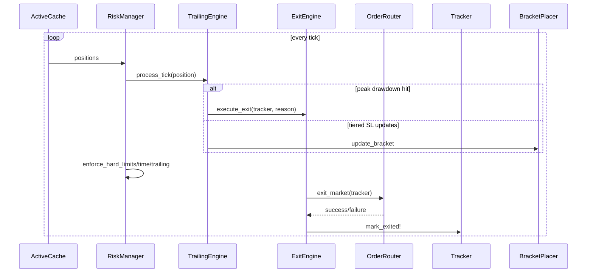
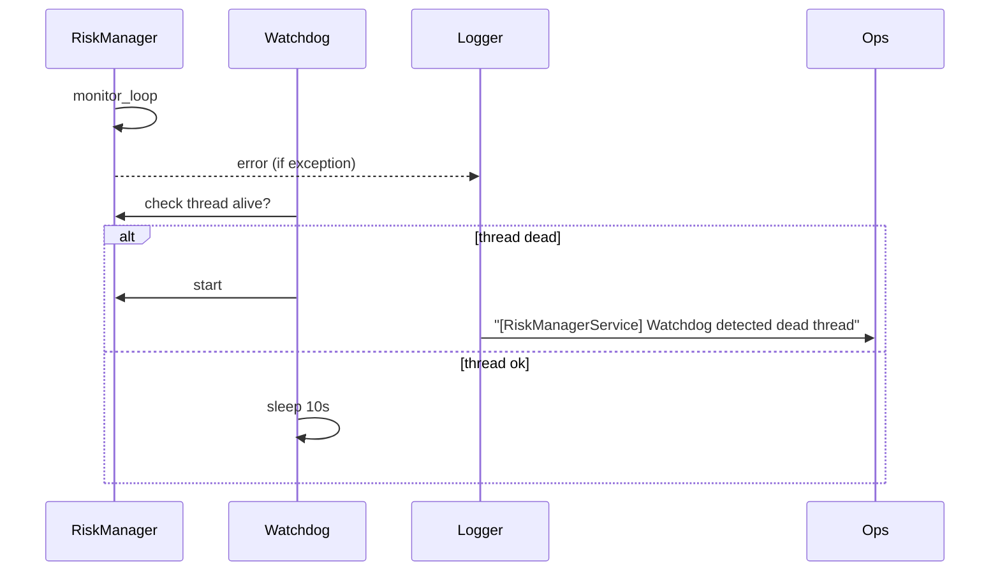
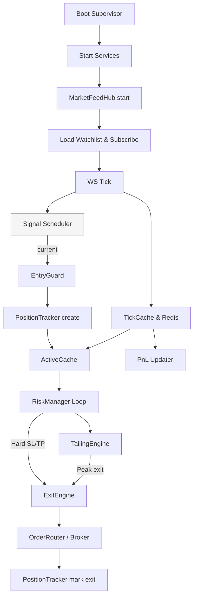

## 1. Executive Summary
The Algo-Scalper Rails API boots through `TradingSystem::Supervisor`, which registers singleton-like service adapters (market data feed, schedulers, risk/exit loops, caches). On boot it loads watchlists, subscribes instruments to the DhanHQ WebSocket, hydrates caches, and spawns multiple threads. Market ticks travel from `Live::MarketFeedHub` → `Live::TickCache` → Redis + dependent services. Signals are produced by `Signal::Scheduler`, but today only the legacy EntryGuard path is wired; the full V3 stack (`IndexSelector`, `TrendScorer`, `StrikeSelector`, `Orders::EntryManager`) exists but is unused, so entries flow straight through EntryGuard into `PositionTracker`s, bypassing ActiveCache and dynamic risk sizing. Risk management (`Live::RiskManagerService`) consumes ActiveCache/Redis PnL snapshots, drives trailing logic (`Live::TrailingEngine`), and hands exits to `Live::ExitEngine`, after which cleanup threads prune caches. Paper vs live is determined by `AlgoConfig[:paper_trading]`, with paper paths short-circuiting order placement and feeding simulated PnL loops. Key gaps: Scheduler doesn’t call V3 modules, `Capital::Allocator` ignores dynamic risk input, and `Orders::BracketPlacer` instantiation is inconsistent.

---

## 2. Global End-to-End Flow (Chronological)

| Stage | Trigger | Components | Input → Output |
| --- | --- | --- | --- |
| **Boot** | Puma process start (`./bin/dev`) | `config/initializers/trading_supervisor.rb` | Registers adapters, starts services (`market_feed`, `signal_scheduler`, `risk_manager`, `position_heartbeat`, `order_router`, `paper_pnl_refresher`, `exit_manager`, `active_cache`). Subscribes active positions via `Live::PositionIndex`. |
| **Subscription load** | `MarketFeedHub.start!` | `Live::MarketFeedHub` | Loads watchlist from DB or ENV, builds DhanHQ WS client, registers `on(:tick)` handler, tracks subscribed keys, starts connection, logs statuses. |
| **Feed ingestion** | Tick event from WS | `MarketFeedHub.handle_tick` → `Live::TickCache.put` → `Live::RedisTickCache.store_tick` | Tick contains `{segment, security_id, kind (:ticker/:prev_close), ltp, prev_close}`. Updates connection health, stores LTP, notifies callbacks (`ActiveSupport::Notifications`, registered services like ActiveCache). Triggers `Live::PnlUpdaterService.cache_intermediate_pnl`. |
| **Signal processing** | `Signal::Scheduler` thread every 30 s (`DEFAULT_PERIOD`) loops on indices | `Signal::Scheduler` + strategy engines + `Options::DerivativeChainAnalyzer` | Evaluates enabled strategies per index, logs first signal, currently calls `Entries::EntryGuard` directly (V3 modules unused). |
| **Entry decision** | `EntryGuard.try_enter` invoked per signal | `Entries::EntryGuard`, `Live::DailyLimits`, `Capital::Allocator`, `Orders.config` | Validates daily limits, exposure, cooldown, resolves LTP (WS or API), calculates qty, enforces tradable segment, places market order (live) or creates paper tracker. |
| **Order routing** | Live mode only | `Orders::Config` (gateway), `TradingSystem::OrderRouter` for exits | `Orders.config.place_market` handles entry; `OrderRouter` is used later for exits with retry logic. |
| **Position creation** | Entry success | `PositionTracker` ActiveRecord model | Stored with segment, security_id, entry price, order number, meta. `Live::PositionIndex` updated via watchers (heartbeat or manual adds). EntryManager **would** add to ActiveCache & bracket but isn’t invoked. |
| **Tracking & caching** | (a) `PositionHeartbeat` every 10 s; (b) `Positions::ActiveCache.start!` callback; (c) manual adds | `Live::PositionIndex`, `Positions::ActiveCache` | Heartbeat bulk-loads active trackers into index; ActiveCache subscribes to ticks, maintains `PositionData` struct (SL/TP/HWM) and persists peaks to Redis. |
| **Risk evaluation** | `Live::RiskManagerService` thread every 5 s | Risk manager loops update paper PnL, ensure Redis entries, iterate ActiveCache positions, feed each into `Live::TrailingEngine`, enforce hard SL/TP/time exits, log losses to `Live::DailyLimits`. |
| **Trailing adjustments** | Called inside risk loop per position | `Live::TrailingEngine`, `Positions::TrailingConfig`, `Orders::BracketPlacer` | Checks peak drawdown (immediate exit via ExitEngine), updates peak profit %, computes tiered SL offsets, updates brackets via BracketPlacer. |
| **Exit execution** | Risk/Trailing triggers, manual commands | `Live::ExitEngine`, `TradingSystem::OrderRouter` | Routes exit orders (live), marks tracker exited, records loss. Paper mode would likely mark tracker using simulated LTP. |
| **Cleanup** | Continuous loops + exit events | `Live::PositionTrackerPruner`, `Positions::ActiveCache.remove_position`, `Live::RedisPnlCache.prune` | Removes stale Redis keys, unsubscribes if necessary (not automatic), stops services on signal trap via supervisor. |

---

## 3. Component Inventory (Comprehensive)

### Boot/Control
- **`TradingSystem::Supervisor`** (`config/initializers/trading_supervisor.rb`)
  - *Role*: Lightweight registry managing service lifecycle, hooking into Puma process start.
  - *Runs*: Boot time; `start_all`, `stop_all`, signal traps (`INT`, `TERM`), `at_exit`.
  - *Dependencies*: Service adapters, `Live::PositionIndex`, `MarketsFeedHub`.
  - *Used by*: Entire runtime (provides handles via `Rails.application.config.x.trading_supervisor`).

- **Service adapters**
  - `MarketFeedHubService`, `PnlUpdaterServiceAdapter`, `ActiveCacheService` wrap singleton services into start/stop interface.

### Market Data & Caching
- **`Live::MarketFeedHub`** (`app/services/live/market_feed_hub.rb`)
  - *Singleton* with `@callbacks`, `@subscribed_keys`, `@watchlist`.
  - *Responsibilities*: Connect WS, ensure creds, subscribe watchlist, deduplicate subscriptions, handle ticks, maintain connection health, log statuses.
  - *Triggers*: `start!` from supervisor, `subscribe[_many]` on demand.
  - *Dependencies*: DhanHQ WS client, `WatchlistItem`, `Live::TickCache`, `Live::RedisTickCache`, `Live::PnlUpdaterService`, `Live::FeedHealthService`.

- **`TickCache` / `Live::TickCache`** (`app/services/tick_cache.rb`)
  - *Singleton in-memory store* using `Concurrent::Map`; merges ticks, persists to Redis.
  - *APIs*: `put`, `ltp`, `fetch`, `delete`, `all`.

- **`Live::RedisTickCache`**
  - *Redis-backed hash store* keyed `tick:SEG:SID`; handles merges, TTL, pruning, protects active/watchlist keys.

- **`Positions::ActiveCache`**
  - *Singleton position store* with `PositionData` struct tracking entry, SL/TP, LTP, PnL, HWM, trailing state.
  - *Runs*: `start!` subscribed to MarketFeedHub ticks; `add_position` invoked manually (EntryManager would do this).
  - *Dependencies*: `Redis` for peak persistence, ActiveCache thread subscription, `Core::EventBus` for SL/TP hits.

- **`Live::PositionIndex`**
  - *Singleton map* from security_id → array of tracker metadata; used for subscription/resubscription and pruning.

- **`Live::RedisPnlCache`**
  - Per-tracker PnL store with TTL 6h; used by RiskManager, PaperPnlRefresher, PnlUpdater.

### Signal & Entry
- **`Signal::Scheduler`**
  - *Threaded scheduler* that loops indices, loads enabled strategies, uses `Options::DerivativeChainAnalyzer` to get candidates, runs engines (OpenInterest, Momentum, etc.), logs results.
  - *Current wiring*: calls `Entries::EntryGuard` only.

- **`Signal::IndexSelector`, `Signal::TrendScorer`**
  - *Not currently invoked* by scheduler; designed to produce trend scores using multi-timeframe indicators via `Instrument#candle_series`.

- **`Options::DerivativeChainAnalyzer`, `Options::StrikeSelector`, `Options::PremiumFilter`**
  - Provide option chain loading, strike filtering, premium/spread/volume validation. StrikeSelector depends on `IndexRules` and `Live::TickCache`.

- **`Entries::EntryGuard`**
  - *Entry pipeline orchestrator*:
    - `Live::DailyLimits.can_trade?`
    - Exposure/cooldown checks
    - WebSocket/Redis/API LTP resolution & subscription
    - `Capital::Allocator.qty_for`
    - Segment validity (rejects index segments, ensuring derivatives only)
    - Paper vs live branch: paper instantiates `PositionTracker` via helper, live calls `Orders.config.place_market`
    - Logs success/failure.

- **`Capital::Allocator`**
  - Calculates quantity by allocation & risk constraints (but no `risk_pct` parameter).
  - `Capital::DynamicRiskAllocator` maps trend score to risk multiplier (unused due to EntryManager inactivity).

- **`Orders::EntryManager`**
  - *Exists to integrate dynamic risk, ActiveCache, bracket placement, event emission,* but is never called from Scheduler. When invoked, it would:
    - Extract pick/candidate
    - Compute dynamic risk
    - Re-run EntryGuard (ensuring order placed)
    - Add tracker to ActiveCache
    - Calculate default SL/TP and call `Orders::BracketPlacer`
    - Call `Live::DailyLimits.record_trade`
    - Emit `entry_filled` event

### Risk, Trailing, Exit
- **`Live::RiskManagerService`**
  - *Threaded loop (5 s)* with watchdog auto-restart.
  - Responsibilities:
    - Update paper PnL (delegates to `update_paper_positions_pnl`)
    - Ensure positions exist in Redis caches
    - Iterate `Positions::ActiveCache` positions:
      - Call `Live::TrailingEngine.process_tick`
      - Enforce fallback exits if no external `ExitEngine`
    - `record_loss_if_applicable`
    - Provide `enforce_hard_limits`, `enforce_trailing_stops`, `enforce_time_based_exit`

- **`Live::TrailingEngine`**
  - Called per position; first checks peak drawdown via `Positions::TrailingConfig`, then updates peak, then applies tiered SL adjustments via `Orders::BracketPlacer`.

- **`Orders::BracketPlacer`**
  - Places/updates SL & TP (currently just updates ActiveCache metadata and emits events). Instantiation pattern inconsistent (per-call vs `.instance` assumption).

- **`Live::ExitEngine`**
  - Idle thread (0.5 s loop) for future use; currently receives exit requests synchronously, calls `TradingSystem::OrderRouter.exit_market`, marks tracker, logs.

### Supporting Services
- **`TradingSystem::PositionHeartbeat`**
  - 10 s thread reloading Active positions into `Live::PositionIndex` and calling `Live::PositionTrackerPruner`.

- **`Live::PositionTrackerPruner`**
  - Removes Redis PnL/tick entries for trackers no longer active.

- **`Live::PaperPnlRefresher`**
  - 40 s loop updating paper trackers’ PnL via TickCache and writing to Redis.

- **`Live::PnlUpdaterService`**
  - 0.25 s flush thread batching intermediate PnL updates into Redis; invoked by MarketFeedHub + others.

- **`Live::DailyLimits`**
  - Redis counters enforcing per-index/global daily loss and trade limits; used in EntryGuard, EntryManager, RiskManager loss recording.

- **Utilities/Providers**
  - `Live::FeedHealthService`, `Core::EventBus`, `IndexInstrumentCache`, `InstrumentHelpers`.

---

## 4. Decision Flow Logic

### Major Decision Points

1. **Supervisor registration & start**
   - *When*: On Puma boot, `Rails.application.config.to_prepare`.
   - *Why*: Determine which services run in process.
   - *Logic*: If not already started (`$trading_supervisor_started`), instantiate services, call `start_all`, subscribe active positions.
   - *Failure*: Exceptions logged per service start, supervisor continues.

2. **MarketFeedHub start**
   - *When*: Supervisor start.
   - *Why*: Ensure WS feed running only if credentials present.
   - *Logic*: Check `enabled?` (ENV vars). Under lock: load watchlist, build client, register handlers, `@ws_client.start`. Outside lock: `subscribe_watchlist`.
   - *Failure*: Logs error, calls `stop!`, returns false.

3. **Tick handling**
   - *When*: Each WS tick.
   - *Why*: Update caches, notify dependent services.
   - *Logic*: update connection state, `Live::TickCache.put` if LTP or prev_close positive, instrument notifications. Fallback for positions lacking ticks (skips).
     Failure: exceptions swallowed (errors logged) to avoid breaking feed.

4. **Signal generation**
   - *When*: `Signal::Scheduler` thread loops indices every `@period`.
   - *Why*: Evaluate strategies for each index, produce candidate signals.
   - *Logic*: load enabled strategies from config, instantiate DerivativeChainAnalyzer, pick first candidate, call `evaluate_strategy`, log signal, call `process_signal`.
   - *Fallback*: If no strategies or no candidates, skip; exceptions logged, loop continues.

5. **Entry validation & quantity**
   - *When*: `Entries::EntryGuard.try_enter`.
   - *Why*: Enforce risk/perf constraints.
   - *Logic*:
     - `Live::DailyLimits.can_trade?`
     - `exposure_ok?` (DB query)
     - `cooldown_active?`
     - WebSocket state logged (never blocks).
     - `resolve_entry_ltp` tries WS subscription, waits up to 300ms, falls back to API.
     - Validate positive LTP
     - `Capital::Allocator.qty_for` (lack of dynamic risk). If qty <= 0, reject.
     - Segment must be tradable.
     - Paper vs live branch; live uses `Orders.config.place_market`.
   - *Failure*: Each check returns `false` with logging; no exception thrown outward.

6. **ActiveCache add & bracket (EntryManager path)**
   - *When*: (Would run) after EntryGuard success.
   - *Logic*: find tracker by segment/security_id, ensure quantity >= lot, compute SL/TP, `ActiveCache.add_position`, `Orders::BracketPlacer.place_bracket`, `Live::DailyLimits.record_trade`, emit event.
   - *Failure*: Missing tracker or add_position failure returns `failure_result`.

7. **Risk loop per position**
   - *When*: `Live::RiskManagerService.monitor_loop`.
   - *Logic*:
     - `process_trailing_for_all_positions`: instantiate `Orders::BracketPlacer` and `Live::TrailingEngine` if not present; call `process_tick` for each ActiveCache position. Failures logged per position.
     - If no external ExitEngine, call `enforce_hard_limits`, `enforce_trailing_stops`, `enforce_time_based_exit` (all iterate `PositionTracker.active`).
     - Each enforcement uses `pnl_snapshot` from Redis and advanced config thresholds; `dispatch_exit` ensures exit engine handles failure.
   - *Failure*: Exceptions logged but loop continues; watchdog restarts service if thread dies.

8. **TrailingEngine decisions**
   - *When*: Each `process_tick`.
   - *Logic*:
     1. Peak drawdown check (if `peak_profit_pct` exists) via `Positions::TrailingConfig.peak_drawdown_triggered?`; obtains tracker, ensures active, calls `exit_engine.execute_exit`.
     2. If not exited, update peak if `pnl_pct` exceeds previous peak.
     3. Calculate new SL via tiered offsets; only update bracket if new SL > current.
   - *Failure*: Logs error and returns `failure_result`; risk loop continues.

9. **Exit Engine**
   - *When*: Called by TrailingEngine or risk enforcement.
   - *Logic*: Grab LTP from TickCache (memory/redis), call router’s `exit_market`, check success, mark tracker with exit price/reason, log, record loss if negative.
   - *Failure*: Logs error, raises (if router failure). Risk manager rescue will log.

10. **Pruning & recovery**
    - *When*: PositionHeartbeat every 10 s, `Live::PositionTrackerPruner` at same time.
    - *Logic*: Reload index from DB, call pruner to remove Redis entries not matching active IDs, prune stale ticks (except indexes & protected keys).
    - *Failure*: Exceptions logged; loop continues.

---

## 5. Entry Pipeline Analysis

### Flow: `Signal` → `Entry`

1. **Signal acquisition**
   - Source: `Signal::Scheduler`.
   - Format: `signal = { meta: { candidate_symbol, multiplier }, reason, ... }`.

2. **Pick creation**
   - `build_pick_from_signal` builds `{segment, security_id, symbol, lot_size}` (ltp left nil).

3. **Entry decision** (`Entries::EntryGuard`)
   - Checks daily trading constraints via `Live::DailyLimits`.
   - Exposure/pyramiding guard ensures limited concurrent positions per underlying.
   - Cooldown guard prevents rapid re-entries.
   - WebSocket status logged (non-blocking).
   - LTP resolution:
     - If WS running & connected, subscribe instrument (if not already) and poll TickCache for up to 300 ms.
     - If still nil, attempt `Derivative#fetch_ltp_from_api_for_segment` or `Instrument#fetch_ltp_from_api_for_segment`.
     - If still nil/<=0, reject.
   - Quantity sizing:
     - `Capital::Allocator.qty_for` uses account balance/policy; no dynamic risk parameter.
     - Rejection if qty <= 0.
   - Segment validation: derivatives only.
   - Paper trading branch: `create_paper_tracker!` creates `PositionTracker` with simulated entry price, quantity, etc.
   - Live branch: `Orders.config.place_market` (includes `client_order_id`, ltp) and `create_tracker!`.
   - Success logs order number.

4. **Post-entry instrumentation**
   - Since `Orders::EntryManager` isn’t called, newly created trackers rely on `Positions::ActiveCache.bulk_load!` or manual test hooks to enter caches. Bracket orders aren’t placed; SL/TP rely on Risk Manager enforcement.

5. **Paper vs Live differences**
   - Paper: direct tracker creation (no gateway), PnL managed via `Live::PaperPnlRefresher`.
   - Live: depends on Dhan order placement; actual fill detection implicit by `PositionTracker` creation.

6. **Alternate flows**
   - Legacy: Already described (EntryGuard only).
   - Target V3: Insert `IndexSelector`, `StrikeSelector`, `Orders::EntryManager` for dynamic risk + ActiveCache integration, bracket placement, `entry_filled` event.

---

## 6. Exit Pipeline Analysis

1. **Per-tick updates**
   - `Positions::ActiveCache.handle_tick` updates `PositionData` for positions keyed by `segment:security_id`, recalculates PnL/HWM, increments stats.
   - Publishes `sl_hit` / `tp_hit` events via `Core::EventBus`.

2. **Trailing logic**
   - `Live::RiskManagerService.process_trailing_for_all_positions` iterates `ActiveCache.all_positions`, passing each to `Live::TrailingEngine.process_tick`.
   - Trailing engine performs:
     - Immediate peak drawdown exit (if `peak_profit_pct` minus current `pnl_pct` ≥ 5%).
     - Peak update via ActiveCache (persisted to Redis).
     - Tiered SL adjustments based on `Positions::TrailingConfig::TIERS`.

3. **Hard limits**
   - `enforce_hard_limits`: uses Redis PnL snapshot to compare against `risk[:sl_pct]`, `risk[:tp_pct]`. On violation, `dispatch_exit`.
   - `enforce_trailing_stops`: uses drop from `hwm_pnl` vs `risk[:exit_drop_pct]`.
   - `enforce_time_based_exit`: compares `Time.current` to `risk[:time_exit_hhmm]` & `market_close_hhmm`, ensuring min profit threshold before exiting.

4. **Exit routing**
   - `dispatch_exit` -> `ExitEngine.execute_exit` (if external engine provided) or `execute_exit` fallback.
   - Exit engine uses router to place exit, marks tracker, records loss via `Live::DailyLimits.record_loss` when PnL negative.

5. **Cleanup**
   - After exit, ActiveCache’s `remove_position` should be triggered elsewhere (not shown but typically on event).
   - `Live::PositionTrackerPruner` removes Redis data for exited trackers.

6. **Paper vs live**
   - Paper: Exits likely simulated; `PaperPnlRefresher` ensures PnL, but exit path still uses `ExitEngine` with router; for paper routers, exit likely just toggles tracker state.
   - Live: Router issues actual exit orders.

---

## 7. Caching & Subscription Lifecycle

| Event | Action |
| --- | --- |
| Boot | Supervisor registers services, `Live::PositionIndex.instance.all_keys` used to subscribe active instruments via `supervisor[:market_feed].subscribe_many`. |
| Watchlist load | `MarketFeedHub.load_watchlist` draws from DB `WatchlistItem.active` or fallback env string; duplicates filtered. |
| New subscription | `subscribe(segment:, security_id:)` ensures running, dedups via `@subscribed_keys`, calls WS `subscribe_one`. `subscribe_many` handles batch operations and logs skipped duplicates. |
| Tick arrival | `Live::TickCache.put` merges tick (maintains previous LTP if new missing) and writes to `Live::RedisTickCache`. `Live::PnlUpdaterService` caches intermediate PnL for `Live::RiskManagerService`. |
| Active position add | Currently manual via tests or `Positions::ActiveCache.bulk_load!`. EntryManager would call `ActiveCache.add_position`. |
| Peak persistence | `ActiveCache.update_position` persists `peak_profit_pct` via Redis `setex` (7-day TTL). `reload_peaks` runs on `start!` to rehydrate. |
| Pruning | `Live::RedisTickCache.prune_stale` removes old ticks except indexes, watchlist, active positions; `Live::RedisPnlCache.prune_except` removes PnL data not in allowed IDs. |
| Unsubscription | No automatic unsubscribing on exit; `unsubscribe` APIs exist but unused by flows. |

Authoritative LTP order: in-memory `TickCache` > `RedisTickCache` > API fallback. For PnL, ActiveCache uses in-memory; risk loops fall back to Redis PnL snapshots; Paper loops compute from tick data.

---

## 8. Config-Driven Behavior Mapping

| Config Source | Keys | Components | Effect |
| --- | --- | --- | --- |
| `AlgoConfig[:indices]` | `key`, `segment`, `sid`, `strategies`, `max_same_side`, `cooldown_sec`, `capital_alloc_pct`, `direction` | Scheduler, EntryGuard, Capital Allocator, StrikeSelector | Determines which indices run, strategy enablement/priority, exposure limits, default capital allocation, default direction (bullish/bearish). |
| `AlgoConfig[:strategy]` | Default strategy config | Scheduler, EntryGuard | Fallback when per-index strategy missing. |
| `AlgoConfig[:chain_analyzer]` | `max_candidates`, `min_oi`, `min_iv`, `max_spread_pct` | `Options::DerivativeChainAnalyzer` | Candidate count, filters relaxations. |
| `AlgoConfig[:paper_trading]` | `enabled`, `balance` | EntryGuard, Capital Allocator, PaperPnlRefresher | Toggles entry path between paper/live; sets available capital for allocator; ensures `PaperPnlRefresher` updates only paper positions. |
| `AlgoConfig[:risk]` | `sl_pct`, `tp_pct`, `exit_drop_pct`, `time_exit_hhmm`, `market_close_hhmm`, `max_daily_loss_pct`, `max_global_daily_loss_pct`, `max_daily_trades`, `max_global_daily_trades` | RiskManager, DailyLimits, Trailing Engine | Sets thresholds for exits, time-based exits, daily limit enforcement. |
| `config.x.dhanhq` | `ws_mode` | MarketFeedHub | Chooses WS mode (ticker/quote/full). |
| ENV variables | `DHANHQ_CLIENT_ID`, `DHANHQ_ACCESS_TOKEN`, `CLIENT_ID`, `ACCESS_TOKEN`, `DHANHQ_WS_WATCHLIST`, `REDIS_URL` | Feed connection, fallback watchlist, Redis clients | Without creds, feed disabled; watchlist env used when DB empty; Redis URL for caches. |
| ENV overrides | `ALLOC_PCT`, `RISK_PER_TRADE_PCT`, `DAILY_MAX_LOSS_PCT` | Capital Allocator | Override deployment policy parameters. |
| Feature flags (proposed) | `NEMESIS_USE_V3_FLOW` (not yet implemented) | Scheduler | Would guard new flow adoption. |

---

## 9. Paper vs Live Execution Path

| Aspect | Paper (`AlgoConfig[:paper_trading][:enabled] == true`) | Live |
| --- | --- | --- |
| Entry | `Entries::EntryGuard#create_paper_tracker!` creates `PositionTracker` without hitting broker; LTP from tick/API used to set entry price. | `Orders.config.place_market` called with `segment`, `security_id`, `qty`, `client_order_id`, `ltp`; requires Dhan credentials and live gateway. |
| Capital | `Capital::Allocator.available_cash` returns `AlgoConfig[:paper_trading][:balance]`. | Calls Dhan Funds API for `available_balance`. |
| PnL updates | `Live::PaperPnlRefresher` loop updates `last_pnl_rupees/pct`, writes to Redis; uses tick data. | `Live::PnlUpdaterService` caches intermediate PnL from real ticks + actual fills; risk loops rely on `Live::RedisPnlCache`. |
| Exit routing | Presumably uses same `ExitEngine` but with paper gateway/no broker call; `tracker.mark_exited!` still used. | `ExitEngine` calls `TradingSystem::OrderRouter`, which wraps actual broker gateway; ensures exit orders placed. |
| Logging | Same structure; additional info (paper-specific) logged in tests. | Real order numbers and router responses logged. |
| Risk rules | Identical logic; thresholds operate on computed PnL. | Same, but actual capital constraints enforced via Dhan balances. |

---

## 10. Error, Failure-Mode & Restart Behavior

| Failure | Behavior | Code |
| --- | --- | --- |
| **Missing WS credentials** | `MarketFeedHub.start!` logs warning and returns false, skipping feed start. | `25:28:app/services/live/market_feed_hub.rb` |
| **WS deadlock** | Already addressed: `subscribe_watchlist` called outside lock prevents recursive locking. If `start!` raises, `rescue` logs error and calls `stop!`. | `58:68 same file` |
| **Tick data stalls** | `connected?` returns false if last tick timestamp older than 30 s; `health_status` exposes `last_tick_at`. No automatic reconnect beyond WS client behavior; watchers should alert. | `96:126 same file` |
| **Redis unavailable** | Each service logs error (`DailyLimits`, `ActiveCache`, `RedisTickCache`); most return false, which in EntryGuard causes trading to be disallowed (`can_trade?` returns `{allowed:false, reason:'redis_unavailable'}`). | `23:85:app/services/live/daily_limits.rb` |
| **Order placement failure** | EntryGuard logs warning and returns false; no retries at EntryGuard level. | `105:121:app/services/entries/entry_guard.rb` |
| **Exit routing failure** | `ExitEngine.execute_exit` rescues, logs, re-raises; RiskManager catches and logs. | `56:71:app/services/live/exit_engine.rb`; `335:347:app/services/live/risk_manager_service.rb` |
| **Risk loop crash** | Surrounding `monitor_loop` with rescue ensures errors logged; watchdog thread restarts service if thread dead. | `48:64 + 30:39 same file` |
| **Scheduler crash** | `start` loop rescues `StandardError` around `indices` iteration, logs, continues; thread continues unless fatal. | `37:53:app/services/signal/scheduler.rb` |
| **Feed disconnect** | No explicit reconnect logic, but Dhan client likely reopens; `@connection_state` updated, `diagnostics` provides statuses. No resubscribe on disconnect aside from dedupe list; newly connected session still holds `@subscribed_keys`. |
| **Unhandled exceptions** | Most loops rescue `StandardError` and log; threads left running. Supervisor start/stop log failures per service but continue.

---

## 11. Complete W5H Answers (Selected Critical Points)

| Lifecycle Point | WHO | WHAT | WHEN | WHERE | WHY | HOW |
| --- | --- | --- | --- | --- | --- | --- |
| Boot & service start | `TradingSystem::Supervisor` | Registers adapters, starts services, subscribes active positions | On web process boot (`config.to_prepare`) | `config/initializers/trading_supervisor.rb` | Ensure trading subsystems active | Instantiate services, call `start`, manage signal traps |
| Watchlist subscription | `Live::MarketFeedHub` | Loads watchlist, subscribes via Dhan WS | Immediately after feed start | `load_watchlist`, `subscribe_watchlist` | Provide tick data for watchlist + active positions | Query `WatchlistItem.active`, build list, call `subscribe_many` |
| Tick ingestion | `MarketFeedHub.handle_tick` | Update caches, notify listeners, maintain connection state | Each WebSocket tick | `app/services/live/market_feed_hub.rb` | Keep TickCache & Redis current, feed downstream services | Set `@last_tick_at`, call `Live::TickCache.put`, `ActiveSupport::Notifications`, `Live::PnlUpdaterService` |
| Signal evaluation | `Signal::Scheduler` | Loop indices, evaluate strategy, emit signal | Every `@period` seconds | `app/services/signal/scheduler.rb` | Generate trade candidates aligned with strategies | For each index, load strategies, use DerivativeChainAnalyzer, run engines |
| Entry decision | `Entries::EntryGuard` | Validate & place entry orders/paper trackers | For each signal | `app/services/entries/entry_guard.rb` | Enforce risk/cooldown, size positions, interface with broker | Daily limits, exposure, cooldown, LTP resolution, quantity sizing, place order |
| Position tracking | `Positions::ActiveCache` + `Live::PositionIndex` | Track active positions, update PnL | On start (subscribe) and on ticks | `app/services/positions/active_cache.rb`, `app/services/live/position_index.rb` | Provide fast PnL/resilience data for risk/trailing | Subscribe to MarketFeedHub, maintain `PositionData`, persist peaks, events |
| Risk evaluation | `Live::RiskManagerService` | Monitor all positions, enforce risk/trailing/time exits | Every 5 s | `app/services/live/risk_manager_service.rb` | Prevent losses, apply trailing logic, exit timely | Call TrailingEngine, check hard limits/time, dispatch exits |
| Exit execution | `Live::ExitEngine` | Execute exit order, mark tracker, log loss | When risk/trailing triggers exit | `app/services/live/exit_engine.rb` | Ensure orders placed, tracker state updated, losses recorded | Router exit, `tracker.mark_exited!`, call DailyLimits.record_loss |
| Cleanup | `Live::PositionTrackerPruner`, `TradingSystem::PositionHeartbeat` | Remove stale Redis data, refresh indices | Every 10 s heartbeat | `app/services/live/position_tracker_pruner.rb`, `app/services/trading_system/position_heartbeat.rb` | Keep caches lean, ensure watchers know active instruments | Rebuild index from DB, prune Redis tick/pnl keys |

---

## 12. Sequence Diagrams (Mermaid)

### Boot Flow


### Feed Flow


### Signal Flow


### Entry Flow (current)


### Exit Flow


### Failure/Recovery Flow


---

## 13. Global Flowchart


---

## 14. Integration Gaps / Broken Flow Detection

| Gap | Evidence | Impact |
| --- | --- | --- |
| Scheduler bypasses V3 modules | `process_signal` calls `Entries::EntryGuard` directly (`150:167:app/services/signal/scheduler.rb`). | `IndexSelector`, `TrendScorer`, `StrikeSelector`, and `Orders::EntryManager` never run; dynamic risk, ActiveCache insertion, bracket placement, premium filters unused. |
| EntryManager never invoked | No callers; only tests use it. | ActiveCache not auto-populated, `entry_filled` events not emitted, `DailyLimits.record_trade` only called in EntryGuard. |
| `Capital::Allocator` lacks `risk_pct` parameter | Audit item §12.2; method signature `qty_for(index_cfg:, entry_price:, derivative_lot_size:, scale_multiplier: 1)` only. | `Capital::DynamicRiskAllocator` output unused even if EntryManager wired. |
| BracketPlacer instantiation inconsistent | RiskManager caches `@bracket_placer ||= Orders::BracketPlacer.new`, TrailingEngine receives optional bracket_placer, EntryManager instantiates new each time. | Could lead to inconsistent stats state; if BracketPlacer intended as singleton w/ stateful event bus, need single shared instance. |
| ActiveCache not auto-updated | Without EntryManager integration, new trackers rely on `ActiveCache.bulk_load!` or manual tests to be cache-aware. | RiskManager may operate on stale/incomplete positions if bulk load frequency insufficient. |
| No unsubscribing on exit | `MarketFeedHub` provides `unsubscribe` but no flow calls it; watchers continue to track even after exit. | Resource use minor but could exceed subscription limits. |
| `Live::RiskManagerService` loops uses `PositionTracker.active.find_each` for enforcement even though ActiveCache should hold filtered set; potential duplication. | Might act on trackers that ActiveCache missed. |

---

## 15. Staging/Production Behavior Differences

| Component | Paper vs Production Differences | External Dependencies |
| --- | --- | --- |
| Entry flow | Paper branches skip brokers, use simulated trackers; production requires Dhan credentials and working `Orders.config`. | DhanHQ order APIs, credentials |
| Capital allocator | `available_cash` uses paper balance vs real funds fetched via Dhan API. | Dhan funds endpoint |
| Feed | Same code; staging can use paper credentials; production requires actual WS connectivity, watchlist from DB. | Dhan WebSocket |
| Risk loops | Identical; but staging may have fewer positions; watchers should still monitor logs. | Redis reliability |
| Tests | `scripts/test_services/run_all_tests.sh` uses real Dhan endpoints if credentials present (`ℹ️  DhanHQ credentials found`). For staging, ensure safe credentials or mocks. | Dhan API, Redis |
| `Live::DailyLimits` | Applies equally; but thresholds may differ via config per environment. | Redis cluster |
| Logging | Production expects STDOUT with request_id tags; `config/environments/production.rb` ensures `force_ssl`, etc. | infrastructure |

---

## Integration Evidence (Sample Snippets)

scheduler.rb


```150:167:app/services/signal/scheduler.rb
      result = Entries::EntryGuard.try_enter(
        index_cfg: index_cfg,
        pick: pick,
        direction: direction,
        scale_multiplier: multiplier
      )
```


```33:101:app/services/orders/entry_manager.rb
      position_data = @active_cache.add_position(
        tracker: tracker,
        sl_price: sl_price,
        tp_price: tp_price
      )
      bracket_placer = Orders::BracketPlacer.new
      bracket_result = bracket_placer.place_bracket(...)
```


```16:60:app/services/tick_cache.rb
    merged = @map.compute(key) do |_, existing|
      ...
      Live::RedisTickCache.instance.store_tick(
        segment: seg,
        security_id: sid,
        data: merged
      )
```


```185:219:app/services/live/risk_manager_service.rb
        if pnl_pct <= -sl_pct
          reason = "SL HIT #{(pnl_pct * 100).round(2)}%"
          dispatch_exit(exit_engine, tracker, reason)
```


---

### Final Notes
- System is architected with a clear domain separation (Signal, Options, Orders, Capital, Positions, Live services).
- Critical integration (V3 modules) remains incomplete—documented in `docs/NEMESIS_V3_WIRING_AUDIT_REPORT.md`.
- Observability and health scripts exist (`scripts/health_check_all_services.rb`, `scripts/test_services/*`).
- Future work: integrate V3 flow with feature flag, add `risk_pct` to allocator, unify BracketPlacer lifecycle, ensure ActiveCache receives entries automatically, add unsubscribes when positions close, and enhance monitoring for feed/tick outages.