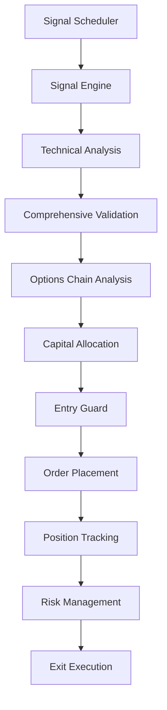

# Algo Scalper API

Rails 8 API backend for **autonomous algorithmic trading** powered by the DhanHQ API v2, specifically designed for **Indian index options trading** (NIFTY, BANKNIFTY, SENSEX).

## 🚀 Features

- **🤖 Fully Autonomous Trading**: Signal generation, option chain analysis, and automated order placement
- **📊 Real-time Market Data**: DhanHQ WebSocket integration for live quotes, LTP, and order updates
- **⚡ Low-latency Execution**: Direct `DhanHQ::Models::*` integration for minimal overhead
- **🛡️ Advanced Risk Management**: Comprehensive validation, trailing stops, and circuit breakers
- **📈 Technical Analysis**: Supertrend, ADX, and other indicators for signal generation
- **🎯 Smart Strike Selection**: ATM-focused option chain analysis with liquidity scoring
- **💰 Capital Management**: Dynamic allocation based on account size and risk parameters
- **🔄 Background Processing**: Solid Queue integration for reliable job processing
- **🤖 AI Integration**: OpenAI-powered trading analysis and strategy suggestions (optional)

---

## 🏗️ Architecture Overview

### Core Components

| Component                  | Purpose                    | Key Features                                          |
| -------------------------- | -------------------------- | ----------------------------------------------------- |
| **Signal Engine**          | Generate trading signals   | Supertrend + ADX analysis, comprehensive validation   |
| **Options Chain Analyzer** | Select optimal strikes     | ATM/ATM±1 focus, liquidity scoring, dynamic intervals |
| **Capital Allocator**      | Calculate position sizes   | Risk-based allocation, lot size compliance            |
| **Entry Guard**            | Prevent duplicate entries  | Exposure limits, cooldown periods                     |
| **Risk Manager**           | Monitor and exit positions | PnL tracking, trailing stops, daily limits            |
| **Market Feed Hub**        | Real-time data streaming   | WebSocket management, tick caching                    |

### Trading Flow


```mermaid
graph TD
    A[Signal Scheduler] --> B[Signal Engine]
    B --> C[Technical Analysis]
    C --> D[Comprehensive Validation]
    D --> E[Options Chain Analysis]
    E --> F[Capital Allocation]
    F --> G[Entry Guard]
    G --> H[Order Placement]
    H --> I[Position Tracking]
    I --> J[Risk Management]
    J --> K[Exit Execution]
```

---

## 🚀 Quick Start

### Prerequisites
- **Ruby 3.3.4**
- **PostgreSQL 14+**
- **Redis** (for Solid Queue)
- **DhanHQ API credentials**

### Setup

```bash
# Clone and setup
git clone <repository-url>
cd algo_scalper_api

# Install dependencies and prepare database
bin/setup --skip-server

# Create and migrate database
bin/rails db:prepare

# Copy environment template
cp .env.example .env
```

### Environment Configuration

Minimal `.env` setup:
```dotenv
# DhanHQ API Credentials (Required)
CLIENT_ID=your_client_id
DHAN_ACCESS_TOKEN=your_access_token

# Application Settings
RAILS_LOG_LEVEL=info
RAILS_MAX_THREADS=2
PORT=3000

# Database
ALGO_SCALPER_API_DATABASE_PASSWORD=your_password

# Redis (for Solid Queue)
REDIS_URL=redis://localhost:6379/0

# Trading Configuration
DHANHQ_ENABLED=true
DHANHQ_WS_ENABLED=true
DHANHQ_ORDER_WS_ENABLED=true

# Trading Mode (PAPER or LIVE)
PAPER_MODE=false  # Set to 'true' for paper trading, 'false' for live trading
```

### Start the Application

```bash
# Web API server (does not start trading services)
bin/dev

# Trading services (separate long-running process)
ENABLE_TRADING_SERVICES=true bundle exec rake trading:daemon

# Or just the Rails server
bin/rails server
```

---

## ⚙️ Configuration

### Trading Parameters (`config/algo.yml`)

```yaml
indices:
  NIFTY:
    key: "NIFTY"
    sid: "13"
    segment: "IDX_I"
    supertrend:
      multiplier: 3.0
      period: 10
    adx:
      min_strength: 18.0
    capital_alloc_pct: 0.30
    max_spread_pct: 3.0
    min_oi: 50000
    min_iv: 10.0
    max_iv: 60.0
```

### Environment Variables

| Variable                  | Purpose                                   | Default                    |
| ------------------------- | ----------------------------------------- | -------------------------- |
| `DHANHQ_ENABLED`          | Master toggle for DhanHQ integration      | `true`                     |
| `CLIENT_ID`               | DhanHQ API client ID                      | Required                   |
| `DHAN_ACCESS_TOKEN`     | DhanHQ API access token                   | Required                   |
| `DHANHQ_WS_ENABLED`       | Enable WebSocket market feed              | `true`                     |
| `DHANHQ_ORDER_WS_ENABLED` | Enable order update WebSocket             | `true`                     |
| `DHANHQ_WS_MODE`          | WebSocket mode (`quote`/`ticker`/`full`)  | `quote`                    |
| `PAPER_MODE`              | Trading mode (`true`=paper, `false`=live) | `false` (live)             |
| `RAILS_LOG_LEVEL`         | Application log level                     | `info`                     |
| `REDIS_URL`               | Redis connection URL                      | `redis://localhost:6379/0` |
| `TRADING_BOOT_RECONCILIATION_STRICT` | Fail daemon start when startup reconciliation fails (`true`/`false`) | `true` when market open, else `false` |

---

### Startup Reconciliation Safety

Trading daemon startup performs a broker-vs-DB reconciliation pass before starting risk/signal loops. This is handled by `Live::PositionSyncService.instance.force_sync!` and prevents stale DB-only state after restarts.

- During market hours, reconciliation failures are strict by default and block daemon startup.
- Outside market hours, strict mode defaults to false.
- Override with `TRADING_BOOT_RECONCILIATION_STRICT=true|false`.


## 📊 Trading System

### Options Buying Readiness

The engine is optimized for **long-only index options** execution:

- **Strike Selection**: `Options::ChainAnalyzer` narrows to ATM and neighbouring strikes while rejecting illiquid contracts to keep slippage manageable. It consumes the `indices` configuration in [`config/algo.yml`](config/algo.yml) to adapt thresholds per index.
- **Risk Controls**: `Live::RiskManagerService` enforces per-trade stop loss, target, and daily cut-offs before any order is placed.
- **Order Placement**: `Orders::PlacementService` prepares CE/PE bracket legs with stop loss and target prices when the broker allows; otherwise it schedules follow-up modify calls for protective exits.
- **Market Data Flow**: `Live::MarketFeedHub` subscribes to index quotes and open option positions so entry/exit decisions use fresh LTP data.

> **Warning:** Confirm `PAPER_MODE=true` and test on the sandbox before enabling live trades with `DHANHQ_ENABLED=true`.

To run pure options-buying strategies:

1. Set `trade_mode: buy_only` under each desired index in [`config/algo.yml`](config/algo.yml) to disable short legs.
2. Enable paper trading with `PAPER_MODE=true` in your `.env` while validating signal quality.
3. Start the scheduler (`bin/dev`) and monitor `log/trading.log` for strike, quantity, and guardrail summaries.
4. Flip to live mode only after verifying order tickets and broker credentials via `rails console` dry-runs.

### Paper Trading Mode

The system supports **two trading modes** via the `PAPER_MODE` environment variable:

#### Paper Trading (`PAPER_MODE=true`)
- **Simulated orders**: No real money is used
- **Virtual wallet**: Tracks capital, PnL, and positions locally
- **Live market data**: Uses real-time DhanHQ WebSocket feeds for prices
- **Performance reports**: Detailed statistics and analytics
- **Safe testing**: Perfect for strategy development and backtesting

#### Live Trading (`PAPER_MODE=false`)
- **Real orders**: Places actual trades through DhanHQ API
- **Real money**: Uses your actual DhanHQ account funds
- **Position tracking**: Monitored via DhanHQ position API
- **Production mode**: Use with caution and proper risk management

**Usage:**

```bash
# Enable paper trading
export PAPER_MODE=true
bin/dev

# Enable live trading (default)
export PAPER_MODE=false
bin/dev
```

**Important Notes:**
- Paper trading uses the same PositionTracker model for position tracking
- All risk management rules apply to paper positions
- Market data comes from live WebSocket feeds
- Only order execution is simulated
- Initialize wallet once: `PaperWallet.wallet` (auto-created on first trade)

### Signal Generation

The system generates trading signals using:

1. **Supertrend Indicator**: Identifies trend direction and strength
2. **ADX Analysis**: Confirms trend momentum
3. **Comprehensive Validation**: 5-layer validation system
   - IV Rank assessment
   - Theta risk evaluation
   - ADX strength confirmation
   - Trend confirmation
   - Market timing validation

### Option Chain Analysis

Smart strike selection with:
- **ATM Focus**: Prioritizes At-The-Money strikes
- **Directional Logic**: ATM+1 for bullish, ATM-1 for bearish
- **Liquidity Scoring**: Advanced scoring based on OI, spread, delta
- **Dynamic Intervals**: Automatic strike interval detection
- **Risk Filtering**: IV, OI, and spread-based filtering

### Risk Management

Multi-layered risk protection:
- **Position Limits**: Maximum 3 positions per derivative
- **Capital Allocation**: Dynamic sizing based on account balance
- **Trailing Stops**: 5% trailing stop from high-water mark
- **Daily Limits**: Circuit breaker on excessive losses
- **Cooldown Periods**: Prevents rapid re-entry

---

## 🔧 API Endpoints

### Health Check
```http
GET /api/health
```

Response:
```json
{
  "status": "healthy",
  "timestamp": "2025-10-12T13:44:59+0530",
  "services": {
    "database": "connected",
    "redis": "connected",
    "dhanhq": "enabled",
    "websocket": "connected",
    "circuit_breaker": "normal"
  },
  "trading": {
    "active_positions": 0,
    "total_pnl": 0.0,
    "daily_pnl": 0.0
  }
}
```

---

## 🛠️ Development

### Code Quality
```bash
# Format and lint
bin/rubocop

# Security scan
bin/brakeman --no-pager

# Run tests
bin/rails test
```

### Database Management
```bash
# Create and migrate
bin/rails db:create db:migrate

# Seed with sample data
bin/rails db:seed

# Reset database
bin/rails db:reset
```

### Instrument Management
```bash
# Import instrument catalog
bin/rails instruments:import

# Check instrument status
bin/rails instruments:status

# Clear and reimport
bin/rails instruments:reimport
```

---

## 📁 Project Structure

```
app/
├── controllers/api/          # API endpoints
├── models/                   # Domain models
│   ├── concerns/            # Model extensions
│   └── *.rb                 # Core models
├── services/                 # Business logic
│   ├── signal/              # Signal generation
│   ├── options/              # Option chain analysis
│   ├── capital/              # Capital management
│   ├── entries/              # Entry management
│   ├── orders/               # Order placement
│   ├── live/                 # Real-time services
│   └── risk/                 # Risk management
├── jobs/                     # Background jobs
└── lib/                      # Shared utilities
    ├── algo_config.rb        # Configuration loader
    └── market/               # Market utilities

config/
├── algo.yml                  # Trading configuration
├── initializers/             # App initialization
└── routes.rb                 # API routes

docs/                         # Documentation
├── index.md                  # Canonical docs index
├── guides/                   # User/integration guides
└── reports/                  # Consolidated review notes and analyses
```

---

## 🔍 Monitoring & Debugging

### Logs
The application provides comprehensive logging:
- **Signal Analysis**: Detailed signal generation logs
- **Option Chain**: Strike selection and filtering logs
- **Risk Management**: PnL tracking and exit decisions
- **Order Management**: Order placement and updates

### Health Monitoring
- Real-time health endpoint
- Circuit breaker status
- WebSocket connection status
- Position and PnL tracking

---

## 🚨 Troubleshooting

### Common Issues

**DhanHQ Authentication Errors**
```bash
# Check credentials
echo $CLIENT_ID
echo $DHAN_ACCESS_TOKEN

# Verify environment
bin/rails runner "puts Rails.application.config.x.dhanhq"
```

**WebSocket Connection Issues**
- Check if market is open (9:15 AM - 3:30 PM IST)
- Verify `DHANHQ_WS_ENABLED=true`
- Check for rate limiting (429 errors)

**Database Connection**
```bash
# Test database connection
bin/rails runner "puts ActiveRecord::Base.connection.active?"
```

**Redis Connection**
```bash
# Test Redis connection
bin/rails runner "puts Redis.current.ping"
```

---

## 📚 Documentation

- **[Documentation Index](docs/index.md)**: Canonical entrypoint for all docs, reports, runbooks, and guides
- **[DhanHQ Integration Guide](docs/guides/dhanhq-client.md)**: Complete DhanHQ API reference
- **[Repository Guidelines](AGENTS.md)**: Development guidelines and best practices

---

## 🤝 Contributing

1. Follow the coding standards in `.rubocop.yml`
2. Run tests before submitting: `bin/rails test`
3. Update documentation for new features
4. Use conventional commit messages

---

## 📄 License

This project is licensed under the MIT License - see the LICENSE file for details.

---

## ⚠️ Disclaimer

This software is for educational and research purposes only. Trading involves substantial risk of loss and is not suitable for all investors. Past performance is not indicative of future results. Always consult with a qualified financial advisor before making investment decisions.