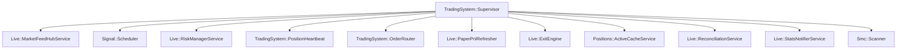

# Component Map

Deep dive into the internal services and engines.

## Core Component Groups

### 1. Signal & Strategy Engine
- **Responsibility**: Analyzing price action and indicators to identify high-probability entries.
- **Key Files**:
  - `app/services/signal/engine.rb` — orchestrates the full signal pipeline (13 numbered steps)
  - `app/services/signal/scheduler.rb` — 30s polling loop per index
  - `app/services/indicators/supertrend.rb`, `adx_indicator.rb`
  - `app/services/signal/trend_scorer.rb` — multi-indicator trend score

### 2. Entry Guard Pipeline
- **Responsibility**: Gate every potential entry through 20 sequential guards.
- **Key Files**:
  - `app/services/entries/entry_guard_pipeline.rb` — registers 20 guards; first block wins
  - `app/services/entries/entry_guard.rb` — orchestrates pipeline + post-pipeline checks
  - `app/services/entries/guards/*.rb` — individual guard implementations

**Pipeline order** (see `entry_guard_pipeline.rb`):

| # | Guard | Notes |
|---|-------|-------|
| 1 | `DrawdownGuard` | Portfolio-level drawdown |
| 2 | `EntryPolicyGuard` | Policy enforcement |
| 3 | `CircuitBreakerGuard` | Redis-backed kill switch |
| 4 | `MiddayQualityGuard` | `trending_adx_bypass: 28` — skip if ADX >= 28 |
| 5 | `EdgeFailureGuard` | Pause when edge lost for index |
| 6 | `LossStreakGuard` | Consecutive loss threshold |
| 7 | `DailyLimitsGuard` | Daily trade/loss/profit caps |
| 8 | `MaxConcurrentGuard` | Max simultaneous positions |
| 9 | `InstrumentLookupGuard` | Sets context[:instrument] |
| 10 | `LtpResolutionGuard` | Sets context[:ltp] |
| 11 | `ExpiryWeekPowerTrendGuard` | Enriches context[:expiry_power_trend]; never blocks |
| 12 | `TimeRegimeGuard` | Bypassed when expiry_power_trend = true |
| 13 | `BankniftyLastWeekGuard` | BANKNIFTY: only last week before monthly expiry |
| 14 | `WeeklyExpiryGuard` | Weekly contract requirement |
| 15 | `BosStructureGuard` | Break-of-Structure requirement |
| 16 | `ExposureGuard` | Max same-side positions per index |
| 17 | `CooldownGuard` | Per-symbol cooldown |
| 18 | `SizingGuard` | Capital sizing gate |
| 19 | `RiskPolicyGuard` | Risk policy compliance |
| 20 | `SmcNavigatorGuard` | SMC alignment check |

### 3. Risk & Exit Engine
- **Responsibility**: Protecting capital through real-time monitoring of active positions via two concurrent paths.
- **Key Files**:
  - `app/services/live/risk_manager_service.rb` (+ `runner.rb`, `exit_enforcement.rb`, `exit_execution.rb`, `config.rb`, `pnl_cache.rb`)
  - `app/services/live/unified_exit_checker.rb` — per-tick priority evaluation
  - `app/services/live/exit_engine.rb` — single source of truth for exit placement
  - `app/services/risk/circuit_breaker.rb` — Redis-backed global kill switch
  - `app/services/risk/rules/*.rb` — individual exit rule engines

**Exit paths by origin**:

Per-tick (`UnifiedExitChecker`): early_trend_failure → stop_loss → take_profit → trailing_stop → time_based

5s loop (`RiskManagerService`): premium_r_stop → dynamic_trailing → profit_floor → structure_invalidation → premium_momentum_failure → rr_profit_booking → percentage_pnl_exit → time_stop → time_based_exit

### 4. Execution & Order Engine
- **Responsibility**: Routing and executing broker-side commands.
- **Key Files**:
  - `app/services/orders/gateway_factory.rb` — selects paper or live at boot
  - `app/services/orders/gateway_live.rb` — real DhanHQ execution with retry + token auto-heal
  - `app/services/orders/gateway_paper.rb` — simulated fills with synthetic order fills
  - `app/services/orders/placer.rb` — DhanHQ API calls, idempotency, `PLACE_ORDER` safety gate
  - `app/services/trading_system/order_router.rb` — routes to gateway

### 5. Market Data Engine
- **Responsibility**: Real-time tick ingestion and caching.
- **Key Files**:
  - `app/services/live/market_feed_hub.rb` — DhanHQ WebSocket singleton
  - `app/services/live/market_feed_hub_service.rb` — Supervisor adapter
  - `app/services/live/tick_cache.rb` — write-through memory + Redis
  - `app/services/live/redis_tick_cache.rb` — Redis persistence keyed by `segment:security_id`
  - `app/services/live/tick_query.rb` — authoritative LTP read boundary (returns nil on miss)
  - `app/services/live/pnl_updater_service.rb` — 250ms PnL flush

### 6. Options Analysis
- **Responsibility**: Strike selection and chain analysis.
- **Key Files**:
  - `app/services/options/chain_analyzer.rb` — ATM±1 scoring, liquidity, OI, IV
  - `app/services/options/derivative_chain_analyzer.rb` — expiry resolution
  - `app/services/options/gamma_ramp_detector.rb` — gamma pressure detection
  - `app/services/options/index_rules/` — per-index rules (nifty, banknifty, sensex)
  - `app/services/adapters/option_chain/dhan_adapter.rb` — live chain fetch (always wired, even in paper)

### 7. Capital Allocation
- **Responsibility**: Position sizing.
- **Key Files**:
  - `app/services/capital/allocator.rb` — rupee-based and percentage-based sizing
  - `app/services/capital/dynamic_risk_allocator.rb` — trend-score-based dynamic risk
  - `app/services/trading/capital_allocator.rb` — lot calculation

### 8. Smart Money Concepts (SMC)
- **Responsibility**: Institutional market structure detection.
- **Key Files**:
  - `app/services/smc/scanner.rb` — 5-minute pattern detection loop
  - `app/services/smc/bias_engine.rb` — directional bias computation
  - `app/services/smc/detectors/` — FVG, order blocks, liquidity, structure detectors

### 9. AI Layer (Optional)
- **Responsibility**: LLM-powered technical analysis.
- **Key Files**:
  - `lib/services/ai/ollama_client.rb` — wraps `Ollama::Client` (chat, generate, stream)
  - `lib/services/ai/technical_analysis_agent.rb` — multi-turn analysis agent
  - `lib/services/ai/technical_analysis_agent/` — agent components (executor, tools, prompts)
- **Provider**: Ollama (local LLM) via `ollama-client` gem (`~> 1.1`). OpenAI removed.

### 10. Market Context (Optional Alpha)
- **Responsibility**: Optional signal enrichment and hard gate before entry.
- **Key Files**:
  - `app/services/market_context/regime_composer.rb` — builds `RegimeSnapshot`
  - `app/services/market_context/regime_snapshot.rb` — conviction score value object
  - `app/services/options/chain_signal_extractor.rb` — chain-side confirmation
  - `app/services/trading/market_permission_gate.rb` — optional hard block
  - `app/services/trading/strategy_profile_selector.rb` — maps snapshot to trailing profile
- **Default**: `market_context.enabled: false` — no behavior until enabled.

---

## Service Registry (The Supervisor)

Services are registered in `lib/trading_system/bootstrap.rb` and managed by `lib/trading_system/supervisor.rb`.

---

## Cross-Cutting Concerns

### Redis Keys
- Tick cache: `segment:security_id` (write-through, TTL-based)
- PnL cache: per `tracker_id` (30s DB sync throttle)
- Circuit breaker: `risk:circuit_breaker` (persists across restarts)
- Position HWM: per `tracker_id` (high-water mark)

### Configuration Layers (merge order)
1. `config/algo.yml` — base config
2. `config/profiles/<run_mode>.yml` — run mode overrides
3. DB `settings` table — hot config changes without restart (30s cache)

### Percentage Format
All percentage values in `config/algo.yml` use **DECIMAL format**: `0.12` = 12%, `0.05` = 5%.

### Idempotency Requirements
- WebSocket handlers must be idempotent (feed can reconnect and replay)
- Exit orders use deterministic `exit_coid` (client order IDs) for retry safety
- `Orders::Placer` checks existing orders before placement

### Locked vs Alpha Layers
- **LOCKED** (do not change without critical scenario): DhanHQ integration, WebSocket/market data/caching, position lifecycle, core order execution, risk-manager plumbing, process wiring, instrument/chain plumbing.
- **ALPHA** (safe to iterate): signal/*, indicators/*, entries/*, capital/allocator, exit conditions (not plumbing), risk rules, options decision logic.
