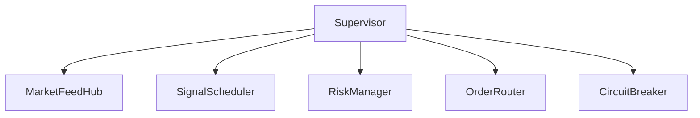

# C3: Component Map

Deep dive into the internal services and engines.

## Core Component Groups

### 1. Signal & Strategy Engine
- **Responsibility**: Analyzing price action and indicators to identify high-probability entries.
- **Key Files**:
    - `app/services/signal/engine.rb`
    - `app/services/signal/scheduler.rb`
    - `app/services/indicators/`

### 2. Risk & Exit Engine
- **Responsibility**: Protecting capital through real-time monitoring of active positions.
- **Key Files**:
    - `app/services/live/risk_manager_service.rb`
    - `app/services/live/unified_exit_checker.rb`
    - `app/services/risk/circuit_breaker.rb`

### 3. Execution & Order Engine
- **Responsibility**: Routing and executing broker-side commands.
- **Key Files**:
    - `app/services/trading_system/order_router.rb`
    - `app/services/orders/placer.rb`
    - `app/services/orders/gateway.rb`

### 4. Market Data Engine
- **Responsibility**: Real-time tick ingestion and caching.
- **Key Files**:
    - `app/services/live/market_feed_hub.rb`
    - `app/services/live/tick_cache.rb`

## Service Registry (The Supervisor)
Services are registered in `lib/trading_system/bootstrap.rb` and managed by `lib/trading_system/supervisor.rb`.

