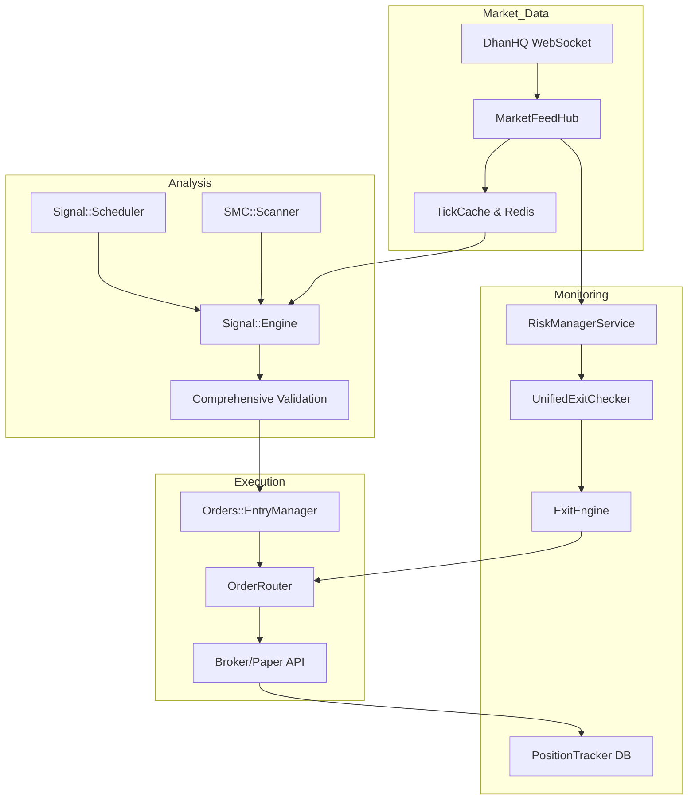
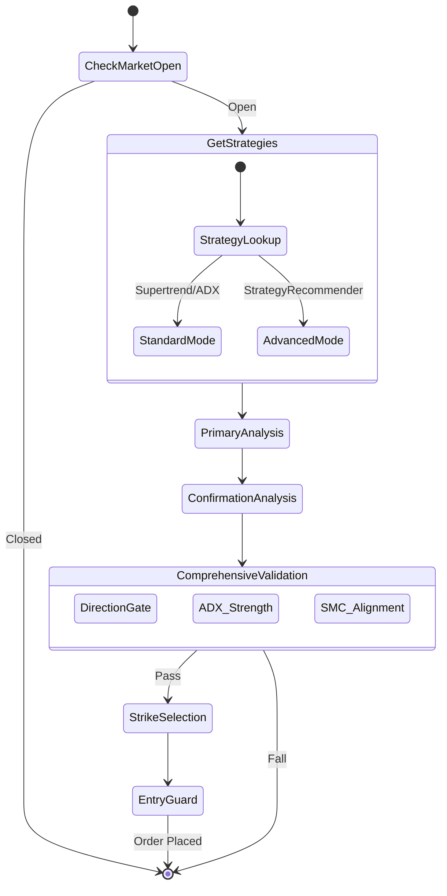
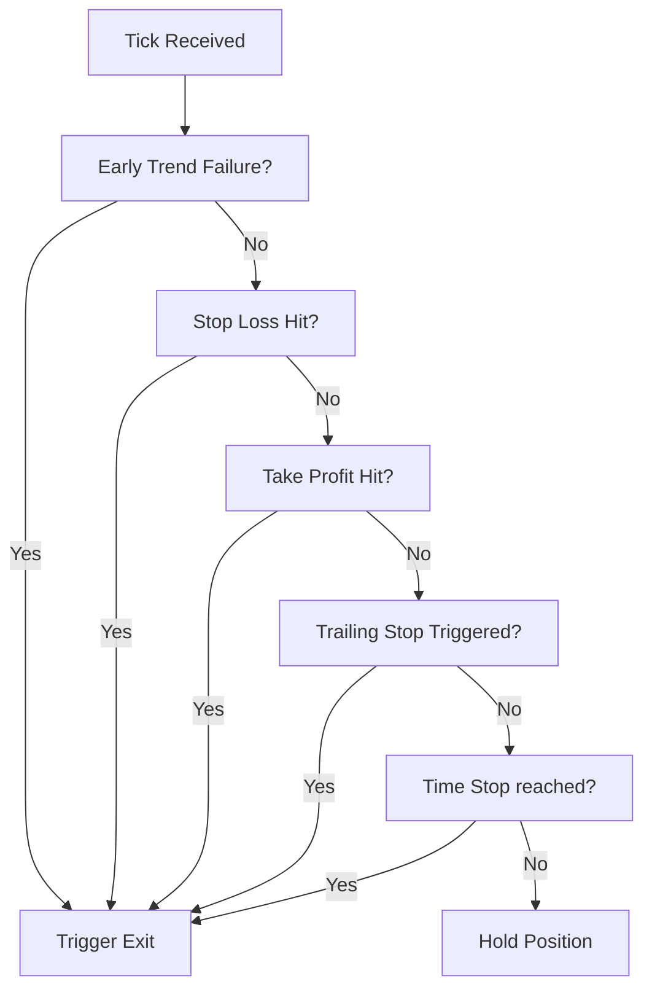

# System Architecture Diagrams

This document points to the **canonical diagram set** and keeps a few legacy diagrams for quick reference.

## Canonical diagrams (C4, flows, architecture)

**Full set:** [diagrams/complete-system-diagrams.md](diagrams/complete-system-diagrams.md)

- **C4 Level 1** — System context (Trader, DhanHQ, Telegram, optional Authority/Ollama)
- **C4 Level 2** — Containers (Web, Trading Daemon, Jobs, Dashboard, PostgreSQL, Redis)
- **C4 Level 3** — Components (Supervisor + 11 services, Web API + ActionCable)
- **High-level process model** — ASCII view of `bin/dev` (4 processes)
- **End-to-end flow** — Signal → Entry (10 guards) → Order → Position → Exit (per-tick + 5s)
- **Data flow** — Ticks → PnL pipeline → RedisPnlCache → RiskManager → ExitEngine
- **Entry guard pipeline** — Order of 10 guards
- **Exit decision flow** — UnifiedExitChecker + run_enforcement_cycle

**Index:** [diagrams/README.md](diagrams/README.md)

**Trading modes (run profiles, paper/live, env flags):**
[../diagrams/trading-modes.md](../diagrams/trading-modes.md)

---

## Quick reference (legacy)

### 1. High-Level Logic Flow
Visualizing the 10,000ft view of the system from Data to Execution.

## 2. Signal Generation Pipeline
The internal logic of `Signal::Engine`.

## 3. Risk Management Hierarchy (Exit Priority)
The decision tree used by `UnifiedExitChecker`.

