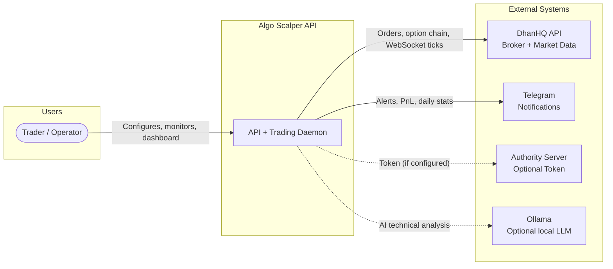
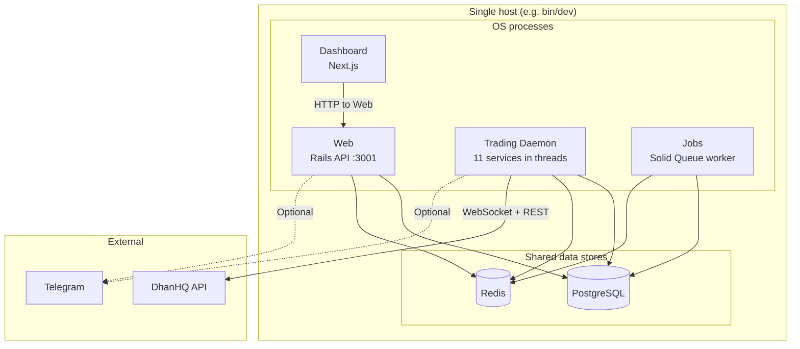
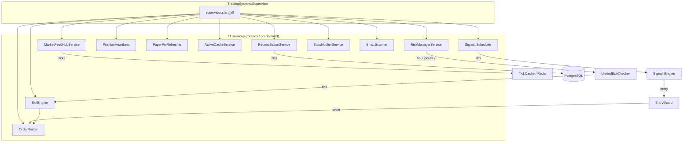
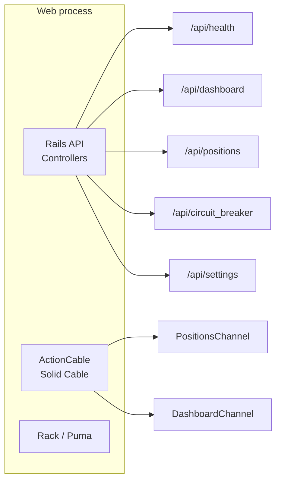
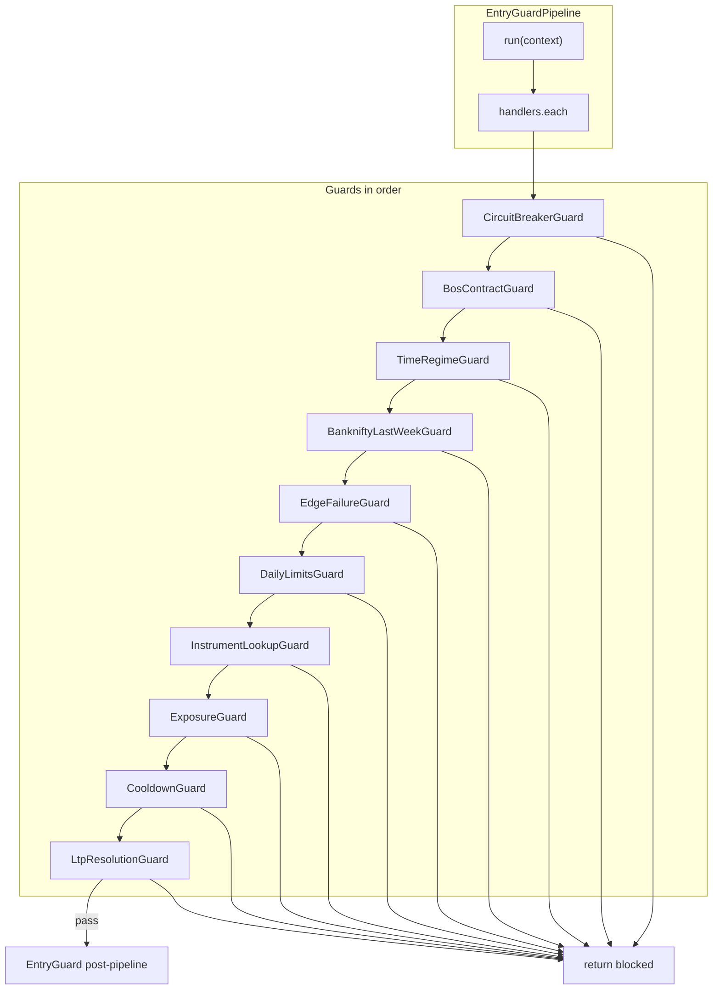
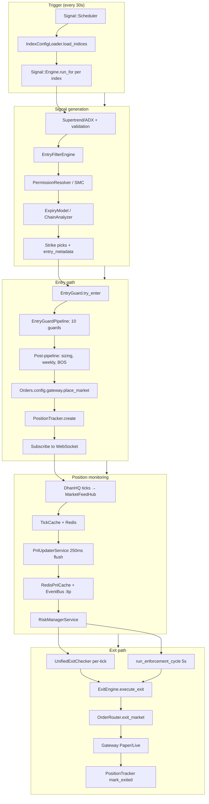
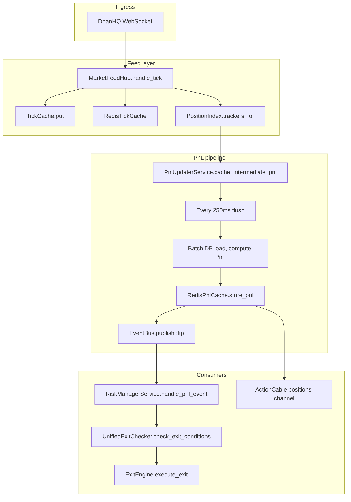
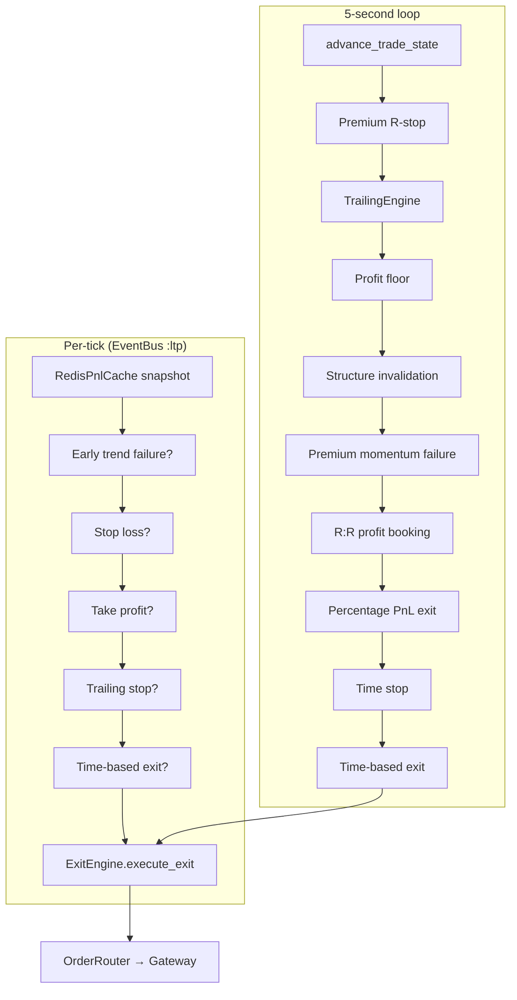

# Complete System Diagrams

Diagrams derived from the current Algo Scalper API codebase: C4 (Level 1–3), high-level architecture, and end-to-end/data flows. Implementation references: `lib/trading_system/bootstrap.rb`, `Procfile.dev`, `app/services/entries/entry_guard_pipeline.rb`, `app/services/live/unified_exit_checker.rb`, `app/services/live/risk_manager_service/runner.rb`.

---

## 1. C4 Level 1 — System Context

Who uses the system and which external systems it talks to.



**Elements:**
- **Trader:** Configures `algo.yml`, views dashboard, uses `/api/circuit_breaker`, health, settings.
- **DhanHQ:** Orders (REST), option chain, WebSocket market feed + order updates.
- **Telegram:** Trade alerts, PnL milestones, daily stats, SMC signals.
- **Authority server:** Optional; provides Dhan access token (`TRADER_API_BASE_URL/auth/dhan/token`).
- **Ollama:** Optional local LLM (`ollama-client`); used by `AiTechnicalAnalysisJob` and related AI paths for NIFTY/SENSEX.

---

## 2. C4 Level 2 — Containers

Deployable runnables and shared data stores. Aligned with `Procfile.dev` and deployment (web + trading + jobs + dashboard).



**Containers:**
- **Web:** Rails API (Puma), ActionCable, health, dashboard API, circuit breaker, settings. Does **not** run trading services.
- **Trading Daemon:** Single process; `TradingSystem::Supervisor` runs 11 services in threads. Market feed, signal scheduler, risk manager, exit engine, reconciliation, etc.
- **Jobs:** Solid Queue worker; `InstrumentsImportJob`, `SmcScannerJob`, `AiTechnicalAnalysisJob`.
- **Dashboard:** Next.js frontend; consumes Web API.
- **PostgreSQL:** Durable state (instruments, derivatives, position_trackers, candles, settings, etc.).
- **Redis:** Tick cache, PnL cache, circuit breaker, position state, rate limits.

---

## 3. C4 Level 3 — Components

### 3a. Trading Daemon (components)

Services registered in `lib/trading_system/bootstrap.rb` and started by `TradingSystem::Supervisor`.



| # | Key | Component | Cadence |
|---|-----|-----------|---------|
| 1 | :market_feed | Live::MarketFeedHubService | WebSocket event-driven |
| 2 | :signal_scheduler | Signal::Scheduler | 30s |
| 3 | :risk_manager | Live::RiskManagerService | 5s loop + per-tick EventBus |
| 4 | :position_heartbeat | TradingSystem::PositionHeartbeat | 10s |
| 5 | :order_router | TradingSystem::OrderRouter | On-demand |
| 6 | :paper_pnl_refresher | Live::PaperPnlRefresher | 1s (paper) |
| 7 | :exit_manager | Live::ExitEngine | On-demand |
| 8 | :active_cache | Positions::ActiveCacheService | On-demand |
| 9 | :reconciliation | Live::ReconciliationService | 30s |
| 10 | :stats_notifier | Live::StatsNotifierService | At market close |
| 11 | :smc_scanner | Smc::Scanner | 5 min |

### 3b. Web process (components)



---

## 4. C4 Level 4 — Code (sample)

One code-level view: entry guard pipeline and its guard classes. Implementation: `app/services/entries/entry_guard_pipeline.rb`, `app/services/entries/guards/*.rb`.



**Key classes:**
- `Entries::EntryGuardPipeline` — holds default_handlers array, invokes each guard with context.
- `Entries::Guards::*Guard` — each implements `.call(context)` → `PASS` or `{ blocked: reason }`.
- `Entries::EntryGuard` — builds context, calls `entry_guard_pipeline.run(context)`, then post-pipeline checks and `place_market`.

---

## 5. High-Level Process Model

What `./bin/dev` (Procfile.dev) starts. Web and Trading are separate OS processes; they share PostgreSQL and Redis only.

```
┌─────────────────────────────────────────────────────────────────────────┐
│ bin/dev (foreman)                                                       │
├────────────────┬────────────────┬────────────────┬─────────────────────┤
│ web             │ trading        │ jobs           │ dashboard           │
│ bin/rails       │ ENABLE_...=true│ bin/jobs       │ cd dashboard        │
│ server -p 3001  │ rake           │                │ npm run dev         │
│                 │ trading:daemon │                │                     │
├─────────────────┼────────────────┼────────────────┼─────────────────────┤
│ Rails API       │ Supervisor     │ Solid Queue    │ Next.js             │
│ ActionCable     │ 11 services    │ recurring      │ frontend            │
│ port 3001      │ in threads     │ tasks          │                     │
└────────┬────────┴───────┬────────┴───────┬────────┴─────────────────────┘
         │                │                │
         └────────────────┼────────────────┘
                           │
                    ┌──────┴──────┐
                    │ PostgreSQL  │
                    │ Redis       │
                    └─────────────┘
```

---

## 6. End-to-End Flow: Signal to Exit

Single trade lifecycle from signal generation to exit order.



---

## 7. Data Flow: Ticks and PnL

How market ticks become PnL and drive exit decisions.



---

## 8. Entry Guard Pipeline (component-level)

Order of the 10 guards; first block wins.

```mermaid
flowchart LR
    A[Context] --> G1[1. CircuitBreaker]
    G1 --> G2[2. BosContract]
    G2 --> G3[3. TimeRegime]
    G3 --> G4[4. BankniftyLastWeek]
    G4 --> G5[5. EdgeFailure]
    G5 --> G6[6. DailyLimits]
    G6 --> G7[7. InstrumentLookup]
    G7 --> G8[8. Exposure]
    G8 --> G9[9. Cooldown]
    G9 --> G10[10. LtpResolution]
    G10 --> Pass[PASS → post-pipeline]
```



---

## 9. Exit Decision Flow (high-level)

Two paths: per-tick (UnifiedExitChecker) and 5s enforcement cycle.



---

## References

- **Bootstrap:** `lib/trading_system/bootstrap.rb`
- **Processes:** `Procfile.dev`
- **Entry guards:** `app/services/entries/entry_guard_pipeline.rb`
- **Exit (per-tick):** `app/services/live/unified_exit_checker.rb`
- **Exit (5s):** `app/services/live/risk_manager_service/runner.rb`, `exit_enforcement.rb`
- **Trade lifecycle:** `docs/architecture/execution-flow.md`
- **Entry/exit rules:** `docs/trading/entry_and_exit_rules.md`
