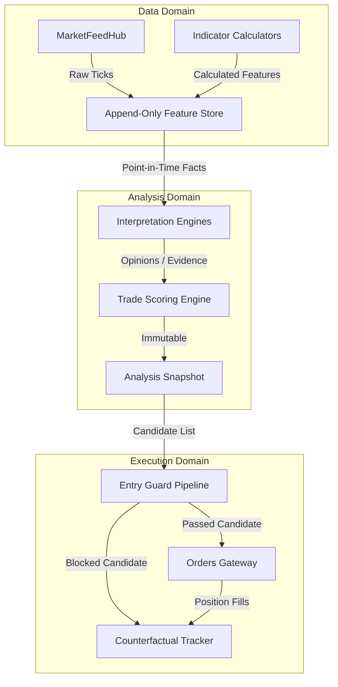

# Market Intelligence Platform v1.0 Architectural Blueprint

This document details the architectural design and refactoring blueprint to transition the options scalping system from its current legacy options buying implementation to the **Market Intelligence Platform v1.0**.

---

## 1. Implementation Audit of Existing Subsystems

An implementation audit of the current repository was performed. The following table identifies all active subsystems, classifies their path forward for v1.0, and provides rationale for the classification.

| Subsystem | Existing Component(s) | Classification | Explanation & Rationale |
| :--- | :--- | :--- | :--- |
| **1. Feed Services** | `Live::MarketFeedHubService`, `OptionsBuying::StreamConsumer`, `OptionsBuying::StreamWriter` | **EXTEND / REPLACE** | **REUSE** the core `Live::MarketFeedHubService` as it is a LOCKED infrastructure singleton. **REPLACE** `OptionsBuying::StreamWriter` and `OptionsBuying::StreamConsumer` with the new append-only `FeatureStore` writer and consumer. |
| **2. Indicator Services** | `Indicators::SMC`, ADX, RSI, `OptionsBuying::VwapCalculator`, `OptionsBuying::TickMetrics`, `OptionsBuying::AtrCompressionChecker` | **EXTEND** | **REUSE** math-heavy calculators (`SMC`, `ADX`, `RSI`). **EXTEND** `TickMetrics` and `AtrCompressionChecker` to write calculated indicators to the append-only `FeatureStore` as facts rather than writing to mutable Redis keys directly. |
| **3. Option-Chain Logic** | `Adapters::OptionChain::DhanAdapter`, `Options::DerivativeChainAnalyzer`, `OptionsBuying::ChainRadar` | **EXTEND** | **REUSE** locked adapters (`DhanAdapter`, `DerivativeChainAnalyzer`). **EXTEND** `ChainRadar` to output a list of qualified candidates with calculated features and option ranking scores to populate the `strike_ranking` in `AnalysisSnapshot`. |
| **4. Signal Generation** | `Signal::Engine`, `Signal::Scheduler`, `OptionsBuying::StrategyEngine`, `OptionsBuying::Strategies::*` | **REPLACE** | **REPLACE** `OptionsBuying::StrategyEngine` and strategy subclasses (e.g., `OrbBreakout`, `TripleTfAlignment`) with specialized, strategy-independent `InterpretationEngines` that output `Evidence` structures. |
| **5. Risk Services** | `Live::RiskManagerService`, `Live::UnifiedExitChecker`, `Live::TrailingEngine`, `OptionsBuying::CarryPolicy`, `OptionsBuying::EodCarryManager`, `OptionsBuying::SlippageChecker` | **EXTEND** | **REUSE** core execution risk plumbing (`RiskManagerService`, `UnifiedExitChecker`, `TrailingEngine`). **EXTEND** `SlippageChecker` and carry policies to run inside the Execution Domain on abstract Candidates. |
| **6. Execution FSM** | `Entries::OrderExecutionService`, `Live::RiskManagerService::ExitExecution`, `Entries::EntryGuard` | **EXTEND** | **REUSE** core transactional pipeline. **EXTEND** `EntryGuard` by adding a `TradeScoringEngineGuard` which verifies `AnalysisSnapshot` availability and composite scoring validation. |
| **7. Order Gateway** | `Orders::Gateway`, `Orders::GatewayLive`, `Orders::GatewayPaper`, `Orders::GatewayFactory` | **REUSE** | **REUSE** as-is. These are LOCKED infrastructure interfaces. |
| **8. Persistence** | `OptionsBuying::StateStore` (Redis keys), `OptionsBuying::PerformanceDb` (exited positions), `PositionTracker` (PG) | **REPLACE / EXTEND** | **REPLACE** mutable Redis keys in `StateStore` with append-only streams. **EXTEND** `PerformanceDb` and `PositionTracker` to support counterfactual tracking for both executed and blocked candidates. |
| **9. Replay / Backtest** | `Backtest::MarketReplayer`, `Backtest::SignalGeneratorBacktester`, `Backtest::SmcReplayRunner` | **EXTEND** | **EXTEND** the backtesters to support the new **Research Mode**, routing historical ticks through the exact same feature calculation, interpretation, and scoring pipeline. |

---

## 2. Bounded Context Separation

To eliminate tight coupling between data ingestion, signal evaluation, and order routing, the v1.0 architecture establishes three strict bounded contexts:



### 1. Data Domain (Facts)
* **Responsibility**: Ingestion, aggregation, and caching of raw data and basic mathematical indicators.
* **Outputs**: Pure objective facts (e.g., LTP, Volume Delta, Bid-Ask Spread, raw RSI, ADX).
* **Guarantees**: Read-only to downstream engines; write-only via append-only streams. No trading logic.

### 2. Analysis Domain (Opinions & Strategy)
* **Responsibility**: Interpreting facts, forming opinions, scoring market structure, ranking option strikes, and generating trade candidates.
* **Outputs**: `AnalysisSnapshot` (containing the feature vector and strike ranking) and `Candidate` structures.
* **Guarantees**: Completely decoupled from execution. It does not know if a candidate will be traded, or which gateway is active.

### 3. Execution Domain (Action & Tracking)
* **Responsibility**: Lifecycle management of trade entries and exits, risk guard checks, capital allocation, and order transmission.
* **Outputs**: Order placement, position state tracking, and counterfactual analysis logging.
* **Guarantees**: Cannot bypass the `TradeScoringEngine` scoring gates. Records performance metrics on both active and blocked candidates.

---

## 3. Facts vs. Opinions (The Feature/Interpretation Divide)

In the legacy design, strategies directly checked indicators and made immediate buy/sell decisions (e.g. `orb_breakout.rb` checking both time, range, and volume inline and calling `arm_breakout!`). v1.0 separates this into **Facts** (Feature Store) and **Opinions** (Interpretation Engines).

### Objective Facts (Feature Store)
* A fact is an indisputable data point.
* Examples: 
  * "Underlying NIFTY spot price is 24,350.25."
  * "14-period RSI on 5-minute chart is 72.5."
  * "Volume delta over the last 5 ticks is +12,500 shares."
* Facts are stored in the append-only `FeatureStore`.

### Evaluative Opinions (Interpretation Engines)
* An opinion is a subjective evaluation of one or more facts.
* Examples:
  * **Trend Interpretation**: "ADX is 28 and RSI is 72.5, which indicates a *strong bullish expansion*."
  * **Liquidity Interpretation**: "Bid-Ask spread is 0.003 and volume rate is 800/min, suggesting *excellent execution liquidity*."
  * **Gamma Wall Interpretation**: "Spot is 24,350 and nearest CE wall is 24,500, indicating *plenty of room to run before resistance*."
* Interpretation Engines read facts and return structured **Evidence** (detailing support direction, confidence, and hard vetoes).

---

## 4. Versioned Analysis Snapshot & Evidence Structures

Every evaluation cycle creates a versioned, immutable `AnalysisSnapshot`. This snapshot records the exact state of the market, the calculated indicators, and the strike ranking.

### Versioned Analysis Snapshot Structure
The `AnalysisSnapshot` is a Struct or Dry::Struct value object:
* `id` (UUIDv4): Unique identifier.
* `sequence` (Integer): Microsecond epoch timestamp for ordering and point-in-time recovery.
* `market_snapshot` (Hash): Raw index spot tick, volumes, bid-ask.
* `feature_vector` (Hash): Calculated indicators (RSI, ADX, VWAP, ATR, ATR Compression Ratio).
* `context` (Hash): Time of day, days to expiry (DTE), active parameter settings.
* `regime` (Symbol): E.g., `:trending_bullish`, `:trending_bearish`, `:ranging`, `:choppy`, `:compression`.
* `structure` (Hash): SMC Navigator details (BOS, CHoCH, Order Blocks, FVGs).
* `oi_state` (Hash): Raw OI, net OI delta, rate of change.
* `iv_state` (Hash): VIX level, IV Percentile, IV Skew.
* `strike_ranking` (Array of Hashes): Ordered list of strikes, each with a qualification score.

### Evidence Structure (Replacing GateResult)
Instead of binary pass/fail gates, each `InterpretationEngine` outputs an `Evidence` value object:
* `supports_long` (Boolean): Does this engine favor a long entry?
* `supports_short` (Boolean): Does this engine favor a short entry?
* `confidence` (Float): Confidence score between `0.0` and `1.0`.
* `hard_constraint` (Boolean): If true, a negative evaluation acts as an absolute veto.
* `reason` (String): Human/AI-readable explanation.
* `inputs` (Hash): The exact slices of the `FeatureStore` or `AnalysisSnapshot` used, ensuring absolute auditability.

---

## 5. Strategy Independence & Candidate Flow

Signals and analysis generate abstract `Candidate` structures rather than binding to concrete option contracts early on.

```
[Raw Ticks/Facts] 
       │
       ▼
[Interpretation Engines] 
       │
       ▼ (Evidence)
[TradeScoringEngine]
       │
       ▼
┌──────────────────────────────────────────────┐
│ Candidate Value Object                       │
│  - index_key: :NIFTY                         │
│  - direction: :long                          │
│  - confidence: 0.88                          │
│  - strike_ranking: [CE 24300, CE 24350]      │
│  - snapshot_id: "c8f2a1b9-..."               │
└──────────────────────────────────────────────┘
       │
       ▼
[Execution Domain (EntryGuard / Capital Allocator)]
       │
  ┌────┴────────────────────────┐
  ▼                             ▼
(Naked Option Purchase)      (Option Credit Spread)
```

By decoupling the market condition evaluation from the trade implementation:
1. The **Analysis Domain** determines *what* direction and *which* strikes are viable.
2. The **Execution Domain** determines *how* to play it based on account size, margin, and slippage. (E.g. buying a naked CE during high volatility vs. entering a debit spread).

---

## 6. Counterfactual Tracking & Sizing Engine

To optimize strategies and eliminate survival bias, the system tracks **all** generated `Candidate` objects, regardless of whether they were executed, blocked by risk limits, or filtered out due to low composite scores.

### Counterfactual Tracking
When a `Candidate` is generated, a counterfactual worker is spawned (or monitored in Redis):
* **Executed Candidates**: Linked to a real `PositionTracker` and monitored normally.
* **Blocked Candidates**: Monitored synthetically using live tick data for a duration equivalent to the strategy's time-stop or target exit.

#### Collected Counterfactual Metrics:
* **Max Favorable Excursion (MFE)**: The maximum hypothetical profit percentage reached during the candidate's simulated lifetime.
* **Max Adverse Excursion (MAE)**: The maximum hypothetical loss percentage reached.
* **Exit Outcome**: Did it hit the simulated Stop Loss (SL), Take Profit (TP), or trigger a Time-Stop first?
* **R-Multiple (RR)**: The ratio of achieved profit relative to the initial risk-offset.
* **Timing Indicators**: Epoch timestamps of entry, peak MFE, trough MAE, and simulated exit.
* **Alternative Sizing Counters**: Simulates what the sizing allocation would have been under different models (e.g. constant fraction vs. Kelly criterion).

---

## 7. Research Mode & Deterministic Replay

The platform supports a dual-mode execution model to ensure that backtesting is an exact replica of live trading.

```
                       ┌─────────────────────────┐
                       │      Market Ticks       │
                       └────────────┬────────────┘
                                    │
                  ┌─────────────────┴─────────────────┐
                  ▼                                   ▼
        [Live / Paper Mode]                  [Research / Replay Mode]
                  │                                   │
       (Ingest via WebSockets)             (Replay Historical Ticks)
                  │                                   │
                  ▼                                   ▼
        ┌───────────────────┐               ┌───────────────────┐
        │ Live FeatureStore │               │ Temp FeatureStore │
        │    (Stream 0)     │               │    (Partition ID) │
        └─────────┬─────────┘               └─────────┬─────────┘
                  │                                   │
                  └─────────────────┬─────────────────┘
                                    │
                                    ▼
                      ┌──────────────────────────┐
                      │  Interpretation Engines  │
                      └─────────────┬────────────┘
                                    │ (Deterministic)
                                    ▼
                      ┌──────────────────────────┐
                      │    Analysis Snapshot     │
                      └──────────────────────────┘
```

* **Live/Paper Mode**: Subscribes to DhanHQ WebSockets, appends to the live Feature Store partition, and processes events in real time.
* **Research/Replay Mode**: Reads ticks from historical database records. It provisions a temporary, isolated Feature Store partition. Ticks are appended sequentially. 
* **Lookahead Bias Prevention**: Because the Feature Store queries are scoped strictly by time boundaries (`sequence` <= current replayed tick time), the `InterpretationEngines` cannot see any future data, ensuring 100% deterministic backtesting.

---

## 8. Engine Lifecycle States & Entry Guard Integration

To manage the execution state of all background processors, every engine implements a standardized state machine:

```
[Uninitialized] ──(setup)──> [Bootstrapped] ──(start)──> [Running] ──(error/stop)──> [Halted]
```

### Lifecycle States
1. **`:uninitialized`**: Class loaded, config not read.
2. **`:bootstrapped`**: Config validated, connections to Redis/PostgreSQL established.
3. **`:running`**: Consuming data, computing features, and actively accepting evaluation requests.
4. **`:halted`**: Paused due to manual override, circuit breaker trip, or unhandled exceptions.

### Entry Guard Integration (`TradeScoringEngineGuard`)
A new guard, `TradeScoringEngineGuard`, is integrated as the very first check in the `EntryGuard` pipeline:

```ruby
module Entries
  module Guards
    class TradeScoringEngineGuard < BaseGuard
      def block?
        # 1. Verify TradeScoringEngine is running
        unless OptionsBuying::TradeScoringEngine.state == :running
          context[:block_reason] = "Scoring engine is not running (Current state: #{OptionsBuying::TradeScoringEngine.state})"
          return true
        end

        # 2. Fetch the latest snapshot
        snapshot = OptionsBuying::FeatureStore.latest_snapshot(index_key)
        if snapshot.nil? || snapshot_stale?(snapshot)
          context[:block_reason] = "Analysis snapshot is missing or stale"
          return true
        end

        # 3. Evaluate scoring result
        scoring_result = OptionsBuying::TradeScoringEngine.score_candidate!(candidate, snapshot)
        unless scoring_result[:passed]
          context[:block_reason] = "Candidate failed composite score: #{scoring_result[:score]}/100"
          return true
        end

        # Enrich context for subsequent guards
        context[:analysis_snapshot_id] = snapshot.id
        context[:composite_score] = scoring_result[:score]
        false
      end

      private

      def snapshot_stale?(snapshot)
        (Time.current.to_i - snapshot.sequence / 1_000_000) > 30 # Stale if older than 30s
      end
    end
  end
end
```

---

## 9. Refactored Interfaces & Concrete Ruby Outlines

The following Ruby outlines define the core classes of the Market Intelligence Platform v1.0, replacing the file-based state checks in `app/services/options_buying/`.

### 9.1 Append-Only Feature Store (`feature_store.rb`)
```ruby
# frozen_string_literal: true

module OptionsBuying
  # Manages the append-only data stream. Replaces mutable state writes in StateStore.
  class FeatureStore
    include Singleton

    @state = :uninitialized

    class << self
      attr_reader :state

      def bootstrap!
        # Initialize connection pools, verify Redis availability
        @state = :bootstrapped
      end

      def start!
        @state = :running
      end

      def halt!
        @state = :halted
      end

      # Appends a raw fact to the stream.
      # @param partition [String] E.g., 'live' or 'replay_run_45'
      # @param key [String] Fact key (e.g. 'nifty:spot:ltp')
      # @param val [Float, Hash] Fact value
      # @param sequence [Integer] Microsecond timestamp
      def append_fact!(partition:, key:, val:, sequence: nil)
        return unless @state == :running
        seq = sequence || Time.current.to_f * 1_000_000
        
        # Redis Stream XADD: facts:{partition}:{key}
        redis.xadd("facts:#{partition}:#{key}", { val: val.to_json, ts: seq }, id: "#{seq.to_i}-*")
      end

      # Queries point-in-time facts, preventing lookahead bias.
      def query_facts(partition:, key:, start_seq: 0, end_seq:)
        # XRANGE facts:{partition}:{key} from start_seq to end_seq
        entries = redis.xrange("facts:#{partition}:#{key}", "#{start_seq}-0", "#{end_seq}-999")
        entries.map { |id, fields| JSON.parse(fields["val"], symbolize_names: true) }
      end

      # Constructs and caches the latest AnalysisSnapshot
      def latest_snapshot(index_key)
        # Fetch current fact vectors and return a new AnalysisSnapshot object
      end

      private

      def redis
        RedisPool.instance
      end
    end
  end
end
```

### 9.2 Versioned Snapshot Value Object (`analysis_snapshot.rb`)
```ruby
# frozen_string_literal: true

module OptionsBuying
  # Immutable value object representing a complete market state at a specific point in time.
  class AnalysisSnapshot
    attr_reader :id, :sequence, :market_snapshot, :feature_vector, :context, 
                :regime, :structure, :oi_state, :iv_state, :strike_ranking

    def initialize(attributes = {})
      @id = attributes.fetch(:id) { SecureRandom.uuid }
      @sequence = attributes.fetch(:sequence) # Microsecond epoch
      @market_snapshot = attributes.fetch(:market_snapshot).freeze
      @feature_vector = attributes.fetch(:feature_vector).freeze
      @context = attributes.fetch(:context).freeze
      @regime = attributes.fetch(:regime)
      @structure = attributes.fetch(:structure).freeze
      @oi_state = attributes.fetch(:oi_state).freeze
      @iv_state = attributes.fetch(:iv_state).freeze
      @strike_ranking = attributes.fetch(:strike_ranking).freeze # Array of ranked strikes
      freeze
    end

    def to_h
      {
        id: id,
        sequence: sequence,
        market_snapshot: market_snapshot,
        feature_vector: feature_vector,
        context: context,
        regime: regime,
        structure: structure,
        oi_state: oi_state,
        iv_state: iv_state,
        strike_ranking: strike_ranking
      }
    end
  end
end
```

### 9.3 Evidence & Candidate Value Objects (`evidence.rb` & `candidate.rb`)
```ruby
# frozen_string_literal: true

module OptionsBuying
  # The opinion returned by an InterpretationEngine
  class Evidence
    attr_reader :supports_long, :supports_short, :confidence, :hard_constraint, :reason, :inputs

    def initialize(supports_long:, supports_short:, confidence:, hard_constraint:, reason:, inputs:)
      @supports_long = !!supports_long
      @supports_short = !!supports_short
      @confidence = confidence.to_f.clamp(0.0, 1.0)
      @hard_constraint = !!hard_constraint
      @reason = reason.to_s
      @inputs = inputs.freeze
      freeze
    end
  end

  # Strategy-independent candidate generated by the Analysis Domain
  class Candidate
    attr_reader :id, :index_key, :direction, :suggested_strike, :expiry, :confidence, :snapshot_id

    def initialize(index_key:, direction:, suggested_strike:, expiry:, confidence:, snapshot_id:)
      @id = SecureRandom.uuid
      @index_key = index_key.to_sym
      @direction = direction.to_sym # :long or :short
      @suggested_strike = suggested_strike
      @expiry = expiry
      @confidence = confidence.to_f
      @snapshot_id = snapshot_id
      freeze
    end
  end
end
```

### 9.4 Base Interpretation Engine (`base_interpretation_engine.rb`)
```ruby
# frozen_string_literal: true

module OptionsBuying
  module Interpretation
    # Abstract class for all specialized interpretation engines
    class BaseInterpretationEngine
      @state = :uninitialized

      class << self
        attr_reader :state

        def bootstrap!
          @state = :bootstrapped
        end

        def start!
          @state = :running
        end

        def halt!
          @state = :halted
        end
      end

      def initialize(index_key)
        @index_key = index_key
      end

      # Evaluates facts to form an opinion.
      # @param snapshot [OptionsBuying::AnalysisSnapshot]
      # @return [OptionsBuying::Evidence]
      def interpret(snapshot)
        raise NotImplementedError, "#{self.class} must implement #interpret"
      end
    end
  end
end
```

### 9.5 Trade Scoring Engine (`trade_scoring_engine.rb`)
```ruby
# frozen_string_literal: true

module OptionsBuying
  # Compiles a weighted composite score (0-100) from all Interpretation Engines.
  class TradeScoringEngine
    @state = :uninitialized

    class << self
      attr_reader :state

      def bootstrap!
        @state = :bootstrapped
      end

      def start!
        @state = :running
      end

      def halt!
        @state = :halted
      end

      # Evaluates a candidate options structure against active interpretation opinions.
      # @param candidate [OptionsBuying::Candidate]
      # @param snapshot [OptionsBuying::AnalysisSnapshot]
      # @return [Hash] Composite scoring report
      def score_candidate!(candidate, snapshot)
        return { passed: false, score: 0.0, reason: "Engine halted" } unless @state == :running

        # Instantiate active interpretation engines
        engines = [
          Interpretation::TrendEngine.new(candidate.index_key),
          Interpretation::VolumeVelocityEngine.new(candidate.index_key),
          Interpretation::GreeksEngine.new(candidate.index_key)
        ]

        evidences = engines.map { |eng| [eng.class.name, eng.interpret(snapshot)] }.to_h

        # 1. Check hard vetoes
        vetoed = evidences.any? { |_, ev| ev.hard_constraint && !ev.supports_long && candidate.direction == :long }
        return { passed: false, score: 0.0, vetoed: true, breakdown: evidences } if vetoed

        # 2. Compute weighted composite score
        total_score = 0.0
        weights = active_weights

        evidences.each do |name, ev|
          weight = weights[name] || 0.0
          engine_score = ev.confidence * 100.0
          total_score += engine_score * weight
        end

        passed = total_score >= threshold
        { passed: passed, score: total_score.round(2), breakdown: evidences }
      end

      private

      def threshold
        AlgoConfig.fetch.dig(:scoring, :threshold) || 80.0
      end

      def active_weights
        {
          "OptionsBuying::Interpretation::TrendEngine" => 0.40,
          "OptionsBuying::Interpretation::VolumeVelocityEngine" => 0.30,
          "OptionsBuying::Interpretation::GreeksEngine" => 0.30
        }
      end
    end
  end
end
```

### 9.6 Counterfactual Tracker (`counterfactual_tracker.rb`)
```ruby
# frozen_string_literal: true

module OptionsBuying
  # Tracks metrics for candidates that were blocked or bypassed to avoid survival bias.
  class CounterfactualTracker
    def self.track!(candidate, block_reason:)
      new(candidate, block_reason).track!
    end

    def initialize(candidate, block_reason)
      @candidate = candidate
      @block_reason = block_reason
      @start_time = Time.current
    end

    def track!
      # Spawn background monitoring thread or schedule task
      Thread.new do
        monitor_simulated_position
      end
    end

    private

    def monitor_simulated_position
      # Fetch initial option candidate price
      entry_price = fetch_current_price(@candidate.suggested_strike)
      max_price = entry_price
      min_price = entry_price
      
      # Simulate exit rules (e.g. 15-minute time stop or standard 10% SL / 20% TP)
      limit_seconds = 900 # 15 mins
      tick_interval = 1.0

      (limit_seconds / tick_interval).to_i.times do
        sleep(tick_interval)
        current = fetch_current_price(@candidate.suggested_strike)
        break if current.nil?

        max_price = current if current > max_price
        min_price = current if current < min_price

        # Check simulated exits
        break if hit_stop_loss?(current, entry_price)
        break if hit_take_profit?(current, entry_price)
      end

      persist_counterfactual!(
        entry_price: entry_price,
        max_favorable_price: max_price,
        max_adverse_price: min_price,
        duration: Time.current - @start_time
      )
    end

    def fetch_current_price(strike)
      # Direct cache/Redis query for option LTP
    end

    def persist_counterfactual!(entry_price:, max_favorable_price:, max_adverse_price:, duration:)
      mfe = (max_favorable_price - entry_price) / entry_price
      mae = (max_adverse_price - entry_price) / entry_price

      # Write record to trade_analytics or a new counterfactuals table
      TradeAnalytic.create!(
        symbol: @candidate.suggested_strike,
        entry_price: entry_price,
        exit_price: max_favorable_price, # placeholder
        max_favorable_excursion: mfe,
        max_adverse_excursion: mae,
        duration_seconds: duration.to_i,
        strategy: "counterfactual:#{@block_reason}",
        exit_reason: "time_stop"
      )
    end
  end
end
```

---

## 10. Transition & Migration Path to v1.0

To execute this migration without interrupting production, we follow a phased migration roadmap:

### Phase 1: Parallel Observation Mode (1-2 Weeks)
1. **Database Schema Update**: Add `trade_analytics` extensions or create a `counterfactual_runs` table. Create `analysis_snapshots` model if persisting snapshots to PostgreSQL.
2. **Deploy FeatureStore and InterpretationEngines**: Run `FeatureStore` stream writer alongside legacy `StateStore`. Live ticks will populate both paths.
3. **Log Parallel Scores**: Run `TradeScoringEngine` in dry-run mode inside `process_message!`. Log the composite scores and compare them against legacy `TradeScoringEngine` actions.
4. **Counterfactual Tracking Bootstrapping**: Populate the counterfactual tables with blocked candidates. Do not execute trades on this scoring path yet.

### Phase 2: Intercept Gateway (1 Week)
1. **Enable TradeScoringEngineGuard**: Add the `TradeScoringEngineGuard` to the `EntryGuard` pipeline as a **soft warning** (log warning if it would block, but don't stop the trade).
2. **Validate Snapshots**: Ensure that replaying ticks through the `FeatureStore` reproduces the identical `AnalysisSnapshot` sequence IDs and composite scores.

### Phase 3: Switchover (Day 1)
1. **Activate Strict Guard Checking**: Toggle the `TradeScoringEngineGuard` configuration to act as a hard constraint.
2. **Decommission Legacy Strategy Files**: 
   * Remove `app/services/options_buying/strategy_engine.rb` and the `strategies/` directory.
   * Remove mutable writes in `StateStore` (e.g. `set_breakout_ready!`, `set_resistance`).
3. **Promote Research Mode**: Adapt the backtester to run exclusively via historical replayed ticks through the `FeatureStore` partition.
