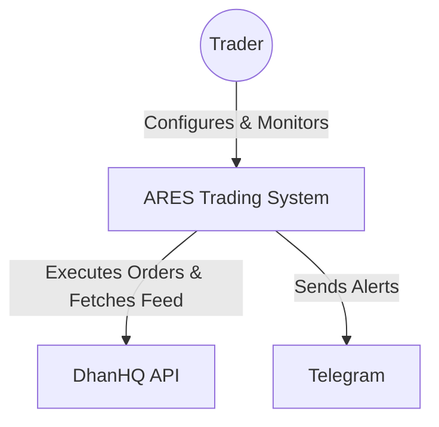

# C1: System Context Diagram

This document describes the high-level relationship between ARES and its environment.

## Overview
ARES is an automated trading system that acts as a bridge between Strategy logic and Broker execution.

## External Actors
- **Trader**: The human operator who manages the `algo.yml` and views the dashboard.
- **DhanHQ API**: The primary gateway for the Indian Stock Market (NSE/BSE/MCX).
- **Telegram**: Used for low-latency asynchronous notifications on system health and trade status.
