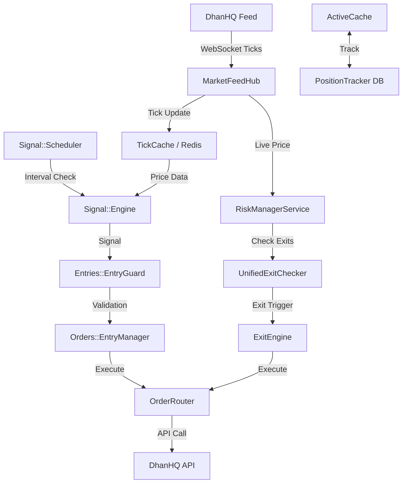

# System Architecture Overview

This document provides a high-level overview of the Algorithmic Scalper API architecture, focused on the core components and their interactions during live trading.

## Core Design Principles

1.  **Service-Oriented Architecture**: Functional domains (Signal, Risk, Feed, Orders) are encapsulated in distinct services.
2.  **Supervisor Orchestration**: A central `TradingSystem::Supervisor` manages the lifecycle (start/stop) of all long-running services.
3.  **Process Isolation**: The trading daemon runs as a separate process from the web server to ensure real-time performance and prevent blocking interactions.
4.  **Redis-First State**: Real-time market data (Ticks) and active trade metrics (PnL) are stored in Redis for low-latency access.

## The Supervisor Registry

The `TradingSystem::Supervisor` coordinates the following core services:

| Service ID | Implementation Class | Responsibility |
| :--- | :--- | :--- |
| `:market_feed` | `Live::MarketFeedHubService` | Manages WebSocket connections to DhanHQ for real-time tick data. |
| `:signal_scheduler` | `Signal::Scheduler` | Orchestrates signal generation for configured indices based on expiry. |
| `:risk_manager` | `Live::RiskManagerService` | Monitors active positions and enforces exit rules. |
| `:order_router` | `TradingSystem::OrderRouter` | Unified interface for placing and tracking orders (Live vs Paper). |
| `:active_cache` | `Positions::ActiveCacheService` | Manages the in-memory/Redis state of all open positions. |
| `:smc_scanner` | `Smc::Scanner` | Performs high-level market structure analysis to provide trend context. |
| `:position_heartbeat` | `TradingSystem::PositionHeartbeat` | Ensures system awareness of position state and health. |
| `:reconciliation` | `Live::ReconciliationService` | Aligns local state with broker state on startup and periodically. |

## High-Level Data Flow

## Process Model

- **Web Process (Rails)**: Handles API requests, dashboard visualization, and manual configuration via `config/algo.yml`.
- **Trading Daemon**: Started via `rake trading:daemon`. This process initializes the `Supervisor`, boots all services, and maintains the trading loop.
- **Background Workers (Sidekiq)**: Handles non-critical paths like logging, telemetry, and periodic SMC scanning.
