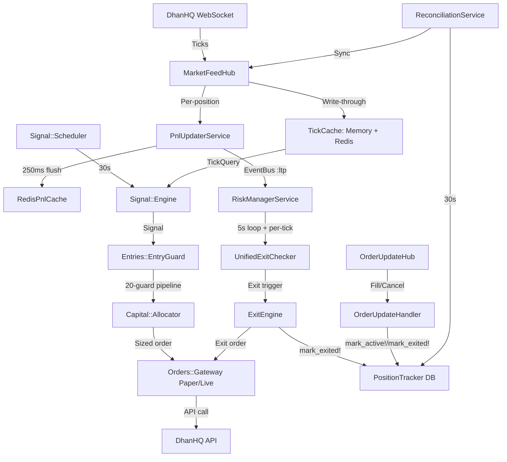

# System Architecture Overview

This document provides a high-level overview of the Algorithmic Scalper API architecture, focused on the core components and their interactions during live trading.

## Core Design Principles

1. **Service-Oriented Architecture**: Functional domains (Signal, Risk, Feed, Orders, Entries, Capital, Options, SMC) are encapsulated in distinct services under `app/services/`.
2. **Supervisor Orchestration**: A central `TradingSystem::Supervisor` manages the lifecycle (start/stop) of all 11 long-running services.
3. **Process Isolation**: The trading daemon runs as a separate process from the web server and job worker to ensure real-time performance.
4. **Redis-First State**: Real-time market data (ticks) and active trade metrics (PnL) are stored in Redis for low-latency access. PostgreSQL is the durable store.
5. **Direct Method Calls**: Live services communicate via direct method calls, not the EventBus (which exists for future use with only a debug subscriber).

## Process Model

`./bin/dev` starts 4 processes via `Procfile.dev`:

```
┌──────────────────────────────────────────────────────────────────┐
│ bin/dev (foreman)                                                │
├──────────────┬──────────────┬──────────────┬─────────────────────┤
│ web          │ trading      │ jobs         │ dashboard           │
│ Rails API    │ Daemon       │ Solid Queue  │ Next.js             │
│ port 3011    │ 11 services  │ recurring    │ frontend            │
│              │ in threads   │ tasks        │                     │
└──────┬───────┴──────┬───────┴──────┬───────┴─────────────────────┘
       │              │              │
       └──────┬───────┴──────┬───────┘
              │              │
         PostgreSQL       Redis
```

- **Web Process**: Handles API requests, dashboard data, ActionCable WebSocket broadcasts. Does NOT run trading services.
- **Trading Daemon**: Started via `rake trading:daemon`. Initializes the Supervisor, boots all 11 services, and maintains the trading loop. If market is closed at boot, only the WebSocket feed starts.
- **Job Worker**: Solid Queue worker for recurring tasks (instrument sync, SMC scanner, AI analysis) and one-off jobs. Uses Solid Queue — NOT Sidekiq.
- **Dashboard**: Next.js frontend (separate, unrelated to Rails).

## The Supervisor Registry

The `TradingSystem::Supervisor` (built by `lib/trading_system/bootstrap.rb`) coordinates the following services:

| # | Service ID | Implementation Class | Cadence | Responsibility |
|---|:-----------|:---------------------|:--------|:---------------|
| 1 | `:market_feed` | `Live::MarketFeedHubService` | Event-driven | DhanHQ WebSocket tick ingestion, subscription management |
| 2 | `:signal_scheduler` | `Signal::Scheduler` | 30s per cycle | Signal generation for configured indices |
| 3 | `:risk_manager` | `Live::RiskManagerService` | 5s loop + per-tick | PnL monitoring, exit rule enforcement, circuit breaker |
| 4 | `:position_heartbeat` | `TradingSystem::PositionHeartbeat` | 10s | Position state health reporting |
| 5 | `:order_router` | `TradingSystem::OrderRouter` | On-demand | Unified exit order routing (paper/live) |
| 6 | `:paper_pnl_refresher` | `Live::PaperPnlRefresher` | 1s | Simulated PnL updates in paper mode only |
| 7 | `:exit_manager` | `Live::ExitEngine` | On-demand | Single source of truth for all exit placement |
| 8 | `:active_cache` | `Positions::ActiveCacheService` | On-demand | In-memory + Redis position state cache |
| 9 | `:reconciliation` | `Live::ReconciliationService` | 30s | Broker/DB state synchronization |
| 10 | `:stats_notifier` | `Live::StatsNotifierService` | At market close | Daily stats + Telegram notification |
| 11 | `:smc_scanner` | `Smc::Scanner` | 5 min | SMC pattern detection (order blocks, FVG, structure) |

## Recurring Jobs (Solid Queue)

Configured in `config/recurring.yml`, executed by the `jobs` process:

| Job | Cadence | Purpose |
|-----|---------|---------|
| `InstrumentsImportJob` | Daily at 8:45 AM | DhanHQ instrument master CSV sync (ensures Derivative records exist) |
| `SmcScannerJob` | Every 15 min (market hours) | SMC + AVRZ pattern detection for all indices |
| `AiTechnicalAnalysisJob` (NIFTY) | Every 15 min (market hours) | AI-powered multi-timeframe analysis via Ollama |
| `AiTechnicalAnalysisJob` (SENSEX) | Every 15 min (market hours) | AI-powered multi-timeframe analysis via Ollama |

Run `rails solid_queue:load_recurring` after changing `config/recurring.yml`.

## Startup Sequence

When `bin/dev` launches the trading daemon:

1. **Rails boot** — All initializers run:
   - `dhanhq_config.rb` — DhanHQ SDK wiring, ENV normalization, token provider lambda
   - `orders_gateway.rb` — Paper/live gateway selection via `Orders::GatewayFactory.build`
   - `trading_supervisor.rb` — Builds supervisor (register-only, no start)
   - `option_chain_adapter.rb` — Wires `DhanAdapter` for option chain reads (always live, even in paper)
   - `dhan_token_bootstrap.rb` — Eager TOTP token refresh before first API call
2. **Daemon guards** — `TradingSystem::Daemon.enabled?` checks `ENABLE_TRADING_SERVICES=true`, not test/backtest/script mode
3. **Position reconciliation** — `Live::PositionSyncService.force_sync!` aligns DB with broker before services start
4. **Service start** — `supervisor.start_all` starts all 11 services in registration order (if market open; WebSocket-only if closed)
5. **Active position resubscription** — Queries `PositionIndex` and subscribes active option instruments to WebSocket
6. **Keep alive** — `sleep` (infinite) keeps the daemon running; SIGINT/SIGTERM trigger graceful `stop_all`

## High-Level Data Flow



## Tick Data Flow (Detail)

```
DhanHQ WebSocket tick event
  → MarketFeedHub#handle_tick
    → TickCache.put(tick)                     # Concurrent::Map in-memory + Redis write-through
    → MarketData::MarketCache.update_ltp      # Rails.cache institutional layer
    → PositionIndex.trackers_for(security_id) # O(1) in-memory lookup
    → PnlUpdaterService.cache_intermediate_pnl(tracker_id:, ltp:)  # enqueue, last-wins

  [PnlUpdaterService flush thread, every 250ms]
    → Batch DB load (1 query for all trackers in batch)
    → TickQuery.for_security → TickCache.fetch → Redis
    → Compute: gross_pnl = (ltp - entry_price) * qty
    → BrokerFeeCalculator.net_pnl (deduct fees)
    → Compute: pnl_pct = (ltp - entry_price) / entry_price (DECIMAL)
    → Update HWM: max(redis_hwm, current_pnl) — continuous, no lag
    → RedisPnlCache.store_pnl (→ sync_pnl_to_database_throttled every 30s)
    → EventBus.publish(:ltp, { tracker_id, ltp, pnl, pnl_pct, hwm })
    → ActionCable broadcast to "positions" channel
    → tracker.cache_live_pnl (in-memory update, no DB write)
```

## Exit Decision Flow (Detail)

Two paths run concurrently:

### High-Frequency Path (per-tick via EventBus)
```
EventBus :ltp event
  → RiskManagerService#handle_pnl_event
    → PositionTracker.find_by(id:)
    → UnifiedExitChecker.check_exit_conditions(tracker)
      → RedisPnlCache.fetch_pnl (snapshot)
      → Priority order (first match wins):
        1. Early trend failure (ADX + candle series)
        2. Loss limit / stop loss (pnl_pct <= -static_sl)
        3. Profit target (pnl_pct >= tp)
        4. Trailing stop (gamma-aware for NIFTY/BANKNIFTY/SENSEX)
        5. Time-based exit
    → ExitEngine.execute_exit if triggered
```

### Slow Path (5-second enforcement loop)
```
RiskManagerService#run_enforcement_cycle
  → Circuit breaker check → force_close_all! if tripped
  → PositionTracker.active.find_each
    → advance_trade_state_for (init → validated → expansion)
    → enforce_premium_r_stop_for
    → enforce_dynamic_trailing_stops_for → TrailingEngine.process_tick
    → enforce_profit_floor_for
    → enforce_structure_invalidation_for
    → enforce_premium_momentum_failure_for
    → enforce_rr_profit_booking_for
    → enforce_percentage_pnl_exit_for
    → enforce_time_stop_for
    → enforce_time_based_exit_for (default: 15:20)
```

## Paper vs Live Trading

| Aspect | Paper Mode | Live Mode |
|--------|-----------|-----------|
| Config | Effective `paper_trading.enabled: true` (default when `LIVE_TRADING` unset/false) | `LIVE_TRADING=true` → effective `paper_trading.enabled: false` |
| Market data | Real DhanHQ WebSocket | Real DhanHQ WebSocket |
| Option chain | Real DhanHQ API (`DhanAdapter`) | Real DhanHQ API (`DhanAdapter`) |
| Orders | Simulated (`GatewayPaper`) | Real DhanHQ API (`GatewayLive`) |
| Order gate | N/A | Requires `dhanhq.enable_orders: true` AND `PLACE_ORDER=true` |
| PnL | Real LTP-based | Real LTP-based |
| Fills | Synthetic (immediate) | DhanHQ WebSocket updates |
| Wallet | Simulated balance from config | Real funds API |

## Run Modes

Set `run_mode` in `config/algo.yml` or override with `RUN_MODE` env var. Profile files at `config/profiles/<mode>.yml` provide partial YAML overrides merged on top of `algo.yml`.

| Mode | Purpose |
|------|---------|
| `production` | Full guards, conservative entries (no overrides) |
| `exit_testing` | Frequent entries to test SL/TP/trailing/time-stop rules |
| `entry_testing` | Relaxed SMC/validation/ADX gates to verify entry pipeline |

## Configuration

All trading parameters in `config/algo.yml`. Runtime overrides via DB `settings` table (deep-merged with 30s cache via `AlgoConfig.fetch`). `AlgoConfig.run_mode` returns the active run mode.

**Key sections**: `paper_trading`, `run_mode`, `dhanhq`, `indices` (per-index config), `trade_limits`, `risk`, `position_sizing`, `signals`, `chain_analyzer`, `expiry_week_power_trend`, `broker_fees`, `telegram`, `ai`.

All percentage values use **DECIMAL format** (0.12 = 12%).

## AI Layer

AI analysis uses a local Ollama server via the `ollama-client` gem (`~> 1.1`). The `lib/services/ai/ollama_client.rb` wrapper provides chat, generate, and streaming interfaces. OpenAI / ruby-openai gems have been removed.

ENV: `OLLAMA_MODEL` (default: `llama3.2:3b`), `OLLAMA_BASE_URL` / `OLLAMA_HOST_URL` (default: `http://localhost:11434`), `OLLAMA_TIMEOUT` (default: 120s).

## Token Management

Three-tier fallback configured in `config/initializers/dhanhq_config.rb`:

1. **Authority server** — HTTP GET to `$TRADER_API_BASE_URL/auth/dhan/token` (60s cache)
2. **TOTP auto-refresh** — `Dhan::TokenManager` generates TOTP via `DHAN_PIN` + `DHAN_TOTP_SECRET`
3. **Static fallback** — `ENV['DHAN_ACCESS_TOKEN']`

On token refresh, `Dhan::TokenManager` restarts `Live::MarketFeedHub` to reconnect with the new token.

## Key Database Tables

| Table | Purpose |
|-------|---------|
| `instruments` | Master instrument data from DhanHQ CSV |
| `derivatives` | Options contracts (strike, expiry, option_type, lot_size, security_id) |
| `position_trackers` | Position lifecycle (pending → active → exited), PnL, trade state |
| `candles` | OHLC candle data by timeframe |
| `trading_signals` | Generated signals with confidence scores and diagnostic metadata |
| `trade_telemetry` | Entry/exit execution stats |
| `trade_analytics` | MAE/MFE analysis, volatility metrics |
| `dhan_access_tokens` | DhanHQ API token storage (single-row) |
| `settings` | Runtime config overrides (merged into AlgoConfig) |

## API Endpoints

```
GET  /api/health                      # System health
GET  /api/dashboard                   # Dashboard data
GET  /api/positions                   # Active positions with live PnL
GET  /api/analysis/:index_key         # AI analysis
GET  /api/settings                    # Algo settings
PATCH /api/settings/bulk              # Bulk update settings
GET  /api/circuit_breaker             # Circuit breaker status
POST /api/circuit_breaker/trip        # Trip (emergency halt)
DELETE /api/circuit_breaker/trip      # Reset
GET  /api/smc/decision                # SMC analytics decision (legacy GET /smc/decision → 301)
POST /cable                           # ActionCable (positions, dashboard channels)
```
