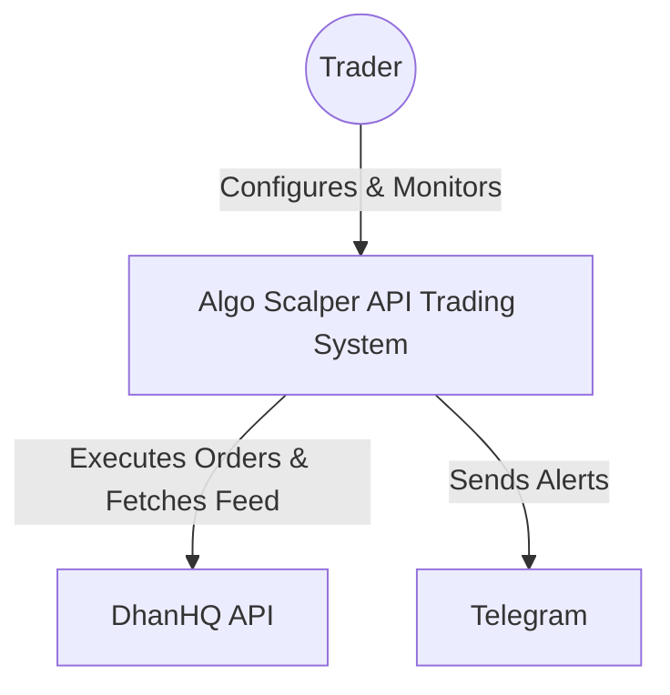
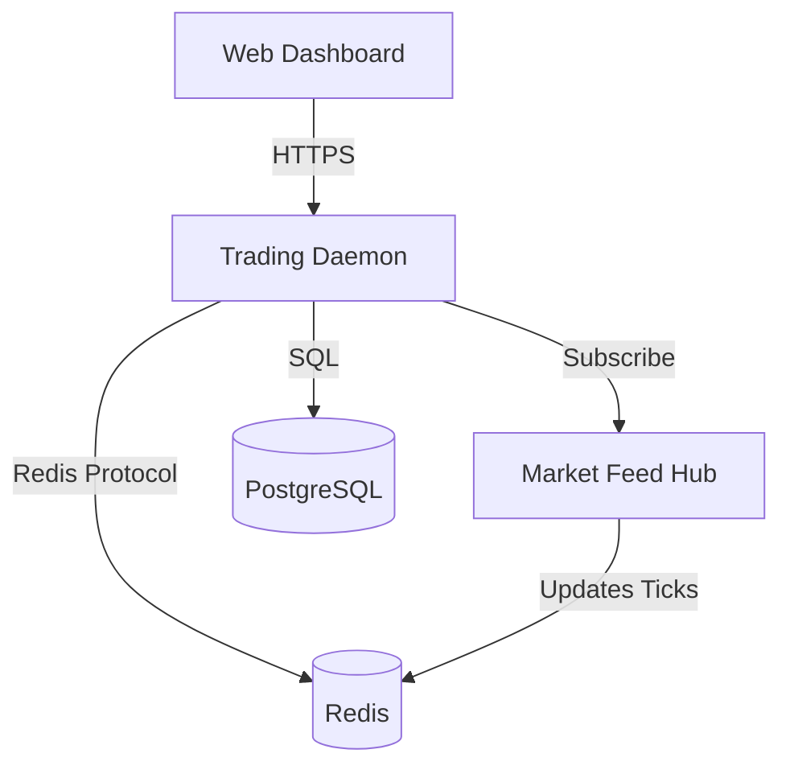
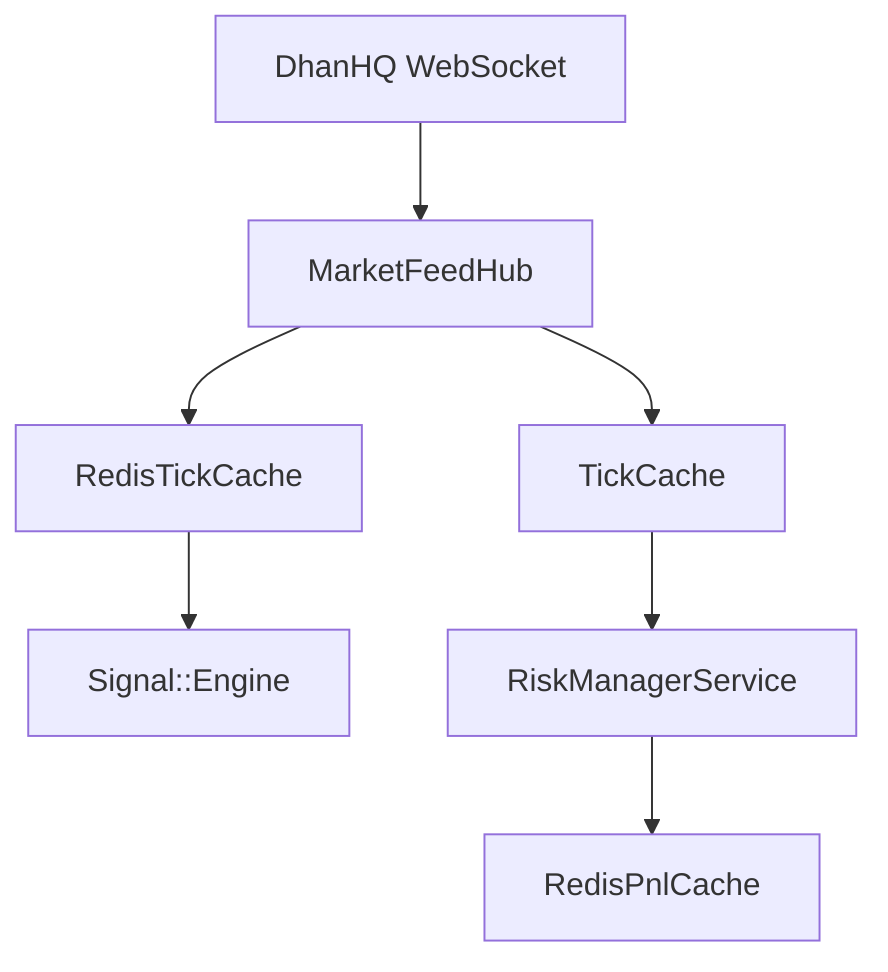

# System Architecture Report (Mandate v3)

This report provides a comprehensive reverse-engineered view of the Algo Scalper API Trading System architecture, documented directly from the codebase.

## 1. System Context (C1)

The Algo Scalper API Trading System is an automated platform that interacts with external broker APIs and market data providers to execute algorithmic strategies.

## 2. Container Architecture (C2)

Algo Scalper API is structured as a Ruby on Rails application with process-isolated components for trading and data handling.

## 3. Core Component Map (C3)

### Strategy & Signal Generation
- **Signal::Scheduler**: Orchestrates periodic evaluation cycles for indices.
- **Signal::Engine**: Core logic for indicator analysis (Supertrend/ADX) and strategy recommendation.
- **Signal::TrendScorer**: Multi-timeframe trend analysis.
- **Entries::EntryGuard**: Gatekeeper for orders, enforcing circuit breakers, exposure limits, and time regimes.

### Execution & Order Management
- **TradingSystem::OrderRouter**: High-level routing for entry and exit requests.
- **Orders::Gateway**: Abstraction layer for `Orders::GatewayLive` and `Orders::GatewayPaper`.
- **Orders::Placer / BracketPlacer**: Low-level DhanHQ API interaction.

### Risk & Exit Management
- **Live::RiskManagerService**: Continuous monitoring loop for active positions.
- **Live::UnifiedExitChecker**: Priority-based exit decision engine (ETF > SL > TP > Trailing).
- **Live::ExitEngine**: Executes broker-side closures for triggered exits.

---

## 4. Trading Pipeline (Signal -> Exit)

The end-to-end flow of a single trade:

```mermaid
flowchart LR
    A[Signal::Scheduler] --> B[Signal::Engine]
    B --> C[Options::ChainAnalyzer]
    C --> D[Entries::EntryGuard]
    D --> E[Orders::EntryManager]
    E --> F[Orders::Placer]
    F --> G[PositionTracker]
    G --> H[Live::RiskManagerService]
    H --> I[Live::UnifiedExitChecker]
    I --> J[Live::ExitEngine]
    J --> K[OrderRouter]
```

## 5. Market Data Architecture

Real-time price ingestion and distribution:

## 6. Service Catalog Excerpt

| Service | File | Responsibility |
| :--- | :--- | :--- |
| `Signal::Engine` | `app/services/signal/engine.rb` | High-level signal evaluation and strategy selection. |
| `Entries::EntryGuard` | `app/services/entries/entry_guard.rb` | Final safety validation before order placement. |
| `Live::RiskManagerService` | `app/services/live/risk_manager_service.rb` | Real-time monitoring of PnL and exit conditions. |
| `Live::MarketFeedHub` | `app/services/live/market_feed_hub.rb` | WebSocket management and tick normalization. |
| `Orders::Placer` | `app/services/orders/placer.rb` | Direct execution via DhanHQ API. |

---

## 7. Discovered Dependencies

- **Hardware**: Heavy reliance on Redis for real-time risk decisions.
- **DhanHQ Client**: Encapsulated in `lib/providers/dhanhq_provider.rb`.
- **SMC Engine**: Integrated via `Smc::Scanner` for higher-order technical insights.
