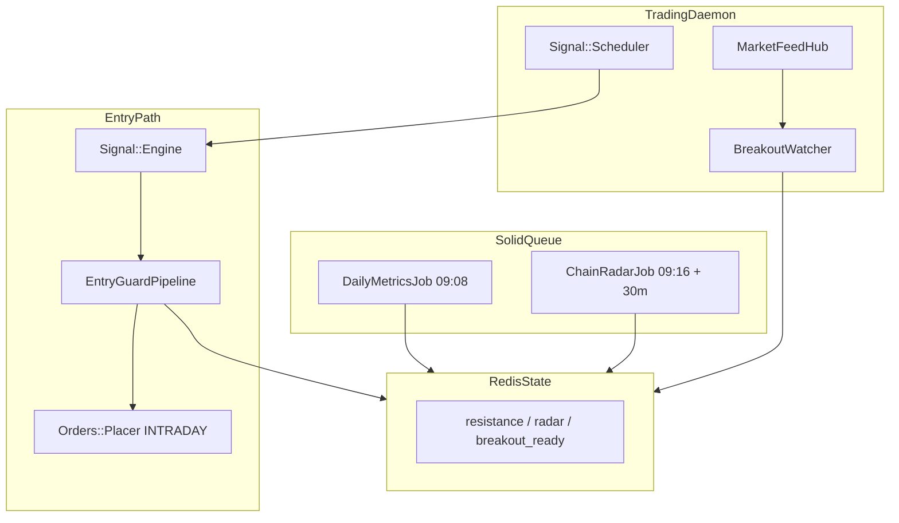

# Options Buying Automation: Master Plan

Single source of truth for integrating **intraday options buying** into `algo_scalper_api`, with Ep-92 positional rules as carry-gated reference.

---

## 1. TL;DR

### Intraday Scalper (default — `mode: intraday_scalper`)

* Naked `INTRADAY` options — preserve positive gamma.
* 1m breakout above max call-OI resistance + volume spike + OI unwind.
* ATR compression **arms** setups; does not cap trend days.
* Target ~1:3 premium R:R (15% SL / 45% TP).
* Chain radar + Greeks every 30 minutes.

### Positional Ep-92 (reference — `mode: positional` + carry)

* Vertical spreads for overnight holds.
* 15–20 min hold above OI walls.
* Compression **hard gate** when `CarryPolicy.carry_allowed?`.
* **Not active** on expiry day or when DTE = 0.

---

## 2. Implementation Phases

| Phase | Scope | Status |
| :--- | :--- | :--- |
| 0 | Docs split, revert `ATRExhaustionGuard`, config | Done |
| 1 | `CarryPolicy`, `AtrCompressionChecker`, `CompressionSetupGuard`, `DailyMetricsJob` | Done |
| 2 | `ChainRadar`, `ChainRadarJob`, recurring schedule | Done |
| 3 | `BreakoutWatcher`, `MinuteBarAggregator`, `BreakoutEvaluator`, `BreakoutReadyGuard`, bootstrap | Done |
| 4 | `RsiDivergenceScanner`, `RsiBiasGuard` | Done |
| 5 | `sl_pct`/`tp_pct` tune, `BidAskSpreadGuard`, expiry-day lockout | Done |
| 6 | Specs + paper validation | See verification below |

---

## 3. Architecture



**Positional path (dashed / future):** `CompressionSetupGuard` + spread orchestrator when carry allowed.

---

## 4. File Map

| File | Role |
| :--- | :--- |
| `app/services/options_buying/mode.rb` | Config mode helpers |
| `app/services/options_buying/state_store.rb` | Redis keys |
| `app/services/options_buying/carry_policy.rb` | Overnight carry gate |
| `app/services/options_buying/atr_compression_checker.rb` | Compression ratio |
| `app/services/options_buying/chain_radar.rb` | OI resistance + liquid strikes |
| `app/services/options_buying/breakout_watcher.rb` | Tick callback |
| `app/services/options_buying/breakout_evaluator.rb` | 1m bar logic |
| `app/services/options_buying/rsi_divergence_scanner.rb` | 15m RSI bias |
| `app/jobs/options_buying/*.rb` | Scheduled jobs |
| `lib/trading_system/bootstrap.rb` | Registers `:options_buying_breakout` |

---

## 5. Failure Modes

| Risk | Mitigation |
| :--- | :--- |
| Breakout guard blocks before radar seeds | Guard passes when resistance not set |
| Wide option spreads on breakouts | `BidAskSpreadGuard` |
| Expiry-day gamma risk | Lockout after 13:00 on expiry day |
| Positional spread leg slippage | Deferred — not in v1 |

---

## 6. Ops

```bash
./bin/dev   # or restart trading daemon only
rails solid_queue:load_recurring
```

Paper mode: `LIVE_TRADING` unset, `dhanhq.enable_orders: false`.

---

## 7. Related Docs

* [`options_buying_framework.md`](options_buying_framework.md) — rules and mode matrix
* [`options_buying_implementation_plan.md`](options_buying_implementation_plan.md) — gap table and verification commands
* [`options_buying_stream_architecture.md`](options_buying_stream_architecture.md) — Redis stream hybrid (current)
* [`options_buying_ingestion_sidecar_future.md`](options_buying_ingestion_sidecar_future.md) — Node/Go sidecar (deferred)
