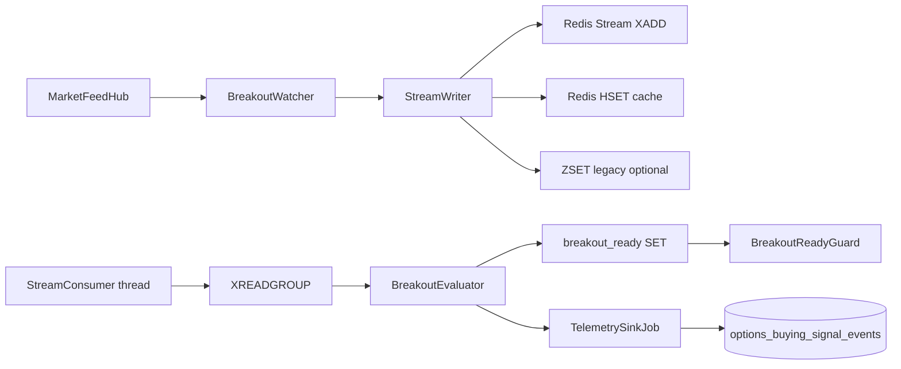

# Options Buying: Redis Stream Hybrid Architecture

How tick telemetry flows through `algo_scalper_api` after the stream hybrid slice.

---

## TL;DR

* **Ingest:** `MarketFeedHub` tick → `BreakoutWatcher` → `StreamWriter` (`XADD` + `HSET` cache)
* **Evaluate:** `StreamConsumer` (`XREADGROUP`) → `BreakoutEvaluator` (60s window, **volume delta**)
* **Signal:** `breakout_ready` Redis flag → `BreakoutReadyGuard` → existing `EntryGuard` path
* **Sink:** `TelemetrySinkJob` → `options_buying_signal_events` (optional, async)

No second WebSocket client. No Node sidecar (see [ingestion sidecar future](options_buying_ingestion_sidecar_future.md)).

---

## Data Flow



---

## Redis Keys

| Key | Type | Purpose |
|-----|------|---------|
| `options_buying:stream:{security_id}` | Stream | Chronological ticks (`MAXLEN ~1000`) |
| `options_buying:cache:{security_id}` | Hash | Latest snapshot for fast API/dashboard reads |
| `options_buying:monitored_strikes` | Set | Active stream consumer targets |
| `options_buying:breakout_ready:{index}` | String | Armed breakout flag (TTL) |

---

## Volume / OI Math

Dhan feed volume is typically **cumulative session volume**. The evaluator uses:

```ruby
volume_delta = last_volume - first_volume  # in 60s window on option contract
oi_delta     = last_oi - first_oi
```

Never sum per-tick volume fields across the window.

**Volume baseline:** compare the 60s `volume_delta` to `volume_threshold_baseline`, which prefers a rolling stream average and falls back to chain radar `session_volume / minutes_since_open`.

**Price breakout** compares **index spot LTP** (index tick, cache, or `TickQuery` fallback) against **chain resistance** (max call-OI strike level). Option ticks supply volume/OI flow only.

---

## Config (`config/algo.yml`)

```yaml
options_buying:
  streams:
    enabled: true
    maxlen: 1000
    window_seconds: 60
    consumer_group: options_buying_evaluators
    consumer_block_ms: 1000
    telemetry_sink_enabled: true
    legacy_zset_enabled: false   # skip duplicate ZSET writes when streams are primary
```

---

## Processes

| Process | Service |
|---------|---------|
| `trading:daemon` | `BreakoutWatcher` + `StreamConsumer` (bootstrap) |
| `bin/jobs` | `TelemetrySinkJob` (Solid Queue) |

Restart trading daemon after deploy.

---

## Related

* [options_buying_implementation_plan.md](options_buying_implementation_plan.md)
* [options_buying_ingestion_sidecar_future.md](options_buying_ingestion_sidecar_future.md)
