# 🔍 Dashboard Static Data Audit

> [!IMPORTANT]
> Full audit of **50+ dashboard files** across views, components, stores, and config. Consolidated from 4 parallel subagent scans.

## Summary

| Severity | Count | Description |
|----------|-------|-------------|
| 🔴 HIGH | 12 | Fake/hardcoded data displayed to user as real |
| 🟡 MEDIUM | 14 | Non-functional buttons, TODO stubs, static config that may drift |
| 🟢 LOW | ~8 | Legitimate constants, acceptable defaults |

---

## ✅ Fully Wired — No Issues

These files correctly fetch and display real API/WebSocket data:

| File | Data Source |
|------|------------|
| [Dashboard.jsx](file:///home/nemesis/project/trading-workspace/algo_scalper_api/dashboard/src/views/Dashboard.jsx) | `useDashboard()` + ActionCable `DashboardChannel` |
| [Signals.jsx](file:///home/nemesis/project/trading-workspace/algo_scalper_api/dashboard/src/views/Signals.jsx) | `/api/signals` with pagination + filtering |
| [Settings.jsx](file:///home/nemesis/project/trading-workspace/algo_scalper_api/dashboard/src/views/Settings.jsx) | Full CRUD via `/api/settings` |
| [Scheduler.jsx](file:///home/nemesis/project/trading-workspace/algo_scalper_api/dashboard/src/views/Scheduler.jsx) | `useScheduler()` → `/api/scheduler/tasks` + 10s polling |
| [Alerts.jsx](file:///home/nemesis/project/trading-workspace/algo_scalper_api/dashboard/src/views/Alerts.jsx) | `useAlerts()` + `AlertsChannel` WS |
| [Analysis.jsx](file:///home/nemesis/project/trading-workspace/algo_scalper_api/dashboard/src/views/Analysis.jsx) | `useAnalysis()` + lazy-loaded details |
| [Funds.jsx](file:///home/nemesis/project/trading-workspace/algo_scalper_api/dashboard/src/views/Funds.jsx) | `useFunds()` + `FundsChannel` WS |
| [Logs.jsx](file:///home/nemesis/project/trading-workspace/algo_scalper_api/dashboard/src/views/Logs.jsx) | `useLogs()` → `/api/logs` polling |
| [Ledger.jsx](file:///home/nemesis/project/trading-workspace/algo_scalper_api/dashboard/src/views/Ledger.jsx) | Ledger store → `/api/ledger/*` |
| [Holdings.jsx](file:///home/nemesis/project/trading-workspace/algo_scalper_api/dashboard/src/views/Holdings.jsx) | `useHoldings()` + `HoldingsChannel` WS |
| [Strategies.jsx](file:///home/nemesis/project/trading-workspace/algo_scalper_api/dashboard/src/views/Strategies.jsx) | `useStrategies()` → full CRUD + validate/deploy |
| [Alpha.jsx](file:///home/nemesis/project/trading-workspace/algo_scalper_api/dashboard/src/views/Alpha.jsx) | `useAlpha()` → 5 API endpoints + 10s polling |
| [Charts.jsx](file:///home/nemesis/project/trading-workspace/algo_scalper_api/dashboard/src/views/Charts.jsx) | `/api/candles` + ActionCable WS + `usePositions()` |
| [TrailEngine.jsx](file:///home/nemesis/project/trading-workspace/algo_scalper_api/dashboard/src/views/TrailEngine.jsx) | `usePositions()` WS + `/api/candles` + `/api/market/vix` |
| [Reports.jsx](file:///home/nemesis/project/trading-workspace/algo_scalper_api/dashboard/src/views/Reports.jsx) | `useReports()` → 5 API endpoints + `useEquityCurve()` |
| All `components/ui/*` | Generic primitives — no data concerns |
| All `components/auth/*` | Auth API |
| All `components/analysis/*` | Props from Analysis store |
| All `components/settings/*` | Settings API |
| [App.jsx](file:///home/nemesis/project/trading-workspace/algo_scalper_api/dashboard/src/App.jsx) | All routes wired, stores connected |

---

## 🔴 HIGH Severity — Fake Data Shown to User

### 1. Dashboard.jsx — Hardcoded Equity Curve SVG

**File:** [Dashboard.jsx](file:///home/nemesis/project/trading-workspace/algo_scalper_api/dashboard/src/views/Dashboard.jsx) **Lines ~152-179**

Static SVG `<path d="M 10 90 L 30 75 L 65 80 L 100 45 L 130 55 L 165 25 L 190 15" ...>` with hardcoded timeline labels (`09:15`, `11:00`, `13:00`, `15:15`). Always shows the same upward curve regardless of actual P&L.

**Should use:** Real intraday equity curve data from `/api/equity_curve` or accumulated from live P&L ticks. The `EquityCurve` chart component already exists.

---

### 2. StatsBar.jsx — Fake Sparkline SVGs

**File:** [StatsBar.jsx](file:///home/nemesis/project/trading-workspace/algo_scalper_api/dashboard/src/components/StatsBar.jsx) **Lines ~42-52, 70-80**

Two static SVG paths that look like sparklines but never change. Always trend upward with green `rgb(52, 211, 153)` stroke, even when P&L is negative. The numeric P&L values above them ARE real — but the visual sparklines are decorative fakes.

**Should use:** Intraday P&L time-series, or remove sparklines to avoid misleading visuals.

---

### 3. MarketWatch.jsx — Hardcoded Change Direction & Percentage

**File:** [MarketWatch.jsx](file:///home/nemesis/project/trading-workspace/algo_scalper_api/dashboard/src/views/MarketWatch.jsx) **Lines ~41-45**

```js
{ label: 'Nifty 50', value: indices()?.nifty, isPositive: true, changePct: 0 },
```

- `isPositive: true` — Always shows green regardless of actual market direction
- `changePct: 0` — Always shows 0% change
- The LTP value IS wired to real-time `indices()` ✅ — but change % and direction are fake

**Should use:** `change` / `change_pct` fields from the WebSocket indices payload.

---

### 4. OptionChain.jsx — Fabricated Previous Close

**File:** [OptionChain.jsx](file:///home/nemesis/project/trading-workspace/algo_scalper_api/dashboard/src/views/OptionChain.jsx) **Lines ~20-25**

```js
spotPrice() / 1.0062  // Fake previous close — always shows ~+0.62% change
```

Spot change and change % are always approximately +0.62% regardless of actual market data. Fallback also returns hardcoded `0.62`.

**Should use:** Actual previous close from the option chain stream's `prev_close` field or a market data endpoint.

---

### 5. OptionChain.jsx — Static PCR & Max Pain Historical Charts

**File:** [OptionChain.jsx](file:///home/nemesis/project/trading-workspace/algo_scalper_api/dashboard/src/views/OptionChain.jsx) **Lines ~493-510**

Two hardcoded SVG path charts for "PCR Historical" and "Max Pain Historical". Static decorative lines that never update.

**Should use:** Historical PCR and max pain data from an API endpoint.

---

### 6. BacktestPreview.jsx — Static Percentage Labels & Fake Chart

**File:** [BacktestPreview.jsx](file:///home/nemesis/project/trading-workspace/algo_scalper_api/dashboard/src/components/strategies/BacktestPreview.jsx) **Lines ~24, 35, 60, 78-109**

| Item | Value | Problem |
|------|-------|---------|
| Date range fallback | `'01 May 2024 - 31 May 2024'` | Fake historical date shown when no data |
| Net Profit % | `+12.43%` | Hardcoded string, not derived from API |
| Max Drawdown % | `2.31%` | Hardcoded string, not derived from API |
| Equity curve SVG | Full hardcoded SVG paths | Decorative art, not data-driven |

**Should use:** Backtest API response with computed metrics and equity curve.

---

### 7. StrategyFlowChart.jsx — Entire Flowchart is Static Art

**File:** [StrategyFlowChart.jsx](file:///home/nemesis/project/trading-workspace/algo_scalper_api/dashboard/src/components/strategies/StrategyFlowChart.jsx) **Lines ~51-105**

The entire strategy flow visualization (Market Open → Record Range → Breakout? → Buy Call/Put) is a static SVG. Shows the same diagram regardless of which strategy is selected.

**Should use:** Dynamically generated flowchart from the strategy's actual logic/rules definition.

---

### 8. OptimizationPanel.jsx — Silent Fallback Fake Values

**File:** [OptimizationPanel.jsx](file:///home/nemesis/project/trading-workspace/algo_scalper_api/dashboard/src/components/analysis/OptimizationPanel.jsx) **Lines ~156-175**

When the API response omits fields, hardcoded fallbacks silently display as real data:

| Metric | Fallback |
|--------|----------|
| Trades simulated | `|| 92` |
| Early trigger | `|| 0.03` |
| Breakeven trigger | `|| 0.08` |
| Activation trigger | `|| 0.15` |
| Trailing distance | `|| 0.20` |

**Should use:** Proper null/loading states instead of fake numbers.

---

### 9. Backtester.jsx — Multiple Dead UI Elements

**File:** [Backtester.jsx](file:///home/nemesis/project/trading-workspace/algo_scalper_api/dashboard/src/views/Backtester.jsx)

| Item | Lines | Problem |
|------|-------|---------|
| Strategy dropdown | ~L38 | Single hardcoded option `Supertrend Backtest` |
| Initial Capital | ~L133 | Hardcoded `₹250,000` string (L272 correctly reads from `config()`) |
| Tab buttons | ~L82-86 | "Equity Curve", "Trades", "Monthly Returns", "Statistics", "Logs" — no onClick handlers, only "Overview" works |
| Save Report button | ~L57 | No onClick handler |
| Export button | ~L157 | No onClick handler |
| Trades filter | ~L154 | Single option "All Trades" |

---

### 10. Replay.jsx — Entire Playback Engine is Cosmetic

**File:** [Replay.jsx](file:///home/nemesis/project/trading-workspace/algo_scalper_api/dashboard/src/views/Replay.jsx)

| Item | Lines | Problem |
|------|-------|---------|
| Strategy name | L33 | Hardcoded `"SMC Replay"` |
| Timeframe | L41 | Hardcoded `"5 Minute"` |
| Load params | L53 | Always loads `{ symbol: 'NIFTY', days_back: 30 }` — no user selection |
| "Sharpe Ratio" label | L122-124 | **Mislabeled** — displays `signalCount` as Sharpe Ratio |
| Playback slider | L193 | Hardcoded to `value="40"` |
| Timestamp | L194 | Hardcoded `09:15:00` |
| Play/Pause | L7-8 | Toggles state but no actual candle-stepping logic — purely cosmetic |
| ⏮/⏭ buttons | L173, L180 | No onClick handlers |
| Strategy State panel | L243-245 | Always shows "Not available in replay mode" |
| Jump to Event button | L256 | No onClick handler |

---

### 11. StrategyCreator.jsx — Fake Live Logs

**File:** [StrategyCreator.jsx](file:///home/nemesis/project/trading-workspace/algo_scalper_api/dashboard/src/views/StrategyCreator.jsx) **Lines ~15-24, L406**

8 hardcoded fake log entries in `sampleLogs` passed to `<RecentLogs>`. Shows fabricated log messages like strategy execution events that never happened.

**Should use:** Real-time strategy execution logs from API or WebSocket.

---

### 12. OptionScalper.jsx — Entire Page is a Stub

**File:** [OptionScalper.jsx](file:///home/nemesis/project/trading-workspace/algo_scalper_api/dashboard/src/views/OptionScalper.jsx)

"Coming Soon" placeholder — entire feature not implemented.

---

## 🟡 MEDIUM Severity — Functional Gaps & Static Config

| # | File | Issue | Lines |
|---|------|-------|-------|
| 1 | [Reports.jsx](file:///home/nemesis/project/trading-workspace/algo_scalper_api/dashboard/src/views/Reports.jsx) | "Schedule Report" button — no onClick | ~L69 |
| 2 | [Reports.jsx](file:///home/nemesis/project/trading-workspace/algo_scalper_api/dashboard/src/views/Reports.jsx) | "Custom Reports" tab — entire tab is placeholder text + dead buttons | ~L678-689 |
| 3 | [OptionChain.jsx](file:///home/nemesis/project/trading-workspace/algo_scalper_api/dashboard/src/views/OptionChain.jsx) | Greeks `rho` always hardcoded to `0` | ~L128-143 |
| 4 | [OptionChain.jsx](file:///home/nemesis/project/trading-workspace/algo_scalper_api/dashboard/src/views/OptionChain.jsx) | Single expiry option — can't select other expiries | ~L172 |
| 5 | [OptimizationPanel.jsx](file:///home/nemesis/project/trading-workspace/algo_scalper_api/dashboard/src/components/analysis/OptimizationPanel.jsx) | Hardcoded lookback & indicator dropdown options | ~L41-61 |
| 6 | [DrawdownChart.jsx](file:///home/nemesis/project/trading-workspace/algo_scalper_api/dashboard/src/components/charts/DrawdownChart.jsx) | `TODO: Wire to useDashboard()` — not self-fetching | L3 |
| 7 | [EquityCurve.jsx](file:///home/nemesis/project/trading-workspace/algo_scalper_api/dashboard/src/components/charts/EquityCurve.jsx) | `TODO: Wire to useDashboard()` — not self-fetching | L3 |
| 8 | [MarketDepth.jsx](file:///home/nemesis/project/trading-workspace/algo_scalper_api/dashboard/src/components/trading/MarketDepth.jsx) | `TODO: Wire to useDashboard()` — not self-fetching | L2 |
| 9 | [OrderBook.jsx](file:///home/nemesis/project/trading-workspace/algo_scalper_api/dashboard/src/components/trading/OrderBook.jsx) | `TODO: Wire to useDashboard()` — not self-fetching | L3 |
| 10 | [RecentLogs.jsx](file:///home/nemesis/project/trading-workspace/algo_scalper_api/dashboard/src/components/strategies/RecentLogs.jsx) | Hardcoded log filter categories | L34-38 |
| 11 | [SignalsSidebar.jsx](file:///home/nemesis/project/trading-workspace/algo_scalper_api/dashboard/src/components/signals/SignalsSidebar.jsx) | Static toggle catalog (values are live, but list is hardcoded) | L3-100 |
| 12 | [useLogs.js](file:///home/nemesis/project/trading-workspace/algo_scalper_api/dashboard/src/stores/useLogs.js) | `TODO: Wire to ActionCable LogsChannel` — polling-only | L3 |
| 13 | [routes.js](file:///home/nemesis/project/trading-workspace/algo_scalper_api/dashboard/src/lib/config/routes.js) | Positions → Dashboard redirect, Orders → Ledger redirect | L84-85 |
| 14 | [routes.js](file:///home/nemesis/project/trading-workspace/algo_scalper_api/dashboard/src/lib/config/routes.js) | `/api/replay` backend noted as "not yet implemented" | L101-102 |

---

## 📋 Fix Priority (Ranked by Impact × Effort)

| Priority | File | What to Fix | Effort |
|----------|------|-------------|--------|
| 🥇 1 | MarketWatch.jsx | Wire `isPositive` and `changePct` to WS indices payload | **Low** |
| 🥇 2 | StatsBar.jsx | Replace fake sparklines with real P&L timeseries or remove | **Low** |
| 🥇 3 | Dashboard.jsx | Replace hardcoded equity SVG with `EquityCurve` component | **Low** |
| 🥇 4 | OptionChain.jsx | Use real `prev_close` from WS stream instead of `/ 1.0062` | **Low** |
| 🥈 5 | OptimizationPanel.jsx | Replace `|| 92` style fallbacks with loading/empty states | **Low** |
| 🥈 6 | BacktestPreview.jsx | Wire % labels and chart to backtest API data | **Medium** |
| 🥈 7 | Backtester.jsx | Wire tab buttons, fetch strategy list, fix capital inconsistency | **Medium** |
| 🥈 8 | StrategyCreator.jsx | Replace `sampleLogs` with real log API/WS data | **Medium** |
| 🥈 9 | OptionChain.jsx | Add multi-expiry selector, wire PCR/MaxPain charts | **Medium** |
| 🥉 10 | StrategyFlowChart.jsx | Generate flowchart from strategy definition data | **High** |
| 🥉 11 | Replay.jsx | Implement actual playback engine or clearly label as prototype | **High** |
| 🥉 12 | OptionScalper.jsx | Implement feature or remove from nav | **High** |

---

## Diagram: Static Data Flow

```mermaid
graph TB
    subgraph "🔴 Hardcoded SVG Charts"
        D1["Dashboard.jsx<br/>Equity Curve SVG"]
        SB["StatsBar.jsx<br/>Sparkline SVGs"]
        OC1["OptionChain.jsx<br/>PCR + MaxPain SVGs"]
        BP["BacktestPreview.jsx<br/>Equity Chart SVG"]
    end

    subgraph "🔴 Fake Numeric Data"
        MW["MarketWatch.jsx<br/>isPositive=true, changePct=0"]
        OC2["OptionChain.jsx<br/>prevClose = spot/1.0062"]
        OP["OptimizationPanel.jsx<br/>|| 92 fallbacks"]
        BP2["BacktestPreview.jsx<br/>+12.43%, 2.31%"]
    end

    subgraph "🔴 Cosmetic/Non-functional Features"
        RP["Replay.jsx<br/>Entire playback is cosmetic"]
        BT["Backtester.jsx<br/>Dead tabs & buttons"]
        SC["StrategyCreator.jsx<br/>Fake sampleLogs"]
        SF["StrategyFlowChart.jsx<br/>Static SVG diagram"]
        OS["OptionScalper.jsx<br/>Coming Soon stub"]
    end

    subgraph "✅ Real API Endpoints Available"
        E1["/api/equity_curve"]
        E2["/api/market/vix"]
        E3["/api/reports/*"]
        E4["/api/backtests"]
        E5["/api/replays"]
        E6["/api/trading_strategies"]
        E7["WebSocket indices payload"]
    end

    D1 -.->|"should use"| E1
    OC1 -.->|"needs new endpoint"| E2
    BP -.->|"should use"| E4
    MW -.->|"should use"| E7
    RP -.->|"should use"| E5
    BT -.->|"should use"| E4
    BP2 -.->|"should use"| E4

    style D1 fill:#ef4444,color:#fff
    style SB fill:#ef4444,color:#fff
    style OC1 fill:#ef4444,color:#fff
    style BP fill:#ef4444,color:#fff
    style MW fill:#ef4444,color:#fff
    style OC2 fill:#ef4444,color:#fff
    style OP fill:#ef4444,color:#fff
    style BP2 fill:#ef4444,color:#fff
    style RP fill:#ef4444,color:#fff
    style BT fill:#ef4444,color:#fff
    style SC fill:#ef4444,color:#fff
    style SF fill:#ef4444,color:#fff
    style OS fill:#ef4444,color:#fff
```


