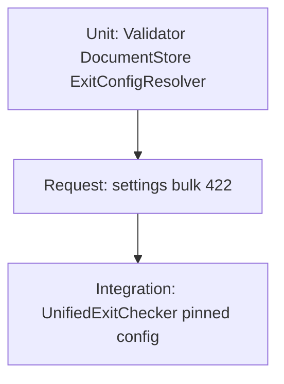

# Config Architecture Roadmap

Hardening the algo config system for an autonomous options-buying engine. Goal:
**deterministic, auditable, reproducible** config — env = mode/secrets, YAML = reviewed
defaults, DB = audited live overrides, tier single-sourced, config frozen per open
position, stamped on every trade, validated on write.

This document is the plan of record. Phase 1 is implemented; Phases 2–4 are designed but
not built.

---

## Background: how config resolves today

`AlgoConfig.fetch` (30s in-process cache) builds the effective config in this order
(`app/lib/algo_config.rb`):

1. **`DocumentStore.current_mutable_document`** — canonical base. The **DB document**
   (`settings.algo_config_document`, full snapshot). `config/algo.yml` only *seeds* it on
   first use; legacy `algo_config_overrides` merged once at bootstrap.
2. **Signal tier preset** (`config/signal_tier_presets.yml`) deep-merged on top.
3. **`LIVE_TRADING`** env → forces `paper_trading.enabled`.
4. **`PAPER_STRICT_DIRECTION_GATE`** env → paper-mode direction-gate relax.

All mutations funnel through `DocumentStore#persist!` → `Setting.put` +
`AlgoConfigChangeLog` audit row + `AlgoConfig.reset!`.

### Problems this roadmap fixes

- DB doc is a **full snapshot**, so `config/algo.yml` is inert at runtime (confusing; YAML
  edits silently do nothing).
- **No validation** on writes — a bad value persists and kills trades or blows risk.
- Config **re-read live every tick** in exit/trailing code → a mid-position change moves an
  **open** position's stop.
- **No config identity per trade** — can't reconstruct which gates/params were active for a
  given trade. `AlgoConfigChangeLog` exists but is orphaned (no version, not joined to trades).
- **`signal_tier` diverges** across YAML / DB / env with env silently winning.
- `Positions::TrailingConfig` was a **global memoized module** — **Phase 2.3** refactored it to
  `TrailingConfig.from(snapshot)` / `from_tracker(tracker)`; live module methods delegate to
  fresh reads (no `@config ||=` freeze).

---

## Phase 1 — Safe high-value hardening  ✅ IMPLEMENTED

Status: done, TDD. **138 examples, 0 failures** in the focused config + pinning suite (last
verified 2026-06-16). Code changes require a **trading-daemon restart**; DB-doc/tier changes
are live within the 30s `AlgoConfig` cache.

| Item | What | Key files |
|------|------|-----------|
| 1.1 Write-validation (hard reject) | `AlgoConfig::Validator` checks range/type/enum for the dangerous gates; wired into `DocumentStore#persist!` (validates changed subtrees only); raises `AlgoConfig::ValidationError`. API → 422 `{errors:[…]}`, nothing persists. Covers calibration auto-apply too. | `app/services/algo_config/validator.rb`, `document_store.rb`, `api/settings_controller.rb` |
| 1.2 `signal_tier` single source | Doc `signals.signal_tier` is primary. `SIGNAL_TIER` env ignored (loud WARN) unless `SIGNAL_TIER_FORCE=true`. Reconciled live divergence to `standard`. | `app/lib/algo_config.rb#resolve_signal_tier`, `config/algo.yml` |
| 1.3 Stamp config on every trade | `AlgoConfig.version` = `{hash, change_log_id}`; stamped on `TradingSignal.metadata` and every `PositionTracker.meta[:config_version]`. | `app/lib/algo_config.rb#version`, `entries/meta_builder.rb`/`entry_guard.rb`, `models/trading_signal.rb` |
| 1.4 Pin config per open position (partial) | `Positions::ExitConfigResolver.for(tracker)` returns the entry-time snapshot (`meta[:config_snapshot]`, secrets excluded) or live fallback. Routed the 4 per-tick read sites through it. | `app/services/positions/exit_config_resolver.rb`, `live/unified_exit_checker.rb`, `live/risk_manager_service/exit_enforcement.rb`, `orders/trailing_engine.rb`, `orders/mfe_exit_engine.rb` |

Deferred out of Phase 1 (moved to Phase 2): `TrailingConfig` per-position pinning + its
frozen-at-boot bug; the sparse-override merge model.

---

## Testing strategy

Config specs follow the same RSpec conventions as the rest of the repo (`rails_helper`,
FactoryBot, DatabaseCleaner transaction strategy).

### Conventions

1. **Always reset in-process cache** after touching config:
   ```ruby
   after { AlgoConfig.reset! }
   ```
2. **Seed the DB document** (not YAML directly) when testing effective config:
   ```ruby
   Setting.put(AlgoConfig::DocumentStore::DOCUMENT_KEY, { risk: { sl_pct: 0.02 } }.to_json)
   AlgoConfig.reset!
   ```
3. **Isolate ENV** with `around` blocks for `LIVE_TRADING`, `SIGNAL_TIER`,
   `SIGNAL_TIER_FORCE`, `PAPER_STRICT_DIRECTION_GATE`, `SETTINGS_UPDATE_TOKEN`.
4. **Validation failures** must assert three things:
   - `raise_error(AlgoConfig::ValidationError)` (service layer) or `422` + `errors` (API)
   - **No** `AlgoConfigChangeLog` row created
   - **No** mutation of the persisted document
5. **One behavior per example**; `context` blocks start with `when` / `with` / `without`.

### Test layers



---

## Phase 1 — Test matrix

| Roadmap item | Spec file | Key examples |
|--------------|-----------|--------------|
| **1.1 Validator** | `spec/services/algo_config/validator_spec.rb` | Range/enum/type checks; `changed_paths` scopes validation to touched subtrees only; `__forced_bootstrap__` validates whole doc |
| **1.1 DocumentStore** | `spec/services/algo_config/document_store_spec.rb` | `apply_deep_merge_patch!` rejects invalid gate without persisting; redacts `telegram.bot_token` → `[REDACTED]` in audit log |
| **1.1 API 422** | `spec/requests/api/settings_spec.rb` | `PATCH /api/settings/bulk` returns 422 + `errors` for `min_confidence: 999`; value not persisted |
| **1.1 MergeUtil** | `spec/services/algo_config/merge_util_spec.rb` | Deep merge preserves untouched nested keys; does not mutate base hash |
| **1.2 signal_tier** | `spec/lib/algo_config_spec.rb` | Selective/exploratory presets apply; `SIGNAL_TIER` env ignored unless `SIGNAL_TIER_FORCE=true` |
| **1.3 version stamp** | `spec/lib/algo_config_spec.rb`, `spec/models/trading_signal_spec.rb`, `spec/services/entries/entry_guard_spec.rb` | `AlgoConfig.version` returns `hash` + `change_log_id`; signal metadata and tracker meta include `config_version` |
| **1.3 position_snapshot** | `spec/lib/algo_config_spec.rb` | Excludes `dhanhq` / `telegram` / `ai`; reflects doc changes after `reset!` |
| **1.4 ExitConfigResolver** | `spec/services/positions/exit_config_resolver_spec.rb` | Pinned `config_snapshot` wins over live `AlgoConfig.fetch`; nil tracker falls back to live |
| **1.4 Exit-path integration** | `spec/integration/config_pinning_exit_spec.rb` | `percentage_pnl_exit_hit?` and `emergency_peak_loss_exit_triggered?` use pinned thresholds |
| **Calibration validation** | `spec/services/options/calibration_auto_applier_spec.rb` | Invalid `proposed_patch` → `applied: false`, `applied_at` nil, no change log |
| **Audit log model** | `spec/models/algo_config_change_log_spec.rb` | `source` required; `changed_paths` array round-trip |

### Representative spec patterns

**Validator — changed_paths scoping** (`spec/services/algo_config/validator_spec.rb`):

```ruby
context 'when an out-of-range value sits under an unchanged top-level key' do
  it 'does not raise when that key is outside changed_paths' do
    config = valid_config.deep_merge(signals: { min_confidence: 999 })
    expect(described_class.validate!(config, changed_paths: ['/risk'])).to be(true)
  end

  it 'raises when the key is within changed_paths' do
    config = valid_config.deep_merge(signals: { min_confidence: 999 })
    expect { described_class.validate!(config, changed_paths: ['/signals']) }
      .to raise_error(AlgoConfig::ValidationError, /min_confidence/)
  end
end
```

**DocumentStore — reject without persist** (`spec/services/algo_config/document_store_spec.rb`):

```ruby
it 'rejects an out-of-range gate value without persisting' do
  expect do
    described_class.apply_deep_merge_patch!(
      { entry_quality: { gates: { min_adx: -5 } } },
      source: 'test'
    )
  end.to raise_error(AlgoConfig::ValidationError, /min_adx/)

  doc = JSON.parse(Setting.find_by!(key: doc_key).value)
  expect(doc.dig('entry_quality', 'gates', 'min_adx')).to be_nil
end
```

**Exit pinning integration** (`spec/integration/config_pinning_exit_spec.rb`):

```ruby
it 'uses pinned target_pct when live config differs' do
  allow(AlgoConfig).to receive(:fetch).and_return(
    risk: { percentage_pnl_exit: { enabled: true, target_pct: 0.99 } },
    exit: { trailing: { enabled: false } }
  )
  snapshot = { pnl_pct: 0.15, hwm_pnl: 0.0 }

  expect(Live::UnifiedExitChecker.percentage_pnl_exit_hit?(tracker, snapshot)).to be(true)
end
```

**Calibration auto-apply validation gate** (`spec/services/options/calibration_auto_applier_spec.rb`):

```ruby
it 'does not apply and leaves applied_at nil' do
  expect do
    result = described_class.call(run: run, source: :historical)
    expect(result.applied).to be(false)
    expect(result.reason).to match(/min_confidence/)
  end.not_to change(AlgoConfigChangeLog, :count)

  expect(run.reload.applied_at).to be_nil
end
```

---

## Phase 1 — Verification commands

```bash
# Focused config + pinning suite (138 examples as of 2026-06-16)
bundle exec rspec \
  spec/lib/algo_config_spec.rb \
  spec/services/algo_config/ \
  spec/models/algo_config_change_log_spec.rb \
  spec/services/positions/exit_config_resolver_spec.rb \
  spec/services/positions/trailing_config_spec.rb \
  spec/services/entries/entry_guard_spec.rb \
  spec/models/trading_signal_spec.rb \
  spec/requests/api/settings_spec.rb \
  spec/integration/config_pinning_exit_spec.rb \
  spec/services/options/calibration_auto_applier_spec.rb \
  spec/services/live/trailing_engine_spec.rb

bundle exec rubocop \
  app/lib/algo_config.rb \
  app/services/algo_config/ \
  app/services/positions/exit_config_resolver.rb \
  app/services/positions/trailing_config.rb \
  app/services/positions/trailing_config/view.rb \
  app/services/live/unified_exit_checker.rb \
  app/services/live/trailing_engine.rb \
  spec/lib/algo_config_spec.rb \
  spec/integration/config_pinning_exit_spec.rb \
  spec/services/positions/trailing_config_spec.rb
```

Activation note: code changes require a **trading-daemon restart**; DB-doc/tier changes are
live within the 30s cache.

---

## Phase 2 — Sparse overrides, versioning, full pinning

Goal: make YAML meaningful again, give config first-class versions/rollback, and finish
per-position pinning. Larger blast radius on `AlgoConfig` core + LOCKED exit plumbing — ship
behind the Phase 1 test net.

### 2.1 Sparse-override merge model

Invert the base: `config/algo.yml` becomes the **live base** (re-read each `fetch`), DB stores
**only changed keys** (a sparse override hash). Effective = `deep_merge(YAML, sparse_override)`
→ tier → env.

- Repurpose/添加 a DB key (e.g. `algo_config_overrides_v2`) holding the sparse diff;
  `DocumentStore` writes patches into the diff, not a full snapshot.
- `current_mutable_document` returns `deep_merge(yaml_seed, sparse_override)` (keeps callers
  working).
- **Data migration**: diff the current full DB doc against `algo.yml` to extract the existing
  sparse override (one-time, idempotent, reversible — keep the old doc as backup).
- Keep `AlgoConfigChangeLog`; `changed_paths` now also reflects which override keys moved.

Risk/contract to preserve: merge semantics (`MergeUtil`), 30s cache, tier overlay order,
`force_bootstrap!`.

### 2.2 `AlgoConfigVersion` model (already anticipated)

`WeeklyCalibrationJob` references a `AlgoConfigVersion` stub (`propose_config!` is a no-op).
Build it for first-class versioning + rollback.

- Table: `id, content_hash, sparse_override (jsonb), source, actor, change_log_id, created_at`.
- On each persist, create a version row (hash of effective config). `AlgoConfig.version`
  (Phase 1) returns this row's id/hash.
- Rollback endpoint/rake: re-apply a prior version's sparse override (audited).
- Wire `CalibrationRun#propose_config!` / `WeeklyCalibrationJob` to emit a proposed version
  instead of a silent no-op.

### 2.3 Finish per-position pinning (`TrailingConfig`)  ✅ IMPLEMENTED

`Positions::TrailingConfig` was a global `module_function` with memoized `@config`. Refactored
to a `TrailingConfig::View` value object built from pinned or live risk config.

- `TrailingConfig.from(effective_config)` / `from_tracker(tracker)` — pinned snapshot via
  `ExitConfigResolver.for(tracker)`; module-level helpers delegate to `live_view` (no memo).
- `UnifiedExitChecker#exit_config_for(tracker)` — early exit, stop loss, take profit, trailing,
  time-based, and underlying-context paths use pinned config.
- `Live::TrailingEngine` — tiered/direct trailing and peak-drawdown math use `from_tracker`.
- `Risk::Rules::PeakDrawdownRule` — uses `TrailingConfig.from(context.risk_config)`.

Constraint: LOCKED layer (CLAUDE.md). Justified under Critical Scenario #2/#3 (open-position
stop integrity).

**Specs:** `spec/services/positions/trailing_config_spec.rb` (`.from` pinning),
`spec/integration/config_pinning_exit_spec.rb` (loss limit + take profit pinning),
`spec/services/live/trailing_engine_spec.rb` (updated for pinned API).

### Phase 2 — Proposed spec templates (not yet implemented)

#### 2.1 Sparse-override merge — `spec/services/algo_config/sparse_override_store_spec.rb`

```ruby
# frozen_string_literal: true

require 'rails_helper'

RSpec.describe AlgoConfig::SparseOverrideStore do
  let(:yaml_seed) { YAML.load_file(Rails.root.join('config/algo.yml')).deep_symbolize_keys }

  describe '.effective_document' do
    context 'when sparse override is empty' do
      it 'returns pure YAML base' do
        effective = described_class.effective_document(sparse: {}, yaml: yaml_seed)
        expect(effective.dig(:risk, :sl_pct)).to eq(yaml_seed.dig(:risk, :sl_pct))
      end
    end

    context 'when sparse override patches one subtree' do
      it 'deep-merges override onto YAML without dropping sibling keys' do
        sparse = { risk: { sl_pct: 0.03 } }
        effective = described_class.effective_document(sparse: sparse, yaml: yaml_seed)

        expect(effective.dig(:risk, :sl_pct)).to eq(0.03)
        expect(effective.dig(:risk, :tp_pct)).to eq(yaml_seed.dig(:risk, :tp_pct))
      end
    end
  end

  describe 'migration extract' do
    it 're-merge reproduces pre-migration effective config' do
      full_doc = JSON.parse(file_fixture('algo_config/full_document_snapshot.json').read)
      sparse = described_class.extract_sparse_override(full_doc: full_doc, yaml: yaml_seed)
      effective = AlgoConfig::MergeUtil.deep_merge_hashes_with_arrays(yaml_seed, sparse)

      expect(effective).to eq(full_doc.deep_symbolize_keys)
    end
  end
end
```

#### 2.2 `AlgoConfigVersion` — `spec/models/algo_config_version_spec.rb`

```ruby
# frozen_string_literal: true

require 'rails_helper'

RSpec.describe AlgoConfigVersion do
  describe '.create_from_persist!' do
    it 'stores content_hash of effective config' do
      version = described_class.create_from_persist!(
        sparse_override: { risk: { sl_pct: 0.03 } },
        source: 'api_settings_bulk',
        change_log_id: 42
      )

      expect(version.content_hash).to be_present
      expect(version.sparse_override).to include('risk' => { 'sl_pct' => 0.03 })
    end
  end

  describe '#rollback!' do
    it 'restores prior effective config and writes audit log' do
      prior = create(:algo_config_version, sparse_override: { risk: { sl_pct: 0.02 } })
      current = create(:algo_config_version, sparse_override: { risk: { sl_pct: 0.05 } })

      expect { current.rollback! }.to change(AlgoConfigChangeLog, :count).by(1)
      expect(AlgoConfig.fetch.dig(:risk, :sl_pct)).to eq(0.02)
    end
  end
end
```

#### 2.3 `TrailingConfig` pinning — `spec/services/positions/trailing_config_spec.rb` ✅

```ruby
describe '.from' do
  let(:pinned_snapshot) do
    {
      risk: {
        trailing: {
          tiers: [{ threshold_pct: 0.05, sl_offset_pct: -0.20 }]
        }
      }
    }
  end

  it 'uses pinned tiers instead of global memoized config' do
    allow(AlgoConfig).to receive(:fetch).and_return(
      risk: { trailing: { tiers: [{ threshold_pct: 0.05, sl_offset_pct: -0.05 }] } }
    )

    cfg = described_class.from(pinned_snapshot)
    expect(cfg.sl_offset_for(0.06)).to eq(-0.20)
  end
end
```

---

## Phase 3 — Proposed spec templates

### 3.1 Expanded validator cross-field rules — `spec/services/algo_config/validator_spec.rb`

```ruby
context 'when stop_loss exceeds profit_target' do
  it 'raises a cross-field ValidationError' do
    config = { risk: { sl_pct: 0.20, tp_pct: 0.10 } }
    expect { described_class.validate!(config) }
      .to raise_error(AlgoConfig::ValidationError, /stop.*target/)
  end
end
```

### 3.2 Settings diff + rollback API — `spec/requests/api/settings_spec.rb`

```ruby
describe 'POST /api/settings/rollback/:version_id' do
  it 'restores sparse override from AlgoConfigVersion' do
    version = create(:algo_config_version, sparse_override: { risk: { sl_pct: 0.02 } })
    post "/api/settings/rollback/#{version.id}"

    expect(response).to have_http_status(:ok)
    expect(AlgoConfig.fetch.dig(:risk, :sl_pct)).to eq(0.02)
  end
end
```

### 3.3 Health endpoint config version — `spec/requests/api/health_spec.rb`

```ruby
it 'includes algo_config_version in response' do
  get '/api/health'
  expect(response.parsed_body).to include('algo_config_version')
  expect(response.parsed_body['algo_config_version']).to include('hash')
end
```

---

## Phase 4 — Proposed spec templates

### 4.1 Credential redaction shared example — `spec/support/shared_examples/config_redaction.rb`

```ruby
RSpec.shared_examples 'redacts credential keys in change log patch' do |credential_key|
  it "redacts #{credential_key} secrets in audit patch" do
    # invoke persist with credential_key => { token: 'secret' }
    log = AlgoConfigChangeLog.order(:id).last
    expect(log.patch.to_s).not_to include('secret')
    expect(log.patch.to_s).to include('[REDACTED]')
  end
end
```

### 4.2 Env-var inventory spec — `spec/lib/algo_config_env_audit_spec.rb`

```ruby
RSpec.describe 'Algo config env hygiene' do
  ENV_INVENTORY = {
    'LIVE_TRADING' => 'AlgoConfig#apply_live_trading_env_override!',
    'SIGNAL_TIER_FORCE' => 'AlgoConfig#resolve_signal_tier'
  }.freeze

  ENV_INVENTORY.each do |var, reader|
    it "#{var} is only read by #{reader}" do
      # grep-based or constant registry assertion
      expect(AlgoConfig::ENV_READERS).to include(var => reader)
    end
  end
end
```

---

## Phase 3 — Validation depth, diff/rollback UX, observability

### 3.1 Expand the validation schema
Grow `AlgoConfig::Validator::RULES` to cover the full risk/exit/sizing surface (cross-field
invariants too, e.g. `stop_loss < profit_target`, trailing tier monotonicity). Optionally move
to a declarative schema file. Keep hard-reject.

### 3.2 Config diff + rollback in the dashboard
- `GET /api/settings/change_logs` already exists; add a **diff view** (before/after per
  `changed_paths`) and a one-click **rollback** to a prior `AlgoConfigVersion`.
- Surface the effective tier + divergence warnings (1.2) in the UI so a stray `SIGNAL_TIER`
  env is visible, not silent.

### 3.3 Observability
- Expose `AlgoConfig.version` on the health endpoint and in trade/exit logs so every exit line
  can be tied to a config version.
- Join `AlgoConfigChangeLog` → trades (via stamped `config_version`) for post-mortems:
  "what changed right before the losing streak?"

---

## Phase 4 — Env hygiene & secrets separation

- Audit all trading env vars (`LIVE_TRADING`, `SIGNAL_TIER(_FORCE)`, `PAPER_STRICT_DIRECTION_GATE`,
  `BACKTEST_MODE`, `SCRIPT_MODE`, `DISABLE/ENABLE_TRADING_SERVICES`, `PLACE_ORDER`,
  `ENABLE_ORDER`, `DHANHQ_WS_*`). Document each: who reads it, what it gates, default.
- Enforce the rule **env = mode/secrets only**; strategy params never in env.
- Confirm credential sections (`dhanhq`, `telegram`, `ai`) never land in persisted snapshots
  (Phase 1 already excludes them from `position_snapshot`) or in `AlgoConfigChangeLog`
  (redaction exists — add a test that asserts it).

---

## Cross-cutting principles

- **One runtime truth** (YAML base + sparse DB override after Phase 2); env only for mode/secrets.
- **Every write audited + validated**; every config state has a version.
- **Freeze config for the life of an open position**; entry gates read live.
- **Stamp config version on every trade** for reproducibility.
- **Touch LOCKED exit/risk plumbing only** under a Critical Scenario, smallest viable change.

## Sequencing

Phase 1 (done) → commit behind a branch → Phase 2 (sparse + versioning + TrailingConfig
pinning, one PR each sub-item) → Phase 3 (UX/observability) → Phase 4 (env/secrets audit).
Each phase is independently shippable and paper-mode-safe.
