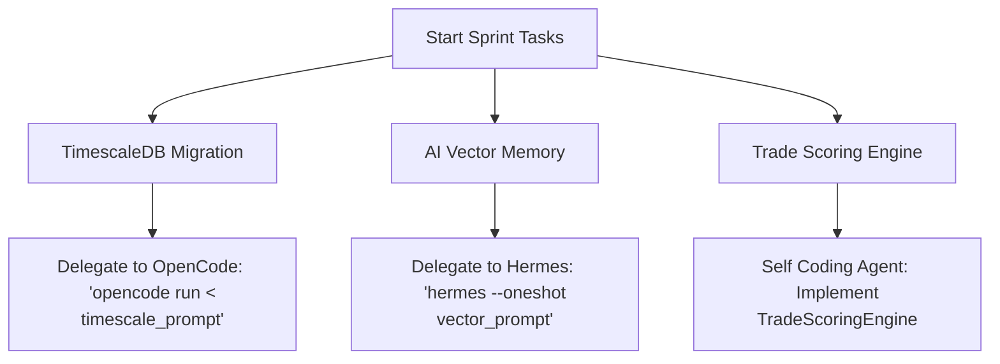

# Audit & Alignment Report: Naked Options Buying Plan

This document compares the institutional-grade **Naked Options Buying Implementation Plan** (from `./options_buying_plan/INDEX.md`) against the actual codebase of the `algo_scalper_api` application. It highlights what is already implemented, what needs update/improvements, and what is missing.

---

## Executive Summary

The `algo_scalper_api` codebase already possesses a **highly mature foundation** for Options Buying. It contains a dedicated `OptionsBuying` namespace (`app/services/options_buying/`) with real-time stream ingestion, 5 pre-built strategy plugins, and 20 entry guards in the `EntryGuardPipeline`.

However, the main deviation from the original roadmap lies in **Phase 2 (Data Platform)** and **Phase 5 (Trade Scoring Engine)**:
1. **No TimescaleDB Partitioning**: The system currently uses Redis (`StateStore`) for real-time tick streaming and in-memory caches. TimescaleDB hypertables for `market_ticks` and `candles` are missing.
2. **Sequential Entry Guards vs. Unified Scoring**: Instead of a weighted composite `TradeScoringEngine` (scoring setups 0–100 based on regime, structure, momentum, and Greeks), the system uses a sequential `EntryGuardPipeline` (fail-fast guards).
3. **No Vector Memory**: Embedding-based similarity searches for historical trades (Phase 7.3) are not implemented.

---

## Detailed Gap Analysis by Phase

### Phase 0 — Foundation & Tooling
*   **Status**: `Partially Implemented`
*   **Implemented Code/Files**:
    *   Rails 8.1.3 API-only core, Puma configuration.
    *   Pre-commit quality gates, `rubocop`, `brakeman`, `bundler-audit` are fully functional.
    *   Database schema defines `instruments`, `derivatives`, `position_trackers`, `trading_signals`, and double-entry `ledger_*` tables.
    *   `AlgoConfig` provides a type-safe settings manager merging YAML configs, database overrides, and environment variables.
*   **Gaps & Required Updates**:
    *   No `market_ticks` or `candles` database tables.
    *   TimescaleDB extension is not enabled in `db/schema.rb`.
*   **Actionable Next Steps**:
    *   Install TimescaleDB in PostgreSQL.
    *   Add migration to create `market_ticks` table with hypertable partitioning.

---

### Phase 1 — DhanHQ Integration
*   **Status**: `Implemented`
*   **Implemented Code/Files**:
    *   [Live::MarketFeedHub](file:///home/nemesis/project/trading-workspace/algo_scalper_api/app/services/live/market_feed_hub.rb): Manages real-time WebSocket subscriptions and distributes ticks.
    *   [OptionsBuying::StreamWriter](file:///home/nemesis/project/trading-workspace/algo_scalper_api/app/services/options_buying/stream_writer.rb): Normalizes raw ticks and streams them to Redis.
    *   [OptionsBuying::StreamConsumer](file:///home/nemesis/project/trading-workspace/algo_scalper_api/app/services/options_buying/stream_consumer.rb): Consumes option ticks in a background thread and evaluates entries.
*   **Gaps & Required Updates**:
    *   Tick streaming is fully functional, but it only feeds Redis Streams (`options_buying:stream:<sec_id>`). It does not persist ticks to PostgreSQL.
*   **Actionable Next Steps**:
    *   Create a background `TickPersistJob` (Solid Queue) to flush batched Redis ticks into the TimescaleDB database periodically (e.g., every 5 seconds).

---

### Phase 2 — Data Platform
*   **Status**: `Partially Implemented`
*   **Implemented Code/Files**:
    *   [OptionsBuying::StateStore](file:///home/nemesis/project/trading-workspace/algo_scalper_api/app/services/options_buying/state_store.rb): Encapsulates Redis keys, streams, and caches.
    *   [OptionsBuying::MinuteBarAggregator](file:///home/nemesis/project/trading-workspace/algo_scalper_api/app/services/options_buying/minute_bar_aggregator.rb): Aggregates ticks to OHLCV bars.
    *   [OptionsBuying::ChainRadar](file:///home/nemesis/project/trading-workspace/algo_scalper_api/app/services/options_buying/chain_radar.rb): Scans the option chain for liquidity and delta bounds, updating Redis.
*   **Gaps & Required Updates**:
    *   Continuous database aggregates for 1m, 5m, 15m, 30m candles are missing (currently cached as JSON in Redis).
    *   No automatic gap filling from DhanHQ historical REST APIs for missing database ranges.
*   **Actionable Next Steps**:
    *   Define continuous aggregates in TimescaleDB.
    *   Implement `CandleGapFiller` inside `HistoricalBackfillService` to query DhanHQ REST API on boot.

---

### Phase 3 — Feature Engineering
*   **Status**: `Implemented`
*   **Implemented Code/Files**:
    *   Technical indicators are located in `app/services/indicators/` ([adx_indicator.rb](file:///home/nemesis/project/trading-workspace/algo_scalper_api/app/services/indicators/adx_indicator.rb), [rsi_indicator.rb](file:///home/nemesis/project/trading-workspace/algo_scalper_api/app/services/indicators/rsi_indicator.rb), [supertrend.rb](file:///home/nemesis/project/trading-workspace/algo_scalper_api/app/services/indicators/supertrend.rb)).
    *   Greeks calculations (delta, gamma walls) are resolved in [Options::ChainAnalyzer](file:///home/nemesis/project/trading-workspace/algo_scalper_api/app/services/options/chain_analyzer.rb).
*   **Gaps & Required Updates**:
    *   Computed indicator values are stored in Redis `StateStore` and local variables. There is no unified Redis Feature Store that standardizes all features to a normalized 0–100 scale.
*   **Actionable Next Steps**:
    *   Create a `Features::Standardizer` service that maps indicator values into standard 0–100 scores.

---

### Phase 4 — Market Intelligence Engines
*   **Status**: `Partially Implemented`
*   **Implemented Code/Files**:
    *   [MarketContext::RegimeComposer](file:///home/nemesis/project/trading-workspace/algo_scalper_api/app/services/market_context/regime_composer.rb): Composes structure, volatility, and participation.
    *   [OptionsBuying::RegimeClassifier](file:///home/nemesis/project/trading-workspace/algo_scalper_api/app/services/options_buying/regime_classifier.rb): Maps indices to `:trending`, `:ranging`, `:low_vix`, `:event_day`, or `:late_day`.
    *   [Smc::Scanner](file:///home/nemesis/project/trading-workspace/algo_scalper_api/app/services/smc/scanner.rb): Detects BOS and CHOCH structure events.
    *   [OptionsBuying::GammaWallDetector](file:///home/nemesis/project/trading-workspace/algo_scalper_api/app/services/options_buying/gamma_wall_detector.rb) & [SlippageChecker](file:///home/nemesis/project/trading-workspace/algo_scalper_api/app/services/options_buying/slippage_checker.rb): Assess option microstructures.
*   **Gaps & Required Updates**:
    *   The 6 market intelligence engines are modeled as independent classes. They do not expose a unified interface (`analyze`) returning standardized confidence scores.
*   **Actionable Next Steps**:
    *   Create base engine interfaces under `app/engines/` representing `ContextEngine`, `RegimeEngine`, `StructureEngine`, `MomentumEngine`, `LiquidityEngine`, and `OptionIntelligenceEngine`.

---

### Phase 5 — Strategy & Decision Layer
*   **Status**: `Partially Implemented`
*   **Implemented Code/Files**:
    *   [OptionsBuying::StrategyEngine](file:///home/nemesis/project/trading-workspace/algo_scalper_api/app/services/options_buying/strategy_engine.rb): Evaluates strategies depending on the classified regime.
    *   Strategies (`app/services/options_buying/strategies/`):
        *   `TripleTfAlignment` (Trend Following)
        *   `OrbBreakout` (Opening Range Breakout)
        *   `VcpBreakout` (Volatility Contraction Pattern / Ranging)
        *   `VixExpansion` (Low VIX Momentum)
        *   `IvPercentileConfluence` (IV Reversion)
    *   [Options::ChainAnalyzer.pick_strikes](file:///home/nemesis/project/trading-workspace/algo_scalper_api/app/services/options/chain_analyzer.rb): Picks ATM option strikes.
*   **Gaps & Required Updates**:
    *   **No TradeScoringEngine**: The decision to enter is binary per strategy, checked by the `EntryGuardPipeline`. There is no composite scorer that applies weights to the different engines.
*   **Actionable Next Steps**:
    *   Implement `TradeScoringEngine` under `app/engines/trade_scoring_engine.rb` aggregating weights: Context (10%), Regime (20%), Structure (20%), Momentum (10%), Liquidity (10%), Option Flow (15%), Greeks (10%), Strike Quality (5%).

---

### Phase 6 — Risk & Execution
*   **Status**: `Implemented`
*   **Implemented Code/Files**:
    *   [Entries::EntryGuardPipeline](file:///home/nemesis/project/trading-workspace/algo_scalper_api/app/services/entries/entry_guard_pipeline.rb): Runs 20 distinct entry checks (daily limits, drawdowns, transaction costs, spreads).
    *   [Orders::GatewayLive](file:///home/nemesis/project/trading-workspace/algo_scalper_api/app/services/orders/gateway_live.rb) & [GatewayPaper](file:///home/nemesis/project/trading-workspace/algo_scalper_api/app/services/orders/gateway_paper.rb): Authoritative live/paper execution paths.
    *   [Live::RiskManagerService](file:///home/nemesis/project/trading-workspace/algo_scalper_api/app/services/live/risk_manager_service.rb): Monitors active positions and enforces exits.
    *   [Live::ExitEngine](file:///home/nemesis/project/trading-workspace/algo_scalper_api/app/services/live/exit_engine.rb): AUTHORITATIVE execution point for position exits.
*   **Gaps & Required Updates**:
    *   Position sizing in `SizingGuard` is currently static or based on static capital configuration. Dynamic position sizing (e.g., Kelly Criterion adjustments) is missing.
*   **Actionable Next Steps**:
    *   Implement Kelly Criterion sizing in `SizingGuard` using the `learning_records` expectancy history.

---

### Phase 7 — AI Gateway
*   **Status**: `Partially Implemented`
*   **Implemented Code/Files**:
    *   [OllamaClient](file:///home/nemesis/project/trading-workspace/algo_scalper_api/lib/services/ai/ollama_client.rb): Serialized, prioritized local model router.
    *   [TechnicalAnalysisAgent](file:///home/nemesis/project/trading-workspace/algo_scalper_api/lib/services/ai/technical_analysis_agent.rb): Prompts local models (like `llama3.2:3b`) for market analysis.
*   **Gaps & Required Updates**:
    *   No pgvector database tables or embedding generator for trade memory (Milestone 7.3).
    *   Missing specialized AI agents: `SetupValidatorAgent`, `TradeReviewerAgent`, `JournalWriterAgent`.
*   **Actionable Next Steps**:
    *   Add `pgvector` migration.
    *   Create specialized prompts under `app/prompts/` and implement the corresponding agents.

---

### Phase 8 — Learning & Optimization
*   **Status**: `Partially Implemented`
*   **Implemented Code/Files**:
    *   `trade_telemetry` and `trade_analytics` tables persist entry/exit states, MAE, MFE, slippage, and hold times.
*   **Gaps & Required Updates**:
    *   No `learning_records` table storing strategy expectancy, average R:R, and sample sizes over time. No closed-loop feedback modifying execution parameters.
*   **Actionable Next Steps**:
    *   Create `learning_records` database table.
    *   Implement a post-trade analysis service that updates `learning_records` after every exit.

---

### Phase 9 — Dashboard & Operations
*   **Status**: `Implemented`
*   **Implemented Code/Files**:
    *   Next.js dashboard displays open/closed positions, live PnL, settings, and health status.
    *   `Api::DashboardController` serves real-time ActionCable ticks.
    *   [TelegramNotifier](file:///home/nemesis/project/trading-workspace/algo_scalper_api/lib/notifications/telegram_notifier.rb): Sends entry/exit notifications.
*   **Gaps & Required Updates**:
    *   Prometheus client and Grafana metrics are missing.
*   **Actionable Next Steps**:
    *   Add Prometheus metrics client.

---

### Phase 10 — Testing & Quality Assurance
*   **Status**: `Implemented`
*   **Implemented Code/Files**:
    *   RSpec test suite is comprehensive and passing (`90 examples, 0 failures` for options buying).
    *   Robust paper trading broker (`GatewayPaper`) with realistic matching and slippage.
    *   Backtest and market replayers exist.
*   **Gaps & Required Updates**:
    *   Walk-forward optimization harness is missing.
*   **Actionable Next Steps**:
    *   Implement `WalkForwardTestRunner` inside `BacktestService`.

---

### Phase 11 — Live Trading & Operations
*   **Status**: `Implemented`
*   **Implemented Code/Files**:
    *   `LiveTradingGuard` and circuit breakers.
    *   Reconciliation service runs every 30s.

---

## Actionable Strategy: Parallelizing with OpenCode and Hermes

To complete the Naked Options Buying platform efficiently, we can delegate tasks to **OpenCode** and **Hermes** running in parallel:



### Prompt for OpenCode (Database / Ingestion tasks):
```text
Write a Rails migration to add pgvector and TimescaleDB extensions, create the market_ticks table partitioned by time, and create continuous aggregates for 1m, 5m, 15m, and 30m candles.
```

### Prompt for Hermes (AI / Vector memory tasks):
```text
Implement an EmbeddingService using Ollama local embeddings that converts trade features to vectors and searches the vector_embeddings table for similar historical trades.
```
