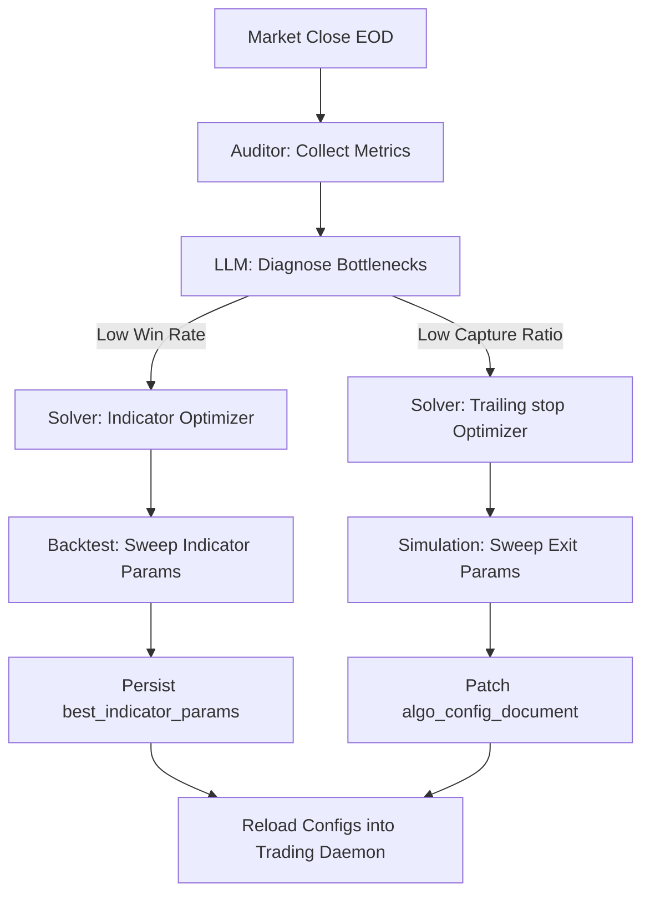

# Autonomous Self-Learning & Optimization Architecture

This document outlines how the `algo_scalper_api` platform automatically tunes, optimizes, and adapts its parameters based on historical trade execution, option chain Greeks, and underlying index backtests.

---

## 1. The Observe-Think-Act Optimization Loop

The continuous improvement engine operates as a closed feedback loop managed by [Ai::Autonomous::Orchestrator](file:///app/services/ai/autonomous/orchestrator.rb). It runs on a scheduled basis (after market close) to audit, analyze, and recalibrate system parameters.

---

## 2. Phase A: Observation & Diagnostic Auditing

The [Ai::Autonomous::Auditor](file:///app/services/ai/autonomous/auditor.rb) queries the database to build a complete diagnostic model of the system's performance over the last $N$ days (default: 30 days):

### 1. Performance Telemetry (from `position_trackers` table)
*   **Realized Expectancy**: Total trades, win rate %, profit factor, and average R-multiple.
*   **Drawdown Metrics**: Computes rolling equity curve peaks and maximum drawdowns.
*   **Exit Breakdown**: Segregates exited trades by triggers: `STOP_LOSS`, `TAKE_PROFIT`, `ADAPTIVE_TRAIL`, `TIME_STOP`, or `ZERO_HWM_KILL`.

### 2. Capture Efficiency (from `trade_analytics` table)
*   **MFE (Maximum Favorable Excursion)**: Caches the peak paper profit reached during the trade's lifetime.
*   **MAE (Maximum Adverse Excursion)**: Caches the peak paper loss reached during the trade's lifetime.
*   **PnL Capture Ratio**: Evaluates how much of the trade's total potential MFE was captured before exiting:
    $$\text{Capture Ratio} = \frac{\text{Realized P\&L}}{\text{Maximum Favorable Excursion}}$$

---

## 3. Phase B: AI Bottleneck Diagnostics

The [OllamaClient](file:///lib/services/ai/ollama_client.rb) processes the Auditor's report. It uses open-weights models to make a logical decision:

*   **Low Win Rate ($< 50\%$)**: The bottleneck is signal quality. The AI selects the **`indicator_tuning`** solver to refine entry triggers and filters.
*   **Low Capture Ratio ($< 0.60$)**: The bottleneck is exit efficiency. The AI selects the **`trailing_optimization`** solver to tighten stop trails and lock in profits.

---

## 4. Phase C: Parameter Optimization Sweeps

Once a solver is chosen, the [TaskRunner](file:///app/services/ai/autonomous/task_runner.rb) triggers the appropriate parameter sweeps:

### 1. Technical Indicators Sweep (`Optimization::SingleIndicatorOptimizer`)
*   **Historical Candles Replay**: Loads historical 5-minute index candles (`intraday_ohlc`) for the lookback window.
*   **Grid Search Parameter Sweeps**:
    *   **ADX**: Sweeps period lengths ($10$ to $25$) and strength thresholds ($20$ to $35$).
    *   **Supertrend**: Sweeps ATR periods ($8$ to $16$) and multiplier widths ($1.5$ to $4.0$).
    *   **RSI**: Sweeps oversold/overbought triggers.
*   **Expectancy Evaluation**: Compiles win rate and average price movement for each combination.
*   **Database Upsert**: Saves the highest expectancy parameters to the `best_indicator_params` table. The strategy engine fetches these parameters dynamically on the next tick.

### 2. Trailing stops Exit Sweep (`Optimization::TrailingOptimizer`)
*   **Historical Exited Trades Replay**: Reads `trade_analytics` coordinates (MFE/MAE/timestamps) for all exited trades.
*   **Exit Logic Simulation**: Runs simulations over different trailing exit variables:
    *   **Early Trigger**: Minimum gain required to tighten stops to protect capital.
    *   **Breakeven Trigger**: Gain threshold to shift stops to entry price (zero-risk).
    *   **Activation Trigger**: Profit level where strict trailing stop tracking begins.
    *   **Trailing Distance**: Width of the trailing stop buffer.
*   **Parameter Solver**: Finds the configuration that maximizes P&L expectancy across those trades.
*   **Config Patch**: Automatically merges the optimized settings directly into the `algo_config_document` settings.

---

## 5. Expiry & Option Greeks Calibration

For options contracts, [Options::AutoCalibrator](file:///app/services/options/auto_calibrator.rb) evaluates contract premium fluctuations:

*   **Real Contract Premiums**: The calibrator reads actual expired option contract candles from the `ExpiredFetcher`.
*   **Delta & Gamma Decay Calibration**: It matches underlying index breakout moves with the option premium's speed of response (leveraging delta and gamma walls).
*   **SL/TP Optimization**: Proposes updated base stop-losses and take-profit targets for options legs to account for IV changes and theta decay, saving the presets to the configuration.
