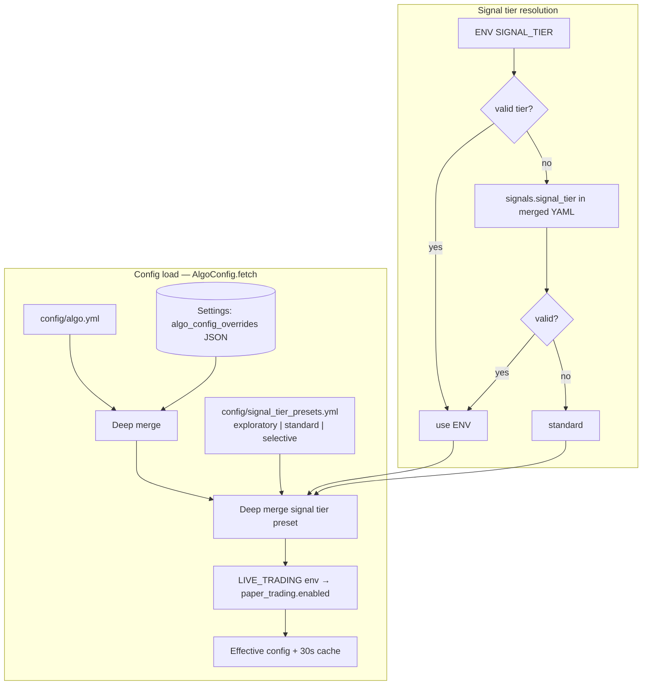
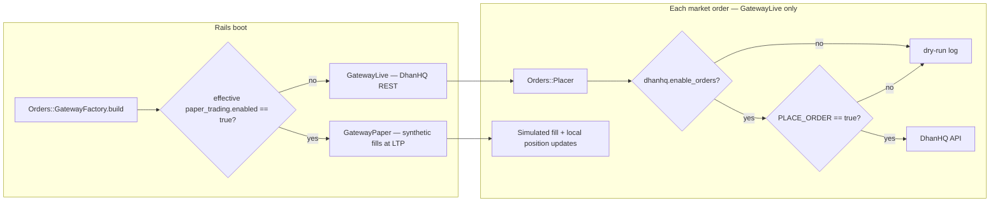
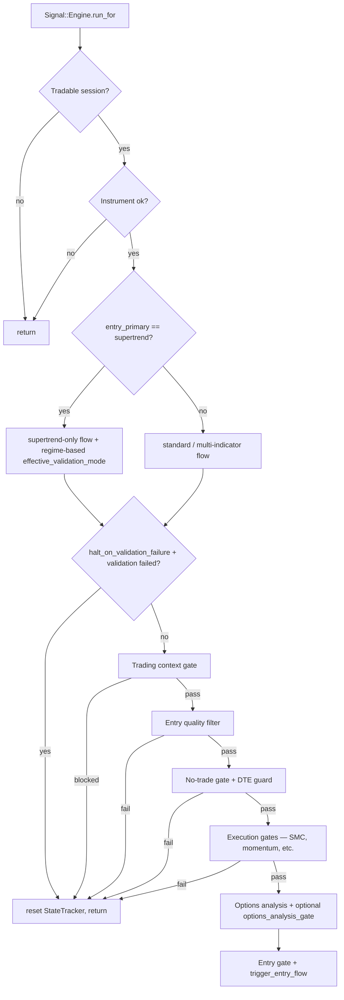
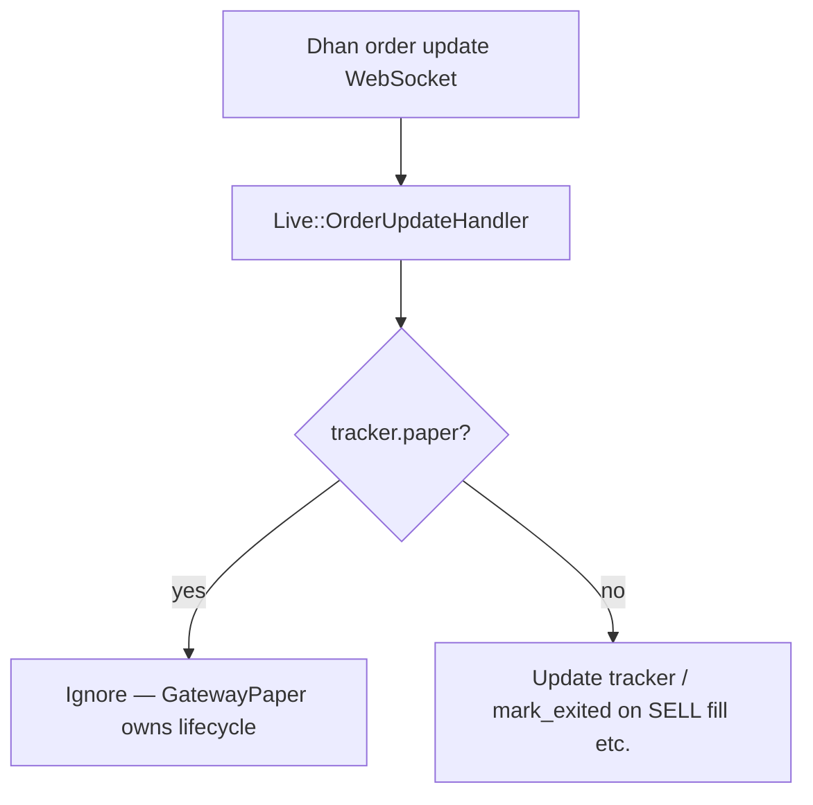
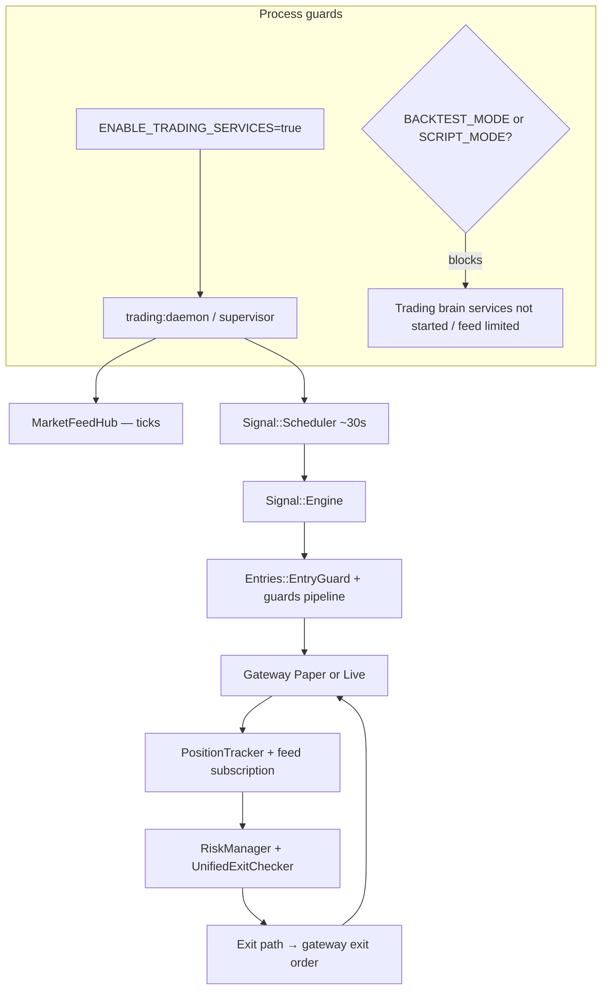

# Trading Modes Flow Diagrams

Mermaid diagrams for how **automated trading modes** combine in Algo Scalper API. Modes are
orthogonal: **effective algo config** (YAML + DB + signal tier + `LIVE_TRADING`), paper vs live
gateway, live order safety (`PLACE_ORDER` + `dhanhq.enable_orders`), and daemon environment
flags.

See also: [Architecture diagrams index](../architecture/diagrams/README.md),
`config/algo.yml`, `config/signal_tier_presets.yml`, `app/lib/algo_config.rb`,
`app/services/signal/engine.rb`, `app/services/orders/gateway_factory.rb`.

---

## Configuration Stack (Effective `AlgoConfig.fetch`)

Effective config is built in this order (each step deep-merges into the previous):

1. `config/algo.yml`
2. DB `settings.algo_config_overrides` (JSON)
3. Overlay from `config/signal_tier_presets.yml` for the active tier
4. `LIVE_TRADING` env forces `paper_trading.enabled` (see below)

---

## LIVE_TRADING And Paper Vs Live Gateway

`LIVE_TRADING` is evaluated after tier merge. When unset or false, **`paper_trading.enabled` is
forced true** (paper). When true, **`paper_trading.enabled` is forced false** (live gateway path).
`dhanhq.enable_orders` and `PLACE_ORDER` still gate actual broker submission on live.

---

## Signal Engine: Single Pipeline

There is **no** `run_mode` / `exit_testing` branch. Strategy and strictness come from merged YAML
and tier preset (e.g. `signals.entry_strategy`, `signals.validation_modes`,
`halt_on_validation_failure`, gates).

---

## Live Order Updates: Paper Trackers Ignored

WebSocket order updates adjust live trackers only; paper positions are owned by `GatewayPaper`.

---

## Trading Daemon: High-Level Automation Loop

Requires `ENABLE_TRADING_SERVICES=true`. Certain env flags suppress the trading brain or feed
behaviour (see `lib/trading_system/daemon.rb`, `Live::MarketFeedHub`).

---

## Signal Tier Quick Reference

| Tier | Source | Intent |
|------|--------|--------|
| `exploratory` | `SIGNAL_TIER=exploratory` or `signals.signal_tier` | Overlay from preset YAML — most permissive for research/paper |
| `standard` | Default when tier missing/invalid | Preset may be empty — behaviour matches `algo.yml` + DB as merged |
| `selective` | `SIGNAL_TIER=selective` or YAML | Stricter overlay from preset (not a profit guarantee) |

Tier choice does **not** switch gateways; use **`LIVE_TRADING=true`** for live gateway selection
at boot (restart required after change).
