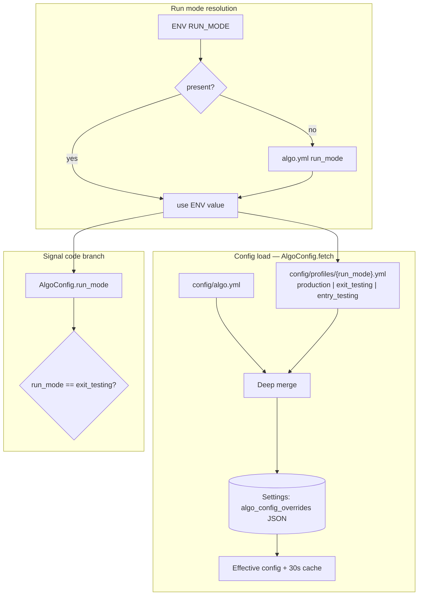
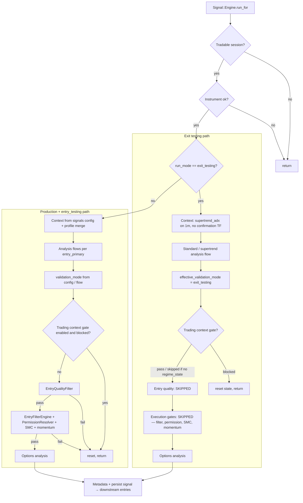
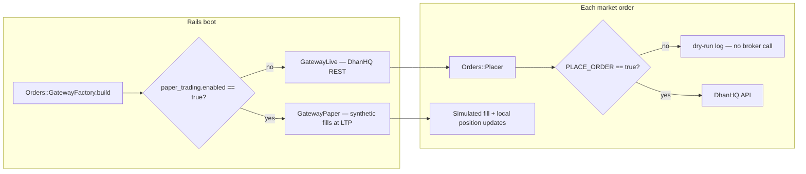
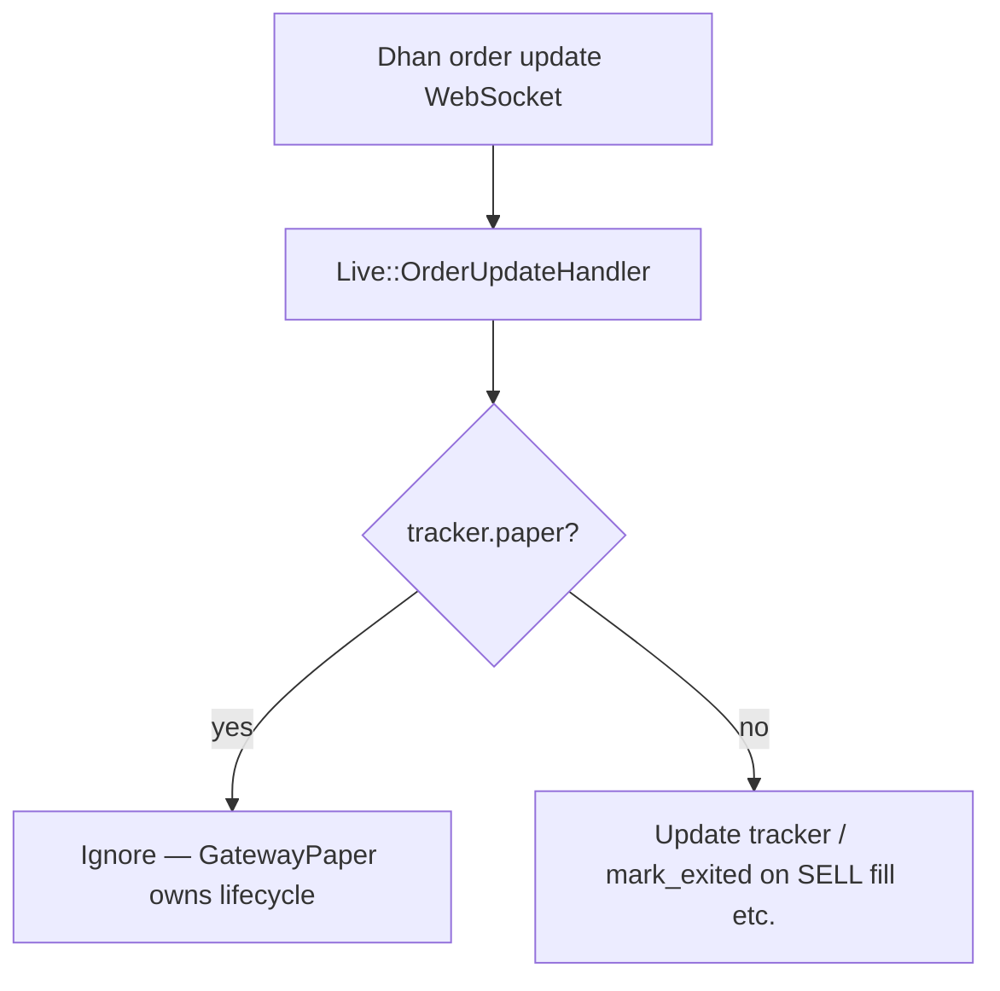
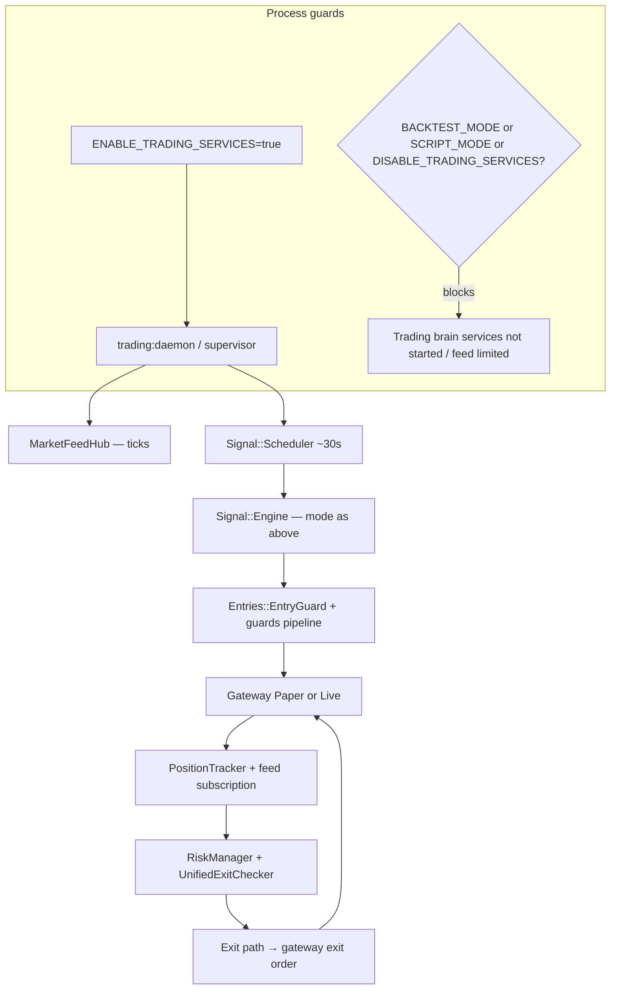

# Trading Modes Flow Diagrams

Mermaid diagrams for how **automated trading modes** combine in Algo Scalper API. Modes are
orthogonal: run profile (`RUN_MODE` + YAML profile), paper vs live gateway, live order safety
(`PLACE_ORDER`), and daemon / safety environment flags.

See also: [Architecture diagrams index](../architecture/diagrams/README.md),
`config/algo.yml`, `config/profiles/*.yml`, `app/lib/algo_config.rb`,
`app/services/signal/engine.rb`, `app/services/orders/gateway_factory.rb`.

---

## Configuration Stack And Run Mode

Effective algo config is built from base YAML, an optional profile keyed by `run_mode`, and DB
overrides. `Signal::Engine` only special-cases `run_mode == exit_testing` in Ruby; `entry_testing`
relies on merged YAML (relaxed thresholds, flags).

---

## Signal Engine: Exit Testing Vs Production And Entry Testing

`production` and `entry_testing` share the same pipeline; profile YAML differs.
`exit_testing` forces a faster path (e.g. 1m primary, skips several gates).

---

## Order Execution: Paper Vs Live And Place Order Gate

Gateway is chosen at boot (`Orders::GatewayFactory`). Live orders still require `PLACE_ORDER`
(and `dhanhq.enable_orders` per deployment docs) or the placer dry-runs.

---

## Live Order Updates: Paper Trackers Ignored

WebSocket order updates adjust live trackers only; paper positions are owned by `GatewayPaper`.

---

## Trading Daemon: High-Level Automation Loop

Requires `ENABLE_TRADING_SERVICES=true`. Certain env flags suppress the trading brain or feed
behaviour (see `lib/trading_system/daemon.rb`, `Live::MarketFeedHub`).

---

## Profile Files Quick Reference

| Profile (`config/profiles/`) | Code path in `Signal::Engine` | Main intent |
|------------------------------|--------------------------------|-------------|
| `production.yml` | Full pipeline (same as base) | Default real / paper evaluation behaviour. |
| `exit_testing.yml` | **`exit_testing` branch** + merged YAML | Many more entries; stress-test exits. |
| `entry_testing.yml` | Full pipeline, relaxed merged YAML | More signals through guards; test entry path. |

Set via `run_mode` in `config/algo.yml` or `ENV RUN_MODE` (see `.env.example`).
