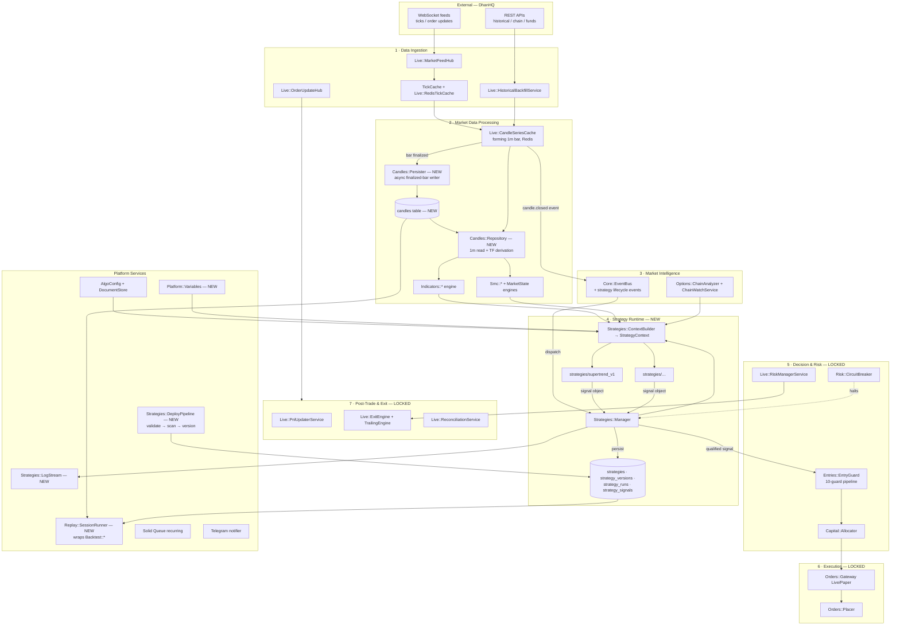

# 02 — Target Architecture

End-state component architecture after all phases of [08](08_migration_roadmap.md). Boxes from the
diagrams are mapped to concrete Ruby classes; `NEW` marks net-new builds.

## Component diagram

## Signal flow trace (live, per 1m candle close)

1. **Tick** arrives → `Live::MarketFeedHub` → `TickCache` →
   `Live::CandleSeriesCache#append_tick` updates the forming 1m bar (Redis). *(unchanged)*
2. **Minute closes** → the finalized bar is (a) handed to `Candles::Persister` for an async
   Postgres insert (indices only, D-03.3/D-03.4) and (b) published as `:candle_closed` on
   `Core::EventBus` with `{instrument_key, timeframe, ts}`. *(NEW)*
3. **`Strategies::Manager`** receives the event and wakes each running strategy subscribed to that
   instrument/timeframe. *(NEW — replaces `Signal::Scheduler`'s fixed 30s poll)*
4. **`Strategies::ContextBuilder`** assembles an immutable `StrategyContext` snapshot: candle
   series (via `Candles::Repository`), indicators, SMC/market-state reads, option chain snapshot,
   position/risk state, clock/session, resolved params (variables → manifest defaults). *(NEW)*
5. **Plugin `#call(context)`** returns a signal object (`Signals::BuyCall` / `BuyPut` / `Exit` /
   `Hold`). *(NEW — the extracted alpha logic)*
6. **Manager** persists the signal to `strategy_signals`, broadcasts on `StrategyStatusChannel`,
   and for actionable signals invokes the **unchanged** platform path:
   `Options::ChainAnalyzer.pick_strikes_with_qualification` → `Entries::EntryGuard.try_enter`
   (10 guards, advisory lock, sizing via `Capital::Allocator`) → gateway. *(reuse, LOCKED)*
7. **Position monitoring and exits** unchanged: tick → PnlUpdater → RiskManager →
   UnifiedExitChecker → ExitEngine.

Exit signals from plugins are **advisory**: they route through `Live::ExitEngine` (the single
source of truth for exit placement) and never bypass risk enforcement.

## Process model

| Process (`Procfile.dev`) | Runs | Platform additions |
| --- | --- | --- |
| `web` (`bin/rails server`) | API controllers, ActionCable | Strategy/variables/replay/backtest/log controllers + channels ([07](07_api_and_frontend_contract.md)). Web process **reads** registry state; lifecycle commands are forwarded to the daemon (see D-02.4) |
| `trading` (daemon) | Supervisor + ~20 services | `Strategies::Manager` registered as a supervised service; candle persist hook; strategy threads |
| `jobs` (`bin/jobs`) | Solid Queue workers | Backtest/replay jobs, candle backfill job, retention job |
| `dashboard` (Vite) | SolidJS SPA | Wired Strategies/Backtester/Replay views |

- **D-02.4 — Cross-process command channel.** Web and daemon are separate OS processes sharing
  Postgres + Redis. Lifecycle commands (start/stop/restart strategy) are written by the API as
  rows/flags (a `desired_status` column on `strategies` plus a lightweight Redis nudge key);
  the daemon's `Strategies::Manager` reconciles desired vs actual state in its control loop
  (same pattern as `Risk::CircuitBreaker`'s cache-backed trip flag). No direct RPC between
  processes.

## Event architecture

- **D-02.1 — Reuse `Core::EventBus` (in-process); no Redis pub/sub.** Everything latency-sensitive
  runs inside the daemon. Redis pub/sub would add serialization, latency, and failure modes with
  zero benefit at single-user scale. The fixed `EVENTS` enum in
  `app/services/core/event_bus.rb` is extended with:
  `candle_closed`, `strategy_started`, `strategy_stopped`, `strategy_signal`, `strategy_error`.
- **D-02.2 — Signals are immutable value objects** (`Signals::BuyCall`, `Signals::BuyPut`,
  `Signals::Exit`, `Signals::Hold` — confidence, reason, metadata). Plugins can never reach
  gateways: the only executable path is manager → EntryGuard.
- **D-02.3 — LOCKED layers consumed as-is.** The runtime plugs in above EntryGuard, exactly where
  `Signal::Engine.run_for` sits today. No changes to gateways, feeds, position lifecycle, or risk
  plumbing (single supervisor carve-out excepted → [09](09_risks_and_change_policy.md)).
- **D-02.5 — Durable audit stays on the event-store pattern.** Strategy signals get a dedicated
  `strategy_signals` table (queryable, joins to versions/runs) rather than overloading
  `smc_events`; lifecycle transitions land in `strategy_runs`. `EventStore::Publisher` remains
  the pattern for schema-validated append-only streams if richer audit is needed later.

## State ownership

| State | Owner | Store | Durability |
| --- | --- | --- | --- |
| Forming 1m bar | `Live::CandleSeriesCache` | Redis | Ephemeral (TTL 3600s) |
| Finalized 1m bars (indices) | `Candles::Persister` → `Candles::Repository` | Postgres `candles` | Durable |
| Ticks | `RedisTickCache` / `TickCache` | Redis + memory | Ephemeral (24h TTL) |
| Option chain snapshots | `ChainWatchService` | Redis/memory | Ephemeral |
| Strategy metadata/versions/runs/signals | Registry | Postgres | Durable |
| Strategy code | Workspace `strategies/` | Filesystem (git) | Durable, versioned |
| Variables | `Platform::Variables` | Postgres | Durable |
| Trading config | `AlgoConfig` document | Postgres `settings` | Durable, audited |
| Positions / PnL | `PositionTracker` + `RedisPnlCache` | Postgres + Redis | Durable + cache |
| Strategy runtime status | `Strategies::Manager` | Memory + `strategies.status` + Redis heartbeat | Reconciled |
| Strategy logs | `Strategies::LogStream` | File + Redis ring buffer | File durable, ring ephemeral |
