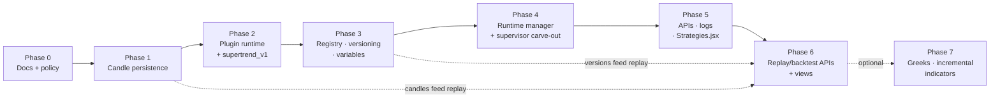

# 08 — Migration Roadmap

Seven phases. Ordering principle: durable data first, then extract the strategy in place, then add
platform machinery around it, then expose it. Phases 1–3 ship with **zero LOCKED-file changes**;
Phase 4 is the single carve-out point.

## Dependency graph

## Phase 0 — Documentation + policy sign-off

**This deliverable.** Plus: agree the CLAUDE.md carve-out wording ([09](09_risks_and_change_policy.md))
before any Phase-4 work.

*Gate:* user approves D-00.2 (files-not-DB), D-01.1 (delete-and-rebuild), D-01.3 (Signal::Engine
deletion), D-02.1 (in-process bus), D-03.3 (indices-only candles), D-10.1 (skip Greeks), and the
carve-out text. *(Decisions confirmed during planning, July 2026; carve-out text pending until
Phase 4.)*

## Phase 1 — Candle persistence ([03](03_data_layer.md))

| Build | Reuse |
| --- | --- |
| `candles` migration, `Candles::Record` model | `Live::CandleSeriesCache` (finalization seam) |
| `Candles::Persister` (async batching writer) | `Live::HistoricalBackfillService` (extra sink) |
| `Candles::Repository` (1m read + TF derivation + forming-bar merge) | `Backtest::ApiLoader`, `candle_extension.rb` fetch primitives |
| `Candles::BackfillJob`, `Candles::RetentionJob` + recurring.yml entries | `Market::Calendar` trading-day math |

LOCKED touches: **none** (persist hook is an additive seam, not a feed/caching change).

*Gate:* (1) full session's stored 1m bars match a fresh DhanHQ `intraday_ohlc` pull bar-for-bar;
(2) mid-session daemon kill → restart backfills the gap, no unique-index violations; (3) derived
5m/15m match broker-native fetches; (4) tick-path latency unchanged.
*Rollback:* disable the persist hook (feature flag) — Redis path is untouched.

## Phase 2 — Strategy plugin runtime, in place ([04](04_strategy_plugin_system.md))

| Build | Reuse / remove |
| --- | --- |
| `Strategies::Base`, `Strategies::StrategyContext` + `ContextBuilder`, `Signals::*` value objects | Reuse: indicators, SMC engines, chain analyzer, `TradingSession`, AlgoConfig |
| `strategies/supertrend_v1/` — alpha logic extracted from `Signal::Engine` | Freeze: `Signal::Engine`/`Signal::Scheduler` (no logic changes from here on) |
| Shadow-mode harness: plugin runs off the same candle closes, signals persisted (interim table or log) with `outcome: "shadow"` | **Delete after harvest**: `app/services/strategy/{base,registry,orchestrator}.rb`, `app/services/context/builder.rb`, `Domain::TradingContext`, `app/services/orchestration/strategy_runner.rb` (D-01.1) |
| Replay-parity harness (drive both paths over stored sessions, diff decisions) | Reuse `Backtest::MarketReplayer` for the harness |

LOCKED touches: **none** (shadow mode piggybacks; EntryGuard untouched).

*Gate:* **replay parity** — identical buy_call/buy_put/hold decisions between plugin and frozen
`Signal::Engine` on ≥3 recorded sessions (Phase-1 candles), plus one live paper session with
shadow signals matching engine decisions. Dead scaffold deleted, suite green
(`bundle exec rspec`, `rubocop`).
*Rollback:* plugin is shadow-only; nothing trades through it yet.

## Phase 3 — Registry, versioning, variables ([04](04_strategy_plugin_system.md), [06](06_platform_services.md))

| Build | Reuse |
| --- | --- |
| Migrations: `strategies`, `strategy_versions`, `strategy_runs`, `strategy_signals`, `platform_variables` | AlgoConfig layering idiom + change-log audit pattern |
| `Strategies::DeployPipeline` (validate → scan → snapshot → register) | Rswag pattern for later API specs |
| AST security scanner + `scan_report` | |
| Template generator (`rails g strategy` / rake) + `strategies/_templates/` | |
| Checksum-verified loader | |

LOCKED touches: **none**.

*Gate:* `supertrend_v1` deployed through the pipeline (v1), a param tweak deployed as v2, checksum
verification catches a hand-edited release file, scan report stored and blockers enforced
(a test strategy with `system(...)` fails deploy).
*Rollback:* tables are additive; pipeline unused until Phase 4 flips execution.

## Phase 4 — Runtime manager + supervisor carve-out ([05](05_runtime_manager.md))

| Build | LOCKED carve-out (the only one) |
| --- | --- |
| `Strategies::Manager` (control loop, runner threads, heartbeats, crash backoff, error-limit auto-stop, kill-switch pause, market-close handling) | `lib/trading_system/supervisor.rb`: add `start_service/stop_service/restart_service` (refactor of existing loops) |
| EventBus additions: `candle_closed`, `strategy_*` events | `lib/trading_system/bootstrap.rb`: register `:strategy_manager` |
| `desired_status` reconciliation (D-02.4) | Deregister `:signal_scheduler` |
| **Cutover**: supertrend_v1 goes from shadow → live (paper mode first); delete `Signal::Engine` + `Signal::Scheduler` | |

*Gate:* start/stop/restart/deploy via console + reconciliation; induced crash → backoff restart →
error-limit auto-stop + Telegram alert; circuit-breaker trip pauses dispatch for all strategies;
full paper session traded by the plugin with results matching the pre-cutover baseline; legacy
files deleted, suite green.
*Rollback:* revert the cutover commit — Phase 2's frozen engine restores the old path (keep the
freeze branch/tag until Phase 5 completes).

## Phase 5 — APIs, logs, dashboard ([06](06_platform_services.md), [07](07_api_and_frontend_contract.md))

| Build | Reuse |
| --- | --- |
| `Api::StrategiesController`, `Api::VariablesController` + routes + Rswag specs | Existing auth, controller/serializer patterns |
| `StrategyStatusChannel`, `StrategyLogsChannel` | Existing ActionCable/solid_cable setup |
| `Strategies::LogStream` (tagged file + Redis ring + broadcast) | Existing structured-log helpers |
| Rebuild `Strategies.jsx` against the API | Existing SolidJS API client, UI kit, cable helper |

LOCKED touches: **none** (controllers/routes are explicitly exempt for new endpoints per CLAUDE.md).

*Gate:* full lifecycle (create-from-template → edit → deploy → start → observe live logs/status →
stop) driven entirely from the dashboard; log tail streams live.

## Phase 6 — Replay & backtest APIs ([06](06_platform_services.md), [07](07_api_and_frontend_contract.md))

| Build | Reuse |
| --- | --- |
| `replay_sessions` migration, `Replay::SessionRunner`, `Replay::SessionJob`, `Api::ReplaysController`, `ReplayProgressChannel` | **Entire `Backtest::*` suite** (engine, replayer, simulator, metrics, report), `EventStore::ReplayEngine`, Phase-1 candles, Phase-3 versions |
| Wire `Backtester.jsx` + `Replay.jsx` | `lightweight-charts` for equity/markers |

*Gate:* dashboard-triggered replay of a `supertrend_v1` version over a stored day completes async
with progress updates and renders metrics + trade markers.

## Phase 7 (optional) — Greeks + incremental indicators ([10](10_greeks_and_indicator_streaming.md))

Enter only if the documented revisit triggers fire (replay needs synthetic greeks; indicator
latency measurably hurts). Otherwise formally skipped — record the skip in 10.

*Gate:* profiling numbers justify entry, or the phase is closed as skipped.

## Definition of done (whole program)

- `Signal::Engine` / `Signal::Scheduler` / dead scaffold deleted; `supertrend_v1` trades via
  `Strategies::Manager` (paper verified; live per the usual `LIVE_TRADING` gates).
- Index 1m candles persist durably; replay runs from the local store.
- A second strategy can be created from a template, deployed, and run **without touching platform
  code** — the acid test of the plugin boundary.
- Dashboard: Strategies / Backtester / Replay views fully functional.
- CLAUDE.md updated: carve-out consumed, architecture/services tables reflect the new components,
  `Signal::*` references removed.
