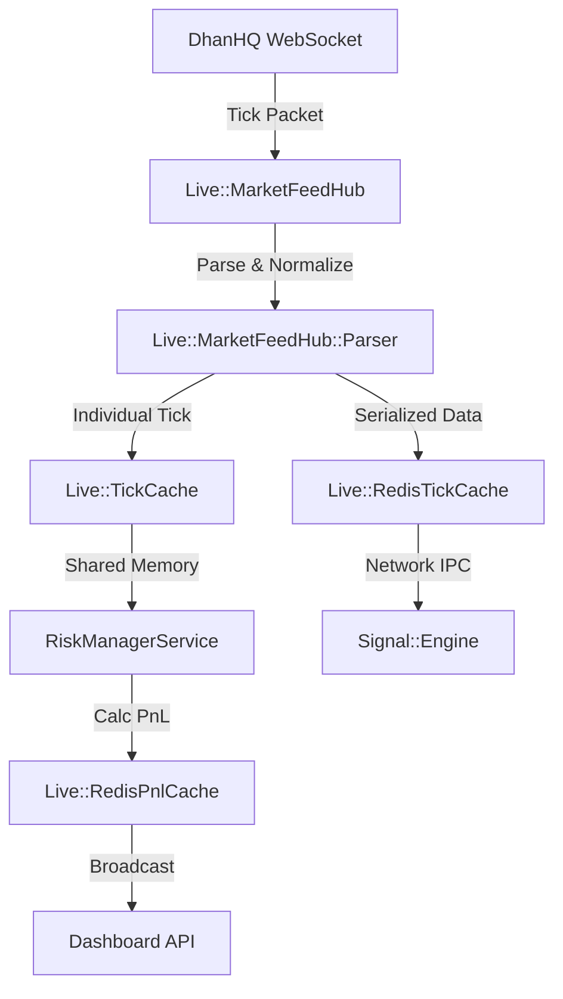

# Market Data Flow

Architecture of real-time price ingestion and internal distribution.

## Architecture Diagram

## Components

### 1. MarketFeedHub
A singleton service that manages the life of the DhanHQ WebSocket connection. It handles re-connections, authentication via tokens, and symbol subscription management.

### 2. Tick Caches
- **In-Memory Cache**: Used for ultra-low latency within the same Ruby process (e.g., the Trading Daemon).
- **Redis Cache**: Used for inter-process communication (IPC), allowing the Web Dashboard and Sidekiq jobs to access the latest price without hitting the broker API.

### 3. PnL Updates
The `RiskManagerService` calculates the live PnL of all active `PositionTracker` entries by comparing their `entry_price` to the `ltp` stored in the Tick Cache. Resulting PnL values are cached in Redis for the Dashboard to consume.
