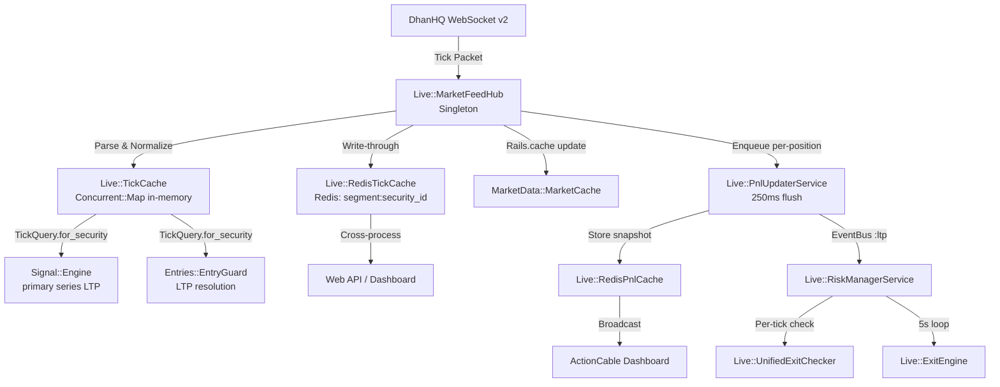

# Market Data Flow

Architecture of real-time price ingestion and internal distribution.

## Architecture



## Components

### 1. MarketFeedHub (Entry Point)

`Live::MarketFeedHub` — Singleton WebSocket gateway.

- Maintains persistent DhanHQ v2 WebSocket connection
- Handles authentication via `Dhan::TokenManager`
- Manages subscriptions for:
  - Index instruments (NIFTY, BANKNIFTY, SENSEX) — subscribed at startup
  - Option instruments — subscribed when positions open; unsubscribed when positions close
- Reconnects automatically on network drops; resubscribes all active instruments on reconnect

**Per tick received:**
1. Parse binary/JSON packet → normalize to tick hash
2. `TickCache.put(tick)` — in-memory write
3. `RedisTickCache.put(tick)` — Redis write (write-through; graceful if Redis down)
4. `MarketData::MarketCache.update_ltp` — Rails.cache update
5. `PositionIndex.trackers_for(security_id)` — O(1) lookup for affected positions
6. `PnlUpdaterService.cache_intermediate_pnl(tracker_id:, ltp:)` — enqueue for 250ms batch

### 2. Tick Caches

**In-Memory Cache (`Live::TickCache`)**:
- `Concurrent::Map` — thread-safe O(1) reads/writes
- Used for ultra-low latency within the trading daemon process
- `TickQuery.for_security` is the authoritative read boundary (returns nil on miss)
- Never throws on miss — `nil` means stale/absent

**Redis Cache (`Live::RedisTickCache`)**:
- Keyed by `"tick:#{segment}:#{security_id}"`
- Enables cross-process access: web API, dashboard, Signal Engine (if in separate process)
- TTL-based expiry to prevent stale data
- Graceful degradation: if Redis is down, in-memory cache still serves the trading process

### 3. PnL Updater (250ms Batch)

`Live::PnlUpdaterService` — batches per-tick LTP updates into periodic PnL flushes.

**Flow:**
```
cache_intermediate_pnl(tracker_id, ltp)  [called per tick; last-wins per tracker]
  ↓ [every 250ms]
  → Batch DB load (single query for all queued tracker IDs)
  → TickQuery.for_security → TickCache → Redis
  → gross_pnl = (ltp - entry_price) * qty
  → net_pnl = gross_pnl - BrokerFeeCalculator.fees
  → pnl_pct = (ltp - entry_price) / entry_price  [DECIMAL]
  → Update HWM: max(redis_hwm, current_pnl)
  → RedisPnlCache.store_pnl → (DB sync throttled to 30s)
  → EventBus.publish(:ltp, { tracker_id, ltp, pnl, pnl_pct, hwm })
  → ActionCable broadcast to "positions" channel
  → tracker.cache_live_pnl  [in-memory, NO DB write]
```

**Key invariants:**
- Never writes directly to DB (uses Redis; DB synced on 30s throttle)
- `pnl_pct` is DECIMAL format (0.10 = 10%)
- HWM is updated continuously (no lag)

### 4. RedisPnlCache (Cross-Process PnL)

`Live::RedisPnlCache` — Redis snapshot store for PnL.

- Stores per-tracker: `{ pnl_rupees, pnl_pct, hwm_pnl, ltp, updated_at }`
- Read by:
  - `Live::RiskManagerService` (per-tick and 5s loop)
  - `Live::UnifiedExitChecker`
  - Web API / dashboard
- DB sync: `sync_pnl_to_database_throttled` every 30s

### 5. EventBus (:ltp)

`Core::EventBus.publish(:ltp, payload)` — lightweight pub/sub for the `:ltp` event.

**Current subscriber:** `Live::RiskManagerService#handle_pnl_event`

**Note:** EventBus is the notification mechanism for high-frequency per-tick risk checks. It is not the active communication layer for general service coordination (which uses direct calls).

### 6. TickQuery (Read Boundary)

`Live::TickQuery` — authoritative LTP read boundary.

```ruby
Live::TickQuery.for_security(segment:, security_id:)
# → Float (LTP) or nil (cache miss)
```

All services that need current LTP must use `TickQuery`, not raw `TickCache` or Redis directly.

**Critical**: Returns `nil` on miss — callers must treat `nil` as stale data, never as 0.

---

## Data Latency Profile

| Stage | Typical Latency |
|-------|----------------|
| DhanHQ WebSocket → MarketFeedHub | Sub-millisecond |
| MarketFeedHub → TickCache | < 1ms (in-process) |
| MarketFeedHub → RedisTickCache | 1-5ms |
| PnlUpdaterService flush | 0-250ms (batch window) |
| RedisPnlCache → Dashboard | 1-5ms |
| DhanHQ order fill → DB | 250ms-2s (fill event via WebSocket) |

---

## Cross-Process Access

Both the **trading daemon** and the **web process** share Redis and PostgreSQL but do NOT share in-process objects.

**Web process** reads market data via:
1. `Live::TickQuery` → `RedisTickCache` → Redis
2. `Live::RedisPnlCache` → Redis
3. DB for historical data

**Trading daemon** reads via:
1. `Live::TickQuery` → `TickCache` (in-memory first) → Redis fallback

---

## Resilience Patterns

- **Redis down**: Trading process falls back gracefully to in-memory cache; no crash
- **WebSocket disconnect**: `MarketFeedHub` auto-reconnects; `resubscribe_active_positions_after_reconnect` restores all subscriptions
- **Feed health**: `Live::FeedHealthService` logs warning if no ticks for > 30s
- **Idempotency**: All WebSocket event handlers are idempotent (reconnects/replays safe)
- **No DB writes in tick handlers**: All tick → DB paths go through `PnlUpdaterService` throttled flush
