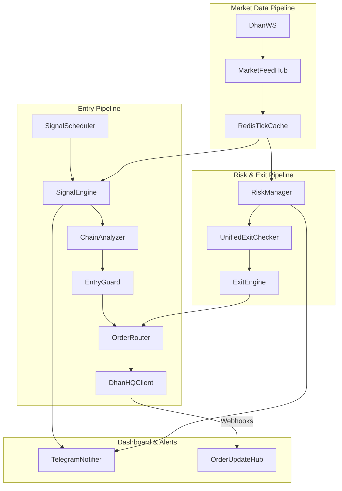

# Service Dependencies

Mermaid diagram visualizing how components interact within the system.

## Top-to-Bottom Interaction

## Dependency Descriptions
- **SignalScheduler**: Periodically polls and triggers the Engine.
- **SignalEngine**: Depends on `RedisTickCache` for latest price and `IndicatorFactory` for TA.
- **EntryGuard**: Depends on `CircuitBreaker` and `PositionTracker` (Active counts).
- **RiskManager**: High-frequency loop polling `RedisTickCache` and evaluating `UnifiedExitChecker`.
- **OrderRouter**: Proxies calls to either `GatewayLive` or `GatewayPaper`.
