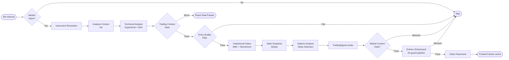

# Signal Generation Engine

The Signal Engine is the central decision-making component that identifies trading opportunities based on market data, technical indicators, and market structure.

## Core Architecture

The engine runs as a series of numbered steps in `Signal::Engine.run_for(index_cfg)`. Each step can abort the pipeline and return nil (no trade). Steps are:

1. Market open check
2. Instrument resolution
3. Analysis context initialization
4. Primary + optional confirmation analysis
5. Trading context gate
6. Entry quality filter
7. Institutional and permission gates
8. State snapshot (deduplication)
9. Options analysis
10. Diagnostic metadata build
11. `TradingSignal` persistence
12. Market context gate (optional)
13. Entry trigger

## Step-by-Step Pipeline

### Step 1: Market Open Check
```ruby
TradingSession::Service.market_closed?
```
Returns immediately if market is closed. Market hours: 09:15-15:30 IST.

### Step 2: Instrument Resolution
```ruby
IndexInstrumentCache.instance.get_or_fetch(index_cfg)
```
Fetches the underlying index instrument (e.g., NIFTY 50 index instrument) from in-memory cache or DB.

### Step 3: Analysis Context Initialization
```ruby
entry_primary = signals_cfg.dig(:entry_strategy, :primary)  # 'supertrend', 'supertrend_adx', etc.
primary_tf    = signals_cfg[:primary_timeframe]             # '5m' default
confirmation_tf = signals_cfg[:confirmation_timeframe]      # '1m' default (if enabled)
```

**In `exit_testing` run mode**: Forces `supertrend_adx` on `1m`, no confirmation timeframe, bypasses quality gates.

### Step 4: Technical Analysis

**Supertrend-only flow** (`entry_primary == 'supertrend'`):
- Fetches candle series for `primary_tf`
- Computes `Indicators::Supertrend` direction (`:bullish` / `:bearish` / `:none`)
- Returns nil if direction is `:none`

**Standard analysis flow** (all other entry strategies):
- Fetches primary and optional confirmation candle series
- Computes `Indicators::Supertrend` + `Indicators::ADX` for each timeframe
- Multi-timeframe alignment: both timeframes must agree on direction
- Regime detection: `Market::MarketRegimeResolver` classifies as TRENDING/RANGING/CHOPPY
- TA filter: optional `IndexTechnicalAnalyzer` for additional technical context (gated by `signals.enable_index_ta_filter`)

### Step 5: Trading Context Gate

```ruby
trading_context_blocked?(index_cfg, primary_series, primary_analysis, regime_result, regime_state, exit_testing_mode, signals_cfg)
```

Checks:
- `Entries::EntryFilterEngine` — structure/liquidity/volatility alignment
- `Trading::PermissionResolver` — SMC + AVRZ permission gating
- SMC decision alignment check (if `signals.enable_smc_decision_alignment: true`)

If blocked, `Signal::StateTracker.reset(index_cfg[:key])` and return nil.

### Step 6: Entry Quality Filter

```ruby
evaluate_entry_quality(index_cfg, primary_series, primary_analysis, final_direction, regime, exit_testing_mode)
```

In `exit_testing` mode: always passes.

Otherwise evaluates:
- **ADX strength**: ADX must meet `min_adx` threshold for the index
- **IV proxy check**: option chain IV must be within acceptable range
- **Theta risk**: avoid high theta decay (near expiry)
- **Validation mode**: `balanced` in trending regime, `conservative` in choppy regime (stricter thresholds)

### Step 7: Institutional and Permission Gates

```ruby
execute_execution_gates(index_cfg, instrument, primary_series, final_direction, signals_cfg, exit_testing_mode)
```

- **SMC bias**: `Smc::BiasEngine.decision` for directional alignment
- **Momentum scoring**: `Signal::MomentumValidator` computes 0-3 score from price action
- Returns `{ permission:, smc_decision:, momentum_score: }`

### Step 8: State Snapshot (Deduplication)

```ruby
Signal::StateTracker.record(index_key:, direction:, candle_timestamp:, config:)
```

Prevents duplicate signals for the same direction + candle timestamp. Returns a `state_snapshot` hash for metadata.

### Step 9: Options Analysis

```ruby
execute_options_analysis(index_cfg, instrument, final_direction, primary_series, effective_validation_mode)
```

Calls `Options::ChainAnalyzer.pick_strikes_with_qualification`:
- Fetches live option chain via `DhanAdapter` (always live, even in paper mode)
- Scores ATM±1 strikes (liquidity, OI, spread, IV proxy)
- Validates expected move via ATR
- Returns ordered `picks` list

If no strikes qualify, flow continues but entry may be blocked at guard level.

### Step 10 + 11: Metadata Build + Signal Persistence

Diagnostic metadata includes: index key, direction, ADX value, Supertrend value, regime, validation mode, timeframes, SMC decision, permission, momentum score, options analysis results, strategy recommendation.

`TradingSignal.create_from_analysis(...)` persists the signal for audit/analysis.

### Step 12: Market Context Gate (Optional)

Only runs when `market_context.enabled: true` in `config/algo.yml` (default: false).

```ruby
evaluate_market_context_for_entry(index_cfg, instrument, picks, primary_series, signal)
```

- `MarketContext::RegimeComposer` builds `RegimeSnapshot` (structure, strength, volatility_state, participation, conviction_score)
- `Options::ChainSignalExtractor` derives chain confirmation (PCR, flow, premium expansion)
- `Trading::StrategyProfileSelector` sets `strategy_profile` in `entry_metadata`
- If `market_context.gate.enabled: true`: `Trading::MarketPermissionGate` may block based on conviction/participation thresholds

See `docs/trading/market_context_and_permission_gate.md` for full details.

### Step 13: Entry Trigger

```ruby
trigger_entry_flow(index_cfg:, instrument:, signal:, picks:, final_direction:, ...)
```

Calls `Entries::EntryGuard.try_enter` or `Entries::BosEntryEngine` depending on entry strategy. The 20-guard pipeline runs here.

---

## Specialized Modules

| Module | File | Purpose |
|--------|------|---------|
| `Signal::TrendScorer` | `app/services/signal/trend_scorer.rb` | Multi-timeframe trend score (0-21) combining RSI, ADX, Supertrend |
| `Signal::StateTracker` | `app/services/signal/state_tracker.rb` | Deduplication — prevents re-entering same signal |
| `Signal::Scheduler` | `app/services/signal/scheduler.rb` | 30s polling loop across configured indices |
| `Signal::MomentumValidator` | `app/services/signal/momentum_validator.rb` | 0-3 momentum score from price action |
| `Trading::PermissionResolver` | `app/services/trading/permission_resolver.rb` | SMC + AVRZ permission gating |
| `Entries::EntryFilterEngine` | `app/services/entries/entry_filter_engine.rb` | Structure/liquidity/volatility alignment filter |

---

## Indicators

| Indicator | File | Notes |
|-----------|------|-------|
| Supertrend | `app/services/indicators/supertrend.rb` | Primary trend direction |
| ADX | `app/services/indicators/adx_indicator.rb` | Trend strength (0-100) |
| RSI | Used in `TrendScorer` | Momentum |
| MACD | Used in `TrendScorer` | Momentum confirmation |
| ML Adaptive Supertrend | `app/services/indicators/ml_adaptive_supertrend.rb` | Volatility-regime switching variant |

---

## Configuration

Signal behavior is controlled via `config/algo.yml` under `signals:`:

```yaml
signals:
  entry_strategy:
    primary: supertrend_adx   # 'supertrend', 'supertrend_adx', 'index_ta'
  primary_timeframe: 5m
  confirmation_timeframe: 1m
  enable_confirmation_timeframe: true
  validation_mode: balanced   # 'balanced' or 'conservative'
  max_expiry_days: 7          # skip instruments with expiry > 7 days away

  # Optional gates (default true)
  enable_smc_decision_alignment: true
  enable_smc_avrz_permission: true

  # Optional technical analysis filter (default false)
  enable_index_ta_filter: false
  ta_min_confidence: 0.6
```

Per-index ADX thresholds in `indices[].min_adx_entry` (default varies: NIFTY ~15, BANKNIFTY ~18).

---

## Run Mode Behavior

| Mode | Entry strategy | Timeframe | Confirmation | Quality gates |
|------|---------------|-----------|-------------|---------------|
| `production` | From config | From config | From config | Full |
| `exit_testing` | `supertrend_adx` (forced) | `1m` (forced) | Disabled | Most bypassed |
| `entry_testing` | From config | From config | From config | Relaxed (lower ADX, no SMC) |

Current default: `run_mode: exit_testing` in `config/algo.yml`.

---

## Signal Flow Diagram


