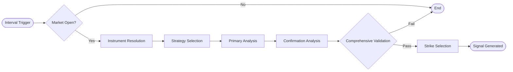

# Signal Generation Engine

The Signal Engine is the central decision-making component that identifies trading opportunities based on market data and technical indicators.

## Core Logic Overview

The engine operates on a multi-stage pipeline for each configured index (e.g., Nifty, BankNifty):

1.  **Market State Filter**: Immediately skips analysis if the market is closed (via `TradingSession::Service`).
2.  **Instrument Resolution**: Fetches target instrument details from `IndexInstrumentCache`.
3.  **Strategy Selection**:
    -   **Standard Mode**: Uses Supertrend + ADX on the primary timeframe.
    -   **Recommender Mode**: Uses `StrategyRecommender` to pick the best-performing strategy/timeframe based on historic expectancy.
4.  **Directional Analysis**:
    -   Analyzes primary and confirmation timeframes (e.g., 5m + 1m).
    -   Calculates Supertrend direction and ADX strength.
5.  **Multi-Timeframe Confirmation**: Validates that both timeframes align (bullish/bearish) before proceeding.
6.  **Comprehensive Validation**:
    -   **ADX Check**: Ensures trend strength meets the `min_strength` threshold.
    -   **Direction Gate**: Prevents entering counter-trend trades.
    -   **SMC Alignment**: (Optional) Verifies alignment with institutional market structure (SMC Scanner).
7.  **Signal Output**: Generates a Signal Hash containing direction, entry path, and diagnostic metadata.

## Signal Flow Pipeline

## Specialized Modules

| Module | Purpose |
| :--- | :--- |
| `Signal::TrendScorer` | Calculates a 0-100 trend score based on RSI, ADX, and Supertrend. |
| `Signal::StateTracker` | Prevents redundant signal generation and manages cooldowns. |
| `IndexTechnicalAnalyzer` | Provides deep technical context (Support/Resistance, Trend Bias). |
| `StrategyRecommender` | Dynamically selects the most profitable strategy parameters for the current index. |

## Configuration
Signal behavior is primarily controlled via `config/algo.yml` under the `signals:` key:
- `entry_strategy`: `supertrend` or `index_ta`.
- `primary_timeframe`: Base interval for analysis (e.g., `5m`).
- `enable_adx_filter`: Boolean toggle for trend strength requirements.
- `use_strategy_recommendations`: Enables AI/Statistical strategy selection.
