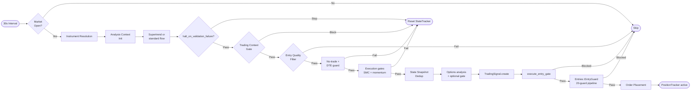

# Signal Generation Engine

The Signal Engine is the central decision-making component that identifies trading opportunities based on market data, technical indicators, and market structure.

Implementation: `Signal::Engine.run_for` in `app/services/signal/engine.rb`. Config is always the **effective** hash from `AlgoConfig.fetch` (DB `algo_config_document` → DB `signal_tier_presets` → DB `india_index_registry` merge → `LIVE_TRADING` paper flag). See [docs/dev/algo-config-db.md](../dev/algo-config-db.md).

## Core Architecture

The engine runs as a **single pipeline** (no `run_mode` / `exit_testing` branch). Numbered steps match the method body order in `run_for`:

1. Market open check
2. Instrument resolution
3. Analysis context initialization (`entry_primary`, timeframes)
4. Primary path: **supertrend-only** (`execute_supertrend_only_flow`) or **standard** (`execute_standard_analysis_flow`)
5. Optional early stop: `halt_on_validation_failure` when comprehensive validation failed
6. Trading context gate
7. Entry quality filter
8. No-trade gate (`enable_no_trade_engine`) + nearest expiry + **`entry_dte_guard`**
9. Execution gates (SMC, momentum, direction, confluence, etc.)
10. `Signal::StateTracker.record` (deduplication)
11. Options analysis (`execute_options_analysis`) + optional **`options_analysis_gate`**
12. Diagnostic metadata build
13. `TradingSignal` persistence
14. `execute_entry_gate` (strike pick validation, optional market context, premium checks)
15. `trigger_entry_flow` → `Entries::EntryGuard` / BOS engine

## Step Details

### Analysis paths

**Supertrend-only** (`entry_strategy.primary: supertrend`):

- Candle series for `primary_timeframe`
- `Indicators::Supertrend` direction (`:bullish` / `:bearish` / `:none`); nil direction aborts
- Regime from merged config; **`effective_validation_mode`** is **conservative** when regime is RANGING or CHOPPY, else **`signals.validation_mode`** (e.g. balanced)

**Standard / legacy path** (other `entry_primary` values):

- Primary ± optional confirmation timeframes
- Supertrend + ADX alignment, regime detection, comprehensive validation as implemented in `execute_standard_analysis_flow`

### Trading context gate

`trading_context_blocked?` — `Entries::EntryFilterEngine`, `Trading::PermissionResolver`, SMC alignment when enabled, using `trading_context_strictness` and related flags.

### Entry quality filter

`evaluate_entry_quality` — ADX strength, IV proxy, theta risk, and validation thresholds from **`signals.validation_modes`** keyed by `effective_validation_mode`.

### No-trade and DTE

- `execute_no_trade_gate` — when `enable_no_trade_engine` is true, builds option context and may block
- `entry_dte_guard` — blocks when `days_to_expiry <= reject_when_days_to_expiry_lte` (see `config/algo.yml`)

### Options analysis

`Options::ChainAnalyzer.pick_strikes_with_qualification` with live `DhanAdapter`. When **`options_analysis_gate.enabled`**, failed IV-rank or theta checks from this stage can block picks per gate flags.

### Entry gate and market context

`execute_entry_gate` runs after the signal row exists. Optional **market context** runs when `market_context.enabled: true`.

---

## Specialized Modules

| Module | File | Purpose |
|--------|------|---------|
| `Signal::TrendScorer` | `app/services/signal/trend_scorer.rb` | Multi-timeframe trend score (0-21) combining RSI, ADX, Supertrend |
| `Signal::StateTracker` | `app/services/signal/state_tracker.rb` | Deduplication — prevents re-entering same signal |
| `Signal::Scheduler` | `app/services/signal/scheduler.rb` | 30s polling loop across configured indices |
| `Signal::MomentumValidator` | `app/services/signal/momentum_validator.rb` | 0-3 momentum score from price action |
| `Trading::PermissionResolver` | `app/services/trading/permission_resolver.rb` | SMC + AVRZ permission gating |
| `Entries::EntryFilterEngine` | `app/services/entries/entry_filter_engine.rb` | Structure/liquidity/volatility alignment filter |

---

## Indicators

| Indicator | File | Notes |
|-----------|------|-------|
| Supertrend | `app/services/indicators/supertrend.rb` | Primary trend direction |
| ADX | `app/services/indicators/adx_indicator.rb` | Trend strength (0-100) |
| RSI | Used in `TrendScorer` | Momentum |
| MACD | Used in `TrendScorer` | Momentum confirmation |
| ML Adaptive Supertrend | `app/services/indicators/ml_adaptive_supertrend.rb` | Volatility-regime switching variant |

---

## Configuration

Signal behaviour is controlled under `signals:` in `config/algo.yml`, then tier preset, then DB overrides. Illustrative fragment (see repo file for full truth):

```yaml
signals:
  signal_tier: standard   # exploratory | standard | selective — merged with signal_tier_presets.yml
  entry_strategy:
    primary: supertrend   # supertrend | supertrend_adx | ...
  primary_timeframe: "1m"
  enable_confirmation_timeframe: false

  validation_mode: balanced
  validation_modes:
    conservative: { ... }
    balanced: { ... }
    aggressive: { ... }

  options_analysis_gate:
    enabled: false
    block_on_iv_rank_failure: true
    block_on_theta_risk_failure: true

  halt_on_validation_failure: false

  entry_dte_guard:
    enabled: true
    reject_when_days_to_expiry_lte: 0

  enable_no_trade_engine: false
  enable_direction_gate: true
  enable_smc_decision_alignment: true
  enable_smc_avrz_permission: false
```

Per-index ADX thresholds live under `indices[].min_adx_entry` / `adx_thresholds` where present.

---

## Signal tier (no run modes)

| Tier | Resolution | Role |
|------|------------|------|
| `exploratory` | `SIGNAL_TIER` env or `signals.signal_tier` | Merges permissive overlay from `config/signal_tier_presets.yml` |
| `standard` | Default when tier missing/invalid | Often empty preset — behaviour follows merged YAML |
| `selective` | env or YAML | Stricter overlay from preset |

Tuning frequency of trades is done with **YAML / DB / tier**, not a separate engine branch. See `docs/development/testing_profiles.md`.

---

## Signal Flow Diagram


