# Trading Pipeline

End-to-end flow from market data to order execution and exit.

## Pipeline Overview

```mermaid
flowchart LR
    A[DhanHQ WebSocket Ticks] --> B[MarketFeedHub + TickCache]
    B --> C[Signal::Scheduler 30s]
    C --> D[Signal::Engine]
    D -- Signal confirmed --> E[Options::ChainAnalyzer]
    E -- Strikes qualified --> F[Entries::EntryGuard\n20-guard pipeline]
    F -- All guards pass --> G[Capital::Allocator]
    G -- Quantity sized --> H[Orders::Gateway\nPaper / Live]
    H -- Filled --> I[PositionTracker active]
    I --> J[MarketFeedHub tick subscription]
    J --> K[PnlUpdaterService 250ms]
    K --> L[RiskManagerService\nper-tick + 5s loop]
    L -- Trigger hit --> M[UnifiedExitChecker]
    M -- Exit decision --> N[ExitEngine]
    N --> H
    H -- Exit filled --> O[PositionTracker exited]
```



---

## Stage 1: Market Data Ingestion

**Service**: `Live::MarketFeedHub` (Singleton)

DhanHQ WebSocket ticks arrive in real time. For each tick:

1. `TickCache.put(tick)` — in-memory write-through, also mirrors to `Live::RedisTickCache`
2. `PositionIndex.trackers_for(security_id)` — O(1) lookup for affected positions
3. `PnlUpdaterService.cache_intermediate_pnl(tracker_id:, ltp:)` — enqueued for 250ms batch

**Tick schema**:
```ruby
{ segment: "IDX_I", security_id: "13", ltp: 22450.50,
  prev_close: 22400.00, timestamp: "2026-03-31 10:15:00" }
```

---

## Stage 2: Signal Generation

**Service**: `Signal::Scheduler` → `Signal::Engine`
**Cadence**: 30-second loop, per index (NIFTY / BANKNIFTY / SENSEX)

**Step-by-step**:
1. Market open check (`TradingSession::Service.market_closed?`)
2. Instrument resolution from `IndexInstrumentCache`
3. Analysis context: determines `entry_primary` (supertrend vs supertrend_adx), `primary_tf`, `confirmation_tf`
   - In `exit_testing` run mode: forces `supertrend_adx` on `1m`, no confirmation
4. Primary analysis: Supertrend direction + ADX strength
5. Optional confirmation analysis: second timeframe must align
6. Trading context gate: `MarketRegimeDetector`, `EntryFilterEngine`, `Trading::PermissionResolver`
7. Entry quality filter: ADX strength, IV proxy, theta risk, comprehensive validation
8. Institutional gates: SMC decision alignment, `Signal::MomentumValidator`
9. `Signal::StateTracker.record` — dedup (skip if same direction/candle as last signal)
10. `Options::ChainAnalyzer.pick_strikes_with_qualification` — returns ordered picks or empty
11. `TradingSignal.create_from_analysis` — persists signal with diagnostic metadata
12. Optional market context gate (only if `market_context.enabled: true`)
13. `trigger_entry_flow` → `Entries::EntryGuard.try_enter`

**Exit testing mode** (`run_mode: exit_testing`):
- Forces `supertrend_adx` strategy on `1m` timeframe, no confirmation
- Bypasses most signal-level quality filters to generate more entries for testing exits

---

## Stage 3: Options Analysis

**Service**: `Options::ChainAnalyzer`

For each qualified signal:
1. Fetch nearest expiry from `Derivative` records
2. Fetch live option chain via `DhanAdapter` (always live data, even in paper mode)
3. Filter by available `Derivative` DB records
4. Score strikes:
   - Liquidity (bid-ask spread, volume)
   - Open interest depth
   - IV proxy vs expected move
   - Premium within configured band (`indices[].premium_band`)
5. Validate expected move (ATR-based)
6. Return ordered picks (ATM±1)

**Indices and expiry rules**:
- NIFTY — weekly options, Thursday expiry
- BANKNIFTY — weekly options; `BankniftyLastWeekGuard` restricts to last week before monthly expiry
- SENSEX — weekly options, weekly expiry

---

## Stage 4: Entry Guard Pipeline

**Service**: `Entries::EntryGuardPipeline`

20 guards in sequence. First block terminates the pipeline.

Key guards:
- **CircuitBreakerGuard** (3): system-wide halt
- **ExpiryWeekPowerTrendGuard** (11): enriches `context[:expiry_power_trend]` when ADX >= 40 + within 5 days of monthly expiry + time 12:00-13:45. Does NOT block.
- **TimeRegimeGuard** (12): blocks during S3 chop/decay (11:30-13:45) unless `expiry_power_trend = true`
- **CooldownGuard** (17): per-symbol cooldown (default: `indices[].cooldown_sec`)

Time regimes (S1-S4):
- S1 OPEN_EXPANSION: 09:15-09:45 — entries allowed, high volatility
- S2 TREND_CONTINUATION: 09:45-11:30 — entries allowed, ideal conditions
- S3 CHOP_DECAY: 11:30-13:45 — entries blocked by default (bypassed for expiry power trend)
- S4 CLOSE_GAMMA: 13:45-15:15 — entries allowed, gamma-aware exits

---

## Stage 5: Capital Allocation

**Service**: `Capital::Allocator`

- Reads `position_sizing` config
- Calculates lot-aligned quantity: `rupees_at_risk / (premium * lot_size)`
- Applies `sizing.post_1100_multiplier: 0.5` after 11:00 AM (half-size)
- Result capped by `Trading::CapitalAllocator.max_lots`
- Must be >= 1 lot (lot-aligned); otherwise entry blocked

---

## Stage 6: Order Placement

**Gateway selection** (fixed at boot via `Orders::GatewayFactory`):

| Config | Gateway | Behavior |
|--------|---------|---------|
| `paper_trading.enabled: true` | `GatewayPaper` | Synthetic fill at current LTP |
| `paper_trading.enabled: false` | `GatewayLive` | DhanHQ API via `Orders::Placer` |

**Live order safety gates** (both required):
- `dhanhq.enable_orders: true` in `config/algo.yml`
- `PLACE_ORDER=true` environment variable

On success: `PositionTracker` created in `active` (paper) or `pending` (live, transitions on fill).

---

## Stage 7: Position Monitoring

After entry, the position is continuously monitored via two concurrent paths:

### Per-tick path (250ms PnlUpdater → EventBus)

```
DhanHQ tick → TickCache → PnlUpdaterService [250ms batch]
  → Compute PnL: (ltp - entry_price) * qty - fees
  → pnl_pct = (ltp - entry_price) / entry_price  [DECIMAL]
  → Update HWM (high-water mark)
  → RedisPnlCache.store_pnl
  → EventBus.publish(:ltp)
    → RiskManagerService.handle_pnl_event
      → UnifiedExitChecker.check_exit_conditions [priority order]
        → ExitEngine.execute_exit if triggered
```

### 5-second enforcement loop

```
RiskManagerService#run_enforcement_cycle [every 5s]
  → Circuit breaker check (force_close_all! if tripped)
  → PositionTracker.active.find_each
    → advance_trade_state_for (init → validated → expansion)
    → enforce_premium_r_stop_for
    → enforce_dynamic_trailing_stops_for
    → enforce_profit_floor_for
    → enforce_structure_invalidation_for
    → enforce_premium_momentum_failure_for
    → enforce_rr_profit_booking_for
    → enforce_percentage_pnl_exit_for
    → enforce_time_stop_for
    → enforce_time_based_exit_for
```

---

## Stage 8: Exit Decision — `Live::UnifiedExitChecker`

**Per-tick priority** (first match wins):

| Priority | Rule | Trigger |
|----------|------|---------|
| 1 | Early trend failure | Enabled + profit < threshold + trend reversal detected |
| 2 | Stop loss | `pnl_pct <= -static_sl` (static) or adaptive drawdown schedule |
| 3 | Take profit | `pnl_pct >= tp` |
| 4 | Trailing stop | Gamma-aware MFE exit or adaptive/fixed drawdown from HWM |
| 5 | Time-based | Current time >= `exit.time_based.exit_time` |

All config values in DECIMAL format (0.10 = 10%).

---

## Stage 9: Exit Execution — `Live::ExitEngine`

- Single source of truth for all exits
- Sets durable fields: `exit_requested_at`, `exit_sent_at`, `exit_coid`
- Places closing order via `Orders.config.gateway`
- On fill: `PositionTracker.mark_exited!`
- Recalculates `last_pnl_pct` from final realized PnL (not stale Redis snapshot)
- Unsubscribes instrument from `MarketFeedHub`

---

## Key Configuration Sections

```yaml
paper_trading:
  enabled: true      # true=paper, false=live
  balance: 100000

run_mode: exit_testing  # production | exit_testing | entry_testing

indices:
  - key: NIFTY
    capital_alloc_pct: 0.30  # 30% of capital
    # ...

risk:
  stop_loss: 0.10     # 10% (DECIMAL)
  take_profit: 0.25   # 25% (DECIMAL)

signals:
  max_expiry_days: 7   # skip instruments with expiry > 7 days

sizing:
  post_1100_multiplier: 0.5  # half-size after 11:00

expiry_week_power_trend:
  enabled: true
  adx_min: 40
  expiry_days_max: 5
  entry_start: "12:00"
  entry_end: "13:45"
```
