# Trading Pipeline

Reverse-engineered flow from Market Tick to Order Exit.

## End-to-End Pipeline

```mermaid
flowchart LR
    A[Tick] --> B[Signal::Engine]
    B -- Signal Confirmed --> C[Options::ChainAnalyzer]
    C -- Strike Selected --> D[Entries::EntryGuard]
    D -- Risk Passed --> E[Orders::EntryManager]
    E -- Order Routed --> F[Orders::Placer]
    F -- API Success --> G[PositionTracker]
    G -- Active --> H[Live::RiskManagerService]
    H -- Trigger Hit --> I[UnifiedExitChecker]
    I -- Exit Command --> J[ExitEngine]
    J -- Routed --> K[OrderRouter]
    K -- API Execute --> L[Broker Exit]
```

## Key Transitions

### 1. The Strategy Gate (`Signal::Engine`)
Evaluates Supertrend, ADX, and SMC indicators. If confluences are found, it triggers the Option Chain analysis.

### 2. The Entry Guard (`Entries::EntryGuard`)
The final safety check. It ensures the system isn't over-exposed, the circuit breaker isn't tripped, and the market regime is favorable.

### 3. The Monitoring Loop (`RiskManagerService`)
A high-frequency loop that hydrates active positions with the latest ticks and checks them against the `UnifiedExitChecker`.

### 4. The Exit Execution (`ExitEngine`)
Responsible for flattening the position at the broker and marking the `PositionTracker` as `exited`.
